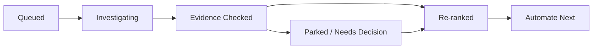

# Checkout Automation Mission Control

Persistent state for the checkout recursive automation prioritization worker.

Related notes:
- [[06 Prompts/Checkout Recursive Automation Prioritization Worker]]
- [[02 Feature QA/Checkout Automation Worker State.json]]
- [[02 Feature QA/Checkout Critical Path Gap Analysis]]
- [[04 Automation/Checkout Money Movement Automation Backlog]]
- [[04 Automation/Checkout Automation Phase 2 Planning]]
- [[04 Automation/Checkout Playwright Automation Review Checkpoint]]
- [[02 Feature QA/Checkout Money Movement Risk Scoring]]
- [[02 Feature QA/Checkout Automation Decision Queue]]
- [[02 Feature QA/Checkout Criticality From Jira Major Critical Export]]

## Current Best Answer

**Automate next:** AUTO-CHK-002 - Duplicate submit/retry creates one paid outcome  
**Why now:** Still the strongest automation-readiness P0: it proves the recurring business invariant that retry/replay cannot create duplicate paid transaction, order, or ticket outcomes. `DUP-CHK-003` tightened the proof recipe: preserve replay evidence, return `invoiceData.transaction_id`, filter Dashboard by that transaction id, and verify confirmation/My Orders shows exactly one expected ticket set. Use the existing Authorize replay harness by default; promote a Stripe equivalent first only if provider volume/business priority says Stripe should drive the first proof.
**Confidence:** High  
**Risk reduced:** Duplicate charge, duplicate order, duplicate confirmation, duplicate ticket issuance, and final-state disagreement after retry/replay behavior.  
**Planning status:** Planning packet ready; `PROOF-CHK-002` refines the first implementation contract. Implementation is out of scope for this worker; continue planning the next highest-value P0 target.
**Ranking caveat:** This is currently an automation-readiness ranking, not final business-priority ranking. `AUTO-CHK-002` is first because duplicate-submit final-state is the highest-value invariant and the Authorize replay harness is ready. `STRIPE-CHK-001` did not find an inspected Stripe duplicate-submit/replay harness. If Stripe carries most production checkout volume, promote a Stripe-specific duplicate-submit/retry proof only after choosing a safe deterministic Stripe path.
**QA handoff:** Automate one duplicate-submit/retry final-state proof. Submit or replay the same checkout attempt twice, preserve evidence that the replay happened, then assert exactly one Dashboard transaction row for `invoiceData.transaction_id`, one paid order/invoice, and one issued ticket set. The only open choice is provider path: use the existing Authorize.net replay harness by default, or switch to a Stripe WebPublic PaymentIntent capture/replay proof first if Stripe volume is the business priority.

**Selected packet:** AUTO-CHK-003 - Dashboard transaction total reconciliation  
**Selection note:** User selected AUTO-CHK-003 after confirming AUTO-CHK-001 planning is done. AUTO-CHK-003 is now planning-ready, so the worker should continue to the next highest-value planning target instead of stopping for implementation.

**Operating mode:** This is a planning loop, not an implementation loop. The goal should not include a stop condition that treats source-code writes as a blocker. If an older copied goal says that, ignore that stop condition, mark the packet `Planning Ready`, keep it ranked, and continue with read-only planning.

**Implementation boundary:** This worker never writes tests and never asks to write tests. A planning-ready packet is the output, not the next action. Continue with ranking review, fixture planning, entry-path discovery, read-only coverage checks, or packet refinement.

**Implementation-step conversion:** If a loop reaches "write the Playwright test", "change a fixture", "edit app code", or "write Qase", convert that into a `Planning Ready` handoff note with future file/assertion/fixture/review criteria, then continue to another read-only planning target. Do not create blocked implementation steps.

**Blocked-step redirect:** Implementation-needed work is never a goal-level blocker. Branch blockers are local only: park product/business/provider/hardware/secret/destructive-setup/read-only-access questions, re-rank, and continue to the next read-only target. Use `/goal blocked` only when every high-value planning branch is ready, parked, duplicated, or unsupported and no defensible read-only planning remains.

**Incident calibration:** `assets/csv/major-critical.csv` was reviewed on 2026-07-09. Criticality now means a reusable business invariant can break, not merely that a Jira card was labeled Critical/Major. Do not force multi-day exploration once Major/Critical incident buckets stop changing the P0/P1 ranking, fixture needs, or assertion contracts.

**Review checkpoint:** `P0-SATURATION-CHK-001` confirms the P0 reviewer set is structurally complete. Ranks 1-6 have reviewer-readable QA handoff fields and proof contracts, and `AUTO-CHK-008` now has a proof contract if package reporting is promoted. `PROMPT-SYNC-CHK-001` synced the reusable worker prompt to this checkpoint, and `ARTIFACT-SYNC-CHK-001` synced the reviewer-facing notes so fresh sessions do not repeat completed P0 audits. `PHASE2-GATE-SYNC-CHK-002` synced [[04 Automation/Checkout Automation Phase 2 Planning]] with `DECISION-QUEUE-SYNC-CHK-003`, so [[02 Feature QA/Checkout Automation Decision Queue]], [[04 Automation/Checkout Money Movement Automation Backlog]], and [[04 Automation/Checkout Playwright Automation Review Checkpoint]] name the same current reviewer gate. `MODE-SYNC-CHK-001` confirms the checkpoint is a planning recommendation for future Playwright work, not an implementation run. `LEVERAGE-CHK-001` adds the efficient future implementation order: shared `CheckoutResult` / `invoiceData.transaction_id` and final-state proof helpers first, then failed-payment context and entry-specific adapters. `AUTO-CHK-002` remains first, and `AUTO-CHK-008` stays review-separately unless package reporting/payout confidence is a current priority.

## Visual Snapshot

## Top Automation Candidates

Reader note: a candidate is not asking for every listed checkout variant. Use `what_to_automate`, `first_action`, `acceptance_criteria`, and `criticality_review` in Worker State as the QA handoff. Use `recommended_first_test` only as supporting detail, and `not_a_matrix` for what should not be tested first. Rankings include automation readiness; production payment-provider volume can change final business priority. P1 scores are intentionally below 80 after the Jira calibration so P1 means important backlog context, not active P0.

| Rank | ID | Priority | Score | Candidate | Why Now | Status |
| ---: | --- | --- | ---: | --- | --- | --- |
| 1 | AUTO-CHK-002 | P0 | 96 | Duplicate submit/retry creates one paid outcome | One-paid-outcome proof is highest value; `DUP-CHK-003` confirmed ready replay, transaction-id, Dashboard, and order/ticket proof surfaces | Planning Ready / Proof Surface Refined |
| 2 | AUTO-CHK-001 | P0 | 94 | Failed payment no paid order/tickets/inventory | `FAILED-CHK-002` confirmed the first proof: failed Affirm WebPublic guest returns failed-checkout context, then proves no paid invoice/order and no invoice-items/tickets | Planning Ready / Proof Surface Refined |
| 3 | AUTO-CHK-003 | P0 | 92 | Dashboard transaction total reconciliation | `DASH-CHK-002` confirmed one helper assertion: compare Dashboard `financial-breakdown-row-Settlement amount` against existing expected paid total input | Planning Ready / Proof Surface Refined |
| 4 | AUTO-CHK-006 | P0 | 91 | Mixed ticket plus checkout add-on reconciliation | `MIXED-CHK-002` confirmed the proof contract: existing CheckoutAddOns path should verify base ticket line, add-on product line, and combined paid total | Planning Ready / Proof Surface Refined |
| 5 | AUTO-CHK-013 | P0 | 90 | Assigned seating payment failure/retry preserves seat ownership | `SEAT-CHK-002` confirmed the proof contract: capture serialized seat identifiers, prove failed payment creates no paid owner, then prove retry creates exactly one paid owner | Planning Ready / Proof Surface Refined |
| 6 | AUTO-CHK-007 | P0 | 89 | Checkout tracking-link unavailable-item paid outcome | `TRACK-CHK-002` confirmed the proof contract: pause on review, assert unavailable items, carry pruned expectations, then prove paid order excludes unavailable quantities | Planning Ready / Proof Surface Refined |
| 7 | AUTO-CHK-008 | P0 | 84 | Package revenue-realization reporting reconciliation | Real reporting/payout risk, but backend covers allocation math and it is less direct than the first six checkout failures | Planning Ready / Review Separately |
| 8 | AUTO-CHK-011 | P1 | 79 | Stripe PaymentIntent cancel/webhook recovery creates no paid order and remains retry-safe | High incident alignment, but Playwright feasibility depends on a safe Stripe hook/provider fixture | Planning Ready |
| 9 | AUTO-CHK-005 | P1 | 78 | Membership event-batch hold-link checkout reconciliation | Membership/hold issues recur, but this is fixture-heavy and below direct charge/failure P0s | Fixture plan tightened |
| 10 | AUTO-CHK-017 | P1 | 77 | Credit-applied checkout remaining balance reconciles to charged amount | Credits and charge mismatches recur, but existing backend/manual/zero-cost coverage lowers P0 urgency | Planning Ready / Manual-backed |
| 11 | AUTO-CHK-018 | P1 | 76 | Configured rate-card fee and tax-on-fee checkout reconciliation | Fees/taxes recur, but broad manual/backend coverage and generic Playwright fee checks reduce urgency | Planning Ready / Manual-backed |
| 12 | AUTO-CHK-019 | P1 | 75 | Resale checkout buyer charge and seller-side completion reconciliation | Money, ownership, and payout risk exists, but backend/Qase/manual coverage is broad | Planning Ready / Manual-backed |
| 13 | AUTO-CHK-014 | P1 | 74 | Waitlist async fulfillment creates one paid order and reconciled revenue | Async fulfillment maps to incident patterns, but backend/Qase cover much of the lifecycle | Planning Ready / Manual-backed |
| 14 | AUTO-CHK-016 | P1 | 73 | Payment-plan checkout installment totals reconcile to Dashboard/API state | Delayed money path, but backend coverage is strong and final release needs a safe trigger | Planning Ready / Backend-covered |
| 15 | AUTO-CHK-010 | P1 | 72 | Guest checkout claim/connect preserves paid order ownership | Ownership/access issues recur, but manual Qase coverage exists and money movement is less direct | Planning Ready |
| 16 | AUTO-CHK-015 | P1 | 71 | Refund-protection upsell checkout creates linked protection-only invoice | Post-purchase money path, but backend coverage exists and core protection checkout is already no-gap | Planning Ready / Backend-covered |
| 17 | AUTO-CHK-020 | P1 | 70 | Checkout upgrade offer replaces item and reconciles upgraded paid outcome | Item replacement affects total/inventory/fulfillment, but Qase/manual and source behavior lower urgency | Planning Ready / Manual-backed |
| 18 | AUTO-CHK-012 | P1 | 69 | One-click wallet checkout cancel/failure/retry creates no paid order until final success | Real provider risk, but parked until wallet browser/provider strategy exists | Planning Parked |
| 19 | AUTO-CHK-009 | P1 | 68 | Square Terminal async completion finalizes one paid Box Office order | Terminal async state maps to incidents, but hardware/provider strategy blocks reliable automation | Planning Parked |
| 20 | AUTO-CHK-004 | P1 | 64 | Gift-card stored value checkout reconciliation | Gift-card/credit signal exists, but business priority and product-scope decision are still needed | Needs business priority |

## Active Investigation

**Packet:** ARTIFACT-SYNC-CHK-001
**Hypothesis:** Reviewer-facing artifacts should mirror `PROMPT-SYNC-CHK-001` so fresh sessions do not miss the current reviewer-driven resume state.
**Current evidence:** Decision Queue, Automation Backlog, Phase 2 Planning, Review Checkpoint, Mission Control, Worker State, and the recursive prompt now point at the same completed P0 saturation checkpoint and reviewer gate.
**Next inspection step:** Reviewer should inspect [[04 Automation/Checkout Playwright Automation Review Checkpoint]], [[04 Automation/Checkout Money Movement Automation Backlog]], [[04 Automation/Checkout Automation Phase 2 Planning]], and `DEC-CHK-046` through `DEC-CHK-050` as the current answer to "what should we automate next?" Do not repeat P0 saturation, handoff, ranking, assertion-contract, CSV, or broad exploration audits unless reviewer feedback or candidate content changes.

## Re-Ranking Log

| Date | Change | Reason |
| --- | --- | --- |
| 2026-07-07 | Seeded AUTO-CHK-001 as rank 1 | Failed-payment gap has direct order/payment/inventory risk and clear automation value |
| 2026-07-07 | Seeded AUTO-CHK-002 as rank 2 | Duplicate charge risk is P0, but existing Authorize repro needs deeper final-state review |
| 2026-07-07 | Seeded AUTO-CHK-003 as rank 3 | Dashboard total reconciliation may unlock multiple money assertions |
| 2026-07-07 | Seeded AUTO-CHK-004 as rank 4 | Gift-card path appears uncovered but business priority needs confirmation |
| 2026-07-07 | Promoted AUTO-CHK-002 to rank 1 | Existing panic-click/replay harness is present, but no inspected assertion proves exactly one final paid transaction/order/ticket set; Dashboard transaction filtering can support compact proof |
| 2026-07-07 | Confirmed AUTO-CHK-003 as ready | Backend invoice serializer and frontend transaction detail expose stable money fields; Playwright receives expected total but does not assert Dashboard Settlement amount |
| 2026-07-07 | Added AUTO-CHK-005 | Entry-path pass found membership event-batch hold-link checkout as a combined money, expiry, inventory, and seat-ownership fixture gap |
| 2026-07-07 | Reclassified AUTO-CHK-005 as fixture spike | Backend route and tests prove membership hold-link generation/purchase path; Playwright lacks reusable setup for creating and retrieving the member hold-link slug |
| 2026-07-07 | Drafted AUTO-CHK-002 automation planning packet | Best first scenario is `diagnostic-replay-purchase` on WebPublic guest, returning checkout result and proving exactly one final transaction/order/ticket set by `invoiceData.transaction_id` |
| 2026-07-07 | Drafted AUTO-CHK-003 automation planning packet | Settlement amount can be asserted with `financial-breakdown-row-Settlement amount` using expected totals already passed into `verifyTransaction` |
| 2026-07-07 | Drafted AUTO-CHK-001 representative-path packet | Failed Affirm WebPublic guest is the fastest existing deterministic failure path for no-paid-outcome assertions; card decline/webhook failure can be separate fixture work |
| 2026-07-07 | Refined AUTO-CHK-005 fixture spike | Generated membership hold links can likely be retrieved through `/api/user/memberships/membership-benefit-issue-tickets/?member={memberId}`; member ID setup remains the spike question |
| 2026-07-07 | Completed read-only Qase scan | Scanned 1566 cases; no exact duplicate submit/replay case found, partial related coverage found for failed payment, settlement reconciliation, and membership hold-link areas |
| 2026-07-07 | Created decision queue | Historical note: read-only discovery initially treated source writes as a boundary; superseded by planning-only continuation rule |
| 2026-07-07 | Boundary rechecked | No new authorization or business-scope decision found; keep decision queue pointed at DEC-CHK-001 |
| 2026-07-07 | Historical stop audit satisfied | Superseded 2026-07-07 12:08 by planning-only continuation rule |
| 2026-07-07 | Resumed Phase 2 planning | User clarified the next phase is planning-only, not source implementation authorization; created [[04 Automation/Checkout Automation Phase 2 Planning]] |
| 2026-07-07 | Finalized AUTO-CHK-002 planning packet | Added handoff checklist and assertion contract; next planning pass should shape AUTO-CHK-001 |
| 2026-07-07 | Finalized AUTO-CHK-001 planning packet | Added failed-payment handoff checklist and assertion contract; next planning pass should shape AUTO-CHK-003 |
| 2026-07-07 | Finalized AUTO-CHK-003 planning packet | Added Dashboard settlement helper handoff checklist and assertion contract; all P0 planning packets are now shaped |
| 2026-07-07 | Finalized AUTO-CHK-005 fixture planning | Added member hold-link setup questions and fixture contract; parked AUTO-CHK-004 until gift-card business scope is confirmed |
| 2026-07-07 | Updated decision queue boundary | Superseded 2026-07-07 12:08 by planning-only continuation rule |
| 2026-07-07 | Planning boundary rechecked | No ranking, implementation, or gift-card scope decision changed; do not repeat broad source/Qase discovery or packet shaping |
| 2026-07-07 | Planning boundary rechecked again | Historical note: superseded by planning-only continuation rule; do not block on implementation authorization |
| 2026-07-07 | Historical post-Phase-2 stop audit satisfied | Superseded 2026-07-07 12:08 by planning-only continuation rule |
| 2026-07-07 | Selected AUTO-CHK-003 | User confirmed AUTO-CHK-001 planning is done and chose AUTO-CHK-003 as the next packet; no source writes authorized |
| 2026-07-07 | Added AUTO-CHK-003 readiness detail | Captured first file, first caller, assertion target, backend/frontend source fields, and later code-change shape |
| 2026-07-07 | Updated decision queue for AUTO-CHK-003 readiness | Superseded 2026-07-07 12:08; selected packet readiness now means continue planning |
| 2026-07-07 | Linked AUTO-CHK-003 test draft | Updated TC-CHK-002 with Qase 935 partial coverage context and linked it from selected-packet readiness |
| 2026-07-07 | Selected-packet boundary rechecked | Historical note: AUTO-CHK-003 reached planning-ready handoff; source repos remain read-only |
| 2026-07-07 | Selected-packet boundary rechecked again | Historical note: superseded by planning-only continuation rule; do not block on implementation authorization |
| 2026-07-07 | Historical selected-packet stop audit satisfied | Superseded 2026-07-07 12:08 by planning-only continuation rule |
| 2026-07-07 | Converted worker to planning-only loop | Source-write authorization is no longer a blocker; planning-ready packets stay queued and the worker continues to the next planning target |
| 2026-07-07 | Tightened AUTO-CHK-005 fixture path | Member id can be retrieved through user memberships members API after purchase, then issue-ticket API can return generated hold links |
| 2026-07-07 | Added AUTO-CHK-006 | Existing CheckoutAddOns coverage exercises mixed ticket plus product add-on, but inspected confirmation proof only passes add-on product details |
| 2026-07-07 | Finalized AUTO-CHK-006 planning packet | Added mixed-basket handoff checklist and assertion contract |
| 2026-07-07 | Hardened planning-only goal rules | Implementation handoff is a success state, not a blocker; continue with Qase reads, source-backed discovery, ranking, fixture planning, or packet refinement |
| 2026-07-07 | Completed AUTO-CHK-006 Qase check | Partial related cases found in Qase 360, 388, 466, 935, 4763, and 4817; no exact event-ticket plus checkout add-on fulfillment proof found |
| 2026-07-07 | Added AUTO-CHK-007 | Checkout tracking-link review handles existing basket and unavailable-item pruning, but inspected E2E coverage does not prove paid order excludes unavailable quantities and matches final total |
| 2026-07-07 | Finalized AUTO-CHK-007 planning packet | First scenario is checkout link with existing basket, partially unavailable extras, one valid remaining item, card payment, and final paid-order reconciliation |
| 2026-07-07 | Clarified non-implementation goal policy | Ready packets are not blocked steps; the worker must not implement or ask to implement, and should continue with read-only planning loops |
| 2026-07-07 | Added AUTO-CHK-008 | Package purchase coverage is broad, but inspected Playwright coverage does not prove package revenue-realization child stat allocation or Dashboard/API reporting reconciliation |
| 2026-07-07 | Completed AUTO-CHK-008 Qase detail check | Qase 4229 and 3879 are related but do not explicitly prove child revenue-realization stat allocation or reporting/payout reconciliation |
| 2026-07-07 | Finalized AUTO-CHK-008 planning packet | Primary proof is venue invoice-items API stat fields; Dashboard is secondary transaction identity/paid-total proof; exact allocation percent proof needs another source-backed helper/API |
| 2026-07-07 | Parked AUTO-CHK-009 | Square Terminal async completion is high-value but hardware/provider-gated; manual Qase coverage exists and exact Playwright coverage was not found |
| 2026-07-07 | Added AUTO-CHK-010 | Guest checkout claim/connect ownership is source-backed and manually covered, but exact Playwright paid-order ownership flow was not found in inspected files |
| 2026-07-07 | Finalized AUTO-CHK-010 planning packet | Added data contract and assertion contract for same-email connect, My Orders ownership proof, and different-email rejection/no-access proof |
| 2026-07-07 | Tightened source-write stop override | Source implementation is not a blocked step for this worker; mark packets `Planning Ready` and continue read-only planning |
| 2026-07-07 | Added AUTO-CHK-011 | Stripe PaymentIntent cancel/webhook/OAuth-delay recovery is source-backed and manually covered, but exact Playwright final-state recovery proof was not found |
| 2026-07-07 | Added AUTO-CHK-012 | One-click wallet checkout is source-backed and manually covered, but exact Playwright cancel/failure/retry final-state proof was not found and automation needs wallet provider/browser strategy |
| 2026-07-07 | Reinforced planning-only boundary | Do not create blocked implementation steps; implementation-ready packets are outputs, and only product/provider/business/read-only-access blockers can park a branch |
| 2026-07-07 | Added AUTO-CHK-013 | Assigned seating failure/retry seat ownership is source-backed; success coverage and generic failed-payment coverage exist separately, but exact combined final-state proof was not found |
| 2026-07-07 | Refined AUTO-CHK-013 fixture contract | Selected-seat capture can use Playwright `captureSeatIdentifiers()`; backend user ticket item serialization exposes seat identifiers for final order proof |
| 2026-07-07 | Added AUTO-CHK-014 | Waitlist async fulfillment is source-backed; inspected Playwright coverage stops at Pending while backend and Qase/manual coverage prove much of the later paid fulfillment lifecycle |
| 2026-07-07 | Tightened implementation-step conversion | Source writes, fixture changes, test implementation, and Qase writes are converted into Planning Ready handoff notes rather than blocked steps; Worker State now records this as the latest policy checkpoint |
| 2026-07-07 | Recorded NO-GAP-CHK-001 | Donation checkout has existing Playwright/Qase/manual coverage and does not change the ranking; optional future refinement is explicit Dashboard/API donation amount, refund retention, and reporting/payout proof |
| 2026-07-07 | Recorded PROOF-CHK-001 | Shared final-state proof contract added for paid/no-paid Dashboard/API/My Orders assertions across top P0 packets; no ranking change |
| 2026-07-07 | Removed implementation-blocker wording from goal | Source writes are not a stop condition; implementation steps convert into `Planning Ready` handoff notes and the worker continues planning |
| 2026-07-07 | Recorded NO-GAP-CHK-002 | Refund-protection checkout has existing Playwright/Qase/manual coverage and does not change the ranking; optional future refinement is explicit Dashboard/API protection amount/status proof |
| 2026-07-07 | Added AUTO-CHK-015 | Refund-protection upsell checkout is a tokenized post-purchase money path with no exact inspected Playwright coverage; keep lower P1 because backend tests cover core lifecycle |
| 2026-07-07 | Tightened blocked-step redirect | Implementation-needed packets now convert to `Planning Ready`; branch blockers are parked locally, and goal-level blocked is only valid when no useful read-only planning remains anywhere |
| 2026-07-07 | Added AUTO-CHK-016 | Payment-plan checkout is a delayed-money path with strong backend coverage but no exact inspected Playwright checkout plus Dashboard/API reconciliation proof |
| 2026-07-07 | Added AUTO-CHK-017 | Partial-credit checkout is source-backed and manually covered, but inspected Playwright does not prove remaining card charge plus Dashboard/API Credit applied reconciliation |
| 2026-07-07 | Recorded NO-GAP-CHK-003 | Core discount checkout has backend, Playwright, Dashboard, and Qase/manual coverage; optional future refinement is explicit Dashboard/API Discounts row proof |
| 2026-07-07 | Added AUTO-CHK-018 | Configured rate-card fee/tax-on-fee checkout is source-backed and manually covered, but inspected Playwright only proves generic service-fee totals, not configured fee/tax row reconciliation |
| 2026-07-07 | Recorded NO-GAP-CHK-004 | Delivery-method shipping/Will Call checkout has backend, Playwright, Dashboard/frontend, and Qase/manual coverage; optional future refinement is Dashboard/API shipping-cost or fulfillment-report proof |
| 2026-07-07 | Added AUTO-CHK-019 | Resale checkout buyer/seller final-state reconciliation is source-backed and manually covered, but inspected Playwright does not prove buyer paid order plus seller completion/refund/payout and resale-fee reconciliation |
| 2026-07-07 | Recorded NO-GAP-CHK-005 | Core exchange checkout has backend, Playwright, Dashboard/frontend, and Qase/manual coverage; optional future refinement is Dashboard/API exchange-adjustment Settlement amount proof |
| 2026-07-07 | Added AUTO-CHK-020 | Checkout upgrade offer replacement is source-backed and manually covered, but inspected Playwright does not prove paid upgraded outcome, original item exclusion, total/inventory reconciliation, and issued upgraded ticket proof |
| 2026-07-07 | Recorded NO-GAP-CHK-006 | Core Pay What You Can checkout has backend, frontend, Playwright, assigned-seating, and Qase/manual coverage; optional future refinement is Dashboard/API PWYC reporting surplus/deficit proof |
| 2026-07-07 | Recorded POLICY-CHK-002 | Active worker scope is P0/highest-risk only; P1/lower packets are preserved as backlog context and should resume only through the continuation prompt when explicitly requested |
| 2026-07-07 | Recorded PROOF-CHK-002 | Refined AUTO-CHK-002 first implementation contract: WebPublic diagnostic replay, return invoice data, preserve replay evidence, prove one Dashboard transaction row, and use venue invoice/invoice-items API only for detail support |
| 2026-07-07 | Recorded PROOF-CHK-003 | Refined AUTO-CHK-001 first implementation contract: WebPublic failed Affirm, return failure context, prove no venue invoice by exact email, and prove no invoice-items by buyer/event/ticket type |
| 2026-07-07 | Recorded PROOF-CHK-004 | Refined AUTO-CHK-003 first implementation contract: assert Dashboard `Settlement amount` row against existing `pricingFeesTaxes.valueOnTransactionPage` inputs without adding a new checkout scenario |
| 2026-07-07 | Recorded PROOF-CHK-005 | Refined AUTO-CHK-006 first implementation contract: upgrade existing `CheckoutAddOns` confirmation proof to pass base ticket and add-on product lines plus combined paid total |
| 2026-07-07 | Recorded PROOF-CHK-006 | Refined AUTO-CHK-013 first implementation contract: use best-available seat capture, failed-Affirm context, no-paid seat ownership proof, and retry same-seat paid ownership proof |
| 2026-07-07 | Applied QA handoff schema to all candidates | Worker State now gives every candidate `what_to_automate`, `qa_handoff`, `first_action`, `decision_needed`, `default_decision`, and `acceptance_criteria` for reviewer/UI handoff |
| 2026-07-09 | Calibrated criticality from Jira export | Reviewed 1,352 exported SPD Major/Critical cards; current top checkout candidates remain directionally aligned, but support scripts/config/hardware/demo cards should not promote automation unless they expose recurring business logic |
| 2026-07-09 | Normalized Worker State candidate scoring | Added `criticality_review` to every candidate and lowered P1 backlog scores below 80 so priority bands match the rubric |
| 2026-07-13 | Recorded PROOF-CHK-007 | Refined AUTO-CHK-007 first implementation contract: inspect checkout-link review before checkout, assert unavailable items, carry pruned quantity/line/total expectations, complete card payment, and prove final paid order excludes unavailable quantities |
| 2026-07-13 | Created REVIEW-CHK-001 | Added [[04 Automation/Checkout Playwright Automation Review Checkpoint]] so the reviewer can approve, revise, or defer the high-value Playwright shortlist before more exploration |
| 2026-07-13 | Recorded RANK-CHK-001 | Sanity-checked the P0 shortlist; ranks 1-6 remain the recommended next Playwright batch, `AUTO-CHK-008` remains review-separately, and current best remains `AUTO-CHK-002` |
| 2026-07-13 | Recorded PROVIDER-CHK-001 | Checked Stripe versus Authorize duplicate-submit readiness; no inspected Stripe replay harness found, so `AUTO-CHK-002` remains first by automation readiness |
| 2026-07-13 | Recorded PACKAGE-CHK-001 | Checked `AUTO-CHK-008` immediate-batch fit; no ranking change, ranks 1-6 remain the recommended next Playwright batch, and package reporting stays review-separately unless it is a current business priority |
| 2026-07-13 | Recorded STRIPE-CHK-001 | Refined `AUTO-CHK-002` provider handoff: duplicate-submit final-state is the risk, Authorize is the ready default harness, and Stripe should be first only if provider volume/business priority overrides the default |
| 2026-07-13 | Recorded FAILED-CHK-001 | Confirmed `AUTO-CHK-001` should start with failed Affirm WebPublic guest; Stripe decline/failure is a later provider-priority fixture unless reviewer explicitly promotes it |
| 2026-07-13 | Recorded DASH-CHK-001 | Confirmed `AUTO-CHK-003` should be a shared Dashboard Settlement amount assertion upgrade, not a new checkout scenario |
| 2026-07-13 | Recorded MIXED-CHK-001 | Confirmed `AUTO-CHK-006` should be one existing CheckoutAddOns verification upgrade: pass both base event ticket and add-on product lines into confirmation/order verification and assert the combined paid total |
| 2026-07-13 | Recorded SEAT-CHK-001 | Confirmed `AUTO-CHK-013` should be one WebPublic best-available assigned-seat failure/retry proof using serialized seat identifiers, not a seating-platform matrix |
| 2026-07-13 | Recorded RANK-CHK-002 | Confirmed the top-six Playwright shortlist remains stable after `SEAT-CHK-001`; current best remains `AUTO-CHK-002` and `AUTO-CHK-008` stays review-separately |
| 2026-07-13 | Recorded DUP-CHK-003 | Refined `AUTO-CHK-002` proof surfaces: replay evidence, `invoiceData.transaction_id`, Dashboard one-row transaction filter, and confirmation/My Orders ticket-set proof |
| 2026-07-13 | Recorded FAILED-CHK-002 | Synced `AUTO-CHK-001` Worker State proof contract: return failed-checkout context, keep failed-Affirm UI recovery, assert no venue invoice/order, and assert no invoice-items/tickets for the failed buyer/event/ticket context |
| 2026-07-13 | Recorded DASH-CHK-002 | Synced `AUTO-CHK-003` Worker State proof contract: assert Dashboard `financial-breakdown-row-Settlement amount` from `amount_paid` / `amountPaid` against `pricingFeesTaxes.valueOnTransactionPage` through an existing Box Office caller |
| 2026-07-13 | Recorded MIXED-CHK-002 | Synced `AUTO-CHK-006` Worker State proof contract: existing CheckoutAddOns flow should verify base ticket line, add-on product line, and combined paid total; venue invoice-items API is fallback only if UI detail cannot prove both lines |
| 2026-07-13 | Recorded SEAT-CHK-002 | Synced `AUTO-CHK-013` Worker State proof contract: capture serialized seat identifiers, prove failed payment creates no paid owner, then prove retry creates exactly one paid ticket owner; canvas state is not primary proof |
| 2026-07-13 | Recorded TRACK-CHK-002 | Synced `AUTO-CHK-007` Worker State proof contract: pause on checkout-link review, assert unavailable items, carry pruned expected lines and total, then prove paid order excludes unavailable quantities |
| 2026-07-13 | Recorded READY-CHK-001 | Audited top-six readiness; ranks 1-6 have proof contracts, QA handoff fields, and acceptance criteria; no ranking change |
| 2026-07-13 | Recorded LEVERAGE-CHK-001 | Identified shared future implementation sequence for ranks 1-6: result/transaction-id proof helpers first, failed-payment context and entry-specific adapters second |
| 2026-07-13 | Recorded BACKLOG-SYNC-CHK-001 | Synced automation backlog with current Worker State: top-six batch, normalized P1 scores, `AUTO-CHK-008` review-separately, and `LEVERAGE-CHK-001` |
| 2026-07-13 | Recorded DECISION-SYNC-CHK-001 | Synced decision queue with current reviewer gate: `DEC-CHK-043` through `DEC-CHK-045`, no implementation authorization step, and no broad exploration before reviewer input |
| 2026-07-13 | Recorded MODE-SYNC-CHK-001 | Confirmed the shortlist is a recommendation for future Playwright automation, not work being implemented by this planning worker |
| 2026-07-13 | Recorded HANDOFF-AUDIT-CHK-001 | Audited top-six candidate handoff fields; all have reviewer-readable automation target, first action, decision/default, acceptance criteria, first test, not-a-matrix guidance, and proof contract |
| 2026-07-13 | Recorded REVIEW-CHECKPOINT-SYNC-CHK-001 | Synced the human review checkpoint with `HANDOFF-AUDIT-CHK-001` so reviewers see the top-six handoff audit is already done |
| 2026-07-13 | Recorded DECISION-QUEUE-SYNC-CHK-002 | Synced the decision queue with `HANDOFF-AUDIT-CHK-001` and `REVIEW-CHECKPOINT-SYNC-CHK-001`; current decision rows are `DEC-CHK-046` through `DEC-CHK-048` |
| 2026-07-13 | Recorded BACKLOG-REVIEW-SYNC-CHK-002 | Synced the automation backlog current recommendation with `DECISION-QUEUE-SYNC-CHK-002`, `HANDOFF-AUDIT-CHK-001`, and `REVIEW-CHECKPOINT-SYNC-CHK-001` |
| 2026-07-13 | Recorded PHASE2-REVIEW-SYNC-CHK-001 | Synced Phase 2 Planning with current Worker State, normalized P1 scores below 80, and the latest reviewer gate; no ranking change |
| 2026-07-13 | Recorded DECISION-QUEUE-SYNC-CHK-003 | Synced Decision Queue, Automation Backlog, and Review Checkpoint with `PHASE2-REVIEW-SYNC-CHK-001`; current decision rows are `DEC-CHK-046` through `DEC-CHK-050`; no ranking change |
| 2026-07-13 | Recorded PHASE2-GATE-SYNC-CHK-002 | Synced Phase 2 Planning with `DECISION-QUEUE-SYNC-CHK-003`; no ranking change |
| 2026-07-13 | Recorded P0-SATURATION-CHK-001 | Audited P0 reviewer readiness; ranks 1-6 are complete and `AUTO-CHK-008` now has a proof contract if promoted; no ranking change |
| 2026-07-13 | Recorded PROMPT-SYNC-CHK-001 | Synced the reusable recursive worker prompt with `P0-SATURATION-CHK-001`; fresh sessions should not repeat completed P0 saturation, handoff, ranking, or broad exploration audits unless reviewer feedback or candidate content changes |
| 2026-07-13 | Recorded ARTIFACT-SYNC-CHK-001 | Synced reviewer-facing artifacts with `PROMPT-SYNC-CHK-001`; no ranking change |

## No-Gap Confirmations

| ID | Area | Evidence | Result |
| --- | --- | --- | --- |
| NO-GAP-CHK-001 | Donation checkout core purchase | Playwright Qase 3297 donation suite, shared checkout matrix, backend donation invoice fields, Dashboard donation row, refund non-refundable UI, and Qase/manual donation-only/receipt/refund/reporting cases | No ranking change; current best automation remains `AUTO-CHK-002` |
| NO-GAP-CHK-002 | Refund-protection core checkout | Playwright Qase 3899/3900/3944 opt-in, opt-out, and high-value suppression suite; WebPublic/Widget matrices; My Orders protection UI proof; backend/frontend protection fields; broad Qase/manual suite | No ranking change; optional future refinement is Dashboard/API `protection_charges`, `has_protection`, and financial breakdown proof |
| NO-GAP-CHK-003 | Core discount checkout | Backend discount allocation tests, Playwright single-code and auto-discount checkout suites, Box Office transaction verification, Dashboard discount rows, and broad Qase/manual cases | No ranking change; optional future refinement is Dashboard/API `Discounts` row and invoice allocation proof |
| NO-GAP-CHK-004 | Delivery-method shipping and Will Call checkout | Backend shipping validation and invoice rollup, frontend delivery/shipping UI, Playwright delivery-method suite across WebPublic/Widget/WebBoxOffice, My Orders barcode behavior, and broad Qase/manual shipping/fulfillment cases | No ranking change; optional future refinement is Dashboard/API `shipping_cost`, `shipping_fulfillment_status`, and shipping-report proof |
| NO-GAP-CHK-005 | Core exchange checkout | Backend exchange-credit creation and replacement-purchase side effects, Playwright `tests/core/exchanges` itemized/full public and Box Office suites, frontend My Orders/Dashboard exchange surfaces, and broad Qase/manual exchange cases | No ranking change; optional future refinement is Dashboard/API exchange-adjustment `Settlement amount` and invoice-item reconciliation proof |
| NO-GAP-CHK-006 | Core Pay What You Can checkout | Backend PWYC basket validation and reporting fields, frontend PWYC selector and basket propagation, Playwright PWYC WebPublic/Widget/WebBoxOffice suite, assigned-seating PWYC configs, and broad Qase/manual cases | No ranking change; optional future refinement is Dashboard/API `Pay What You Can Enabled` and `Pay What You Can Surplus/Deficit` proof |

## Shared Proof Contracts

| ID | Supports | Contract | Result |
| --- | --- | --- | --- |
| PROOF-CHK-001 | AUTO-CHK-002, AUTO-CHK-001, AUTO-CHK-006, AUTO-CHK-007, AUTO-CHK-013 | Carry `invoiceData.id`, `invoiceData.transaction_id`, buyer identity, expected total, expected item lines, and expected ticket quantity; use Dashboard transaction filter, My Orders order detail, and venue invoice/invoice-items APIs for paid/no-paid proof | No ranking change; use as later implementation handoff |
| PROOF-CHK-002 | AUTO-CHK-002 | Start with WebPublic guest `diagnostic-replay-purchase`; return `CheckoutResult` or `invoiceData`; preserve replay response evidence; prove exactly one Dashboard transaction row by `invoiceData.transaction_id`; verify confirmation/My Orders shows one expected ticket set; use venue invoice/invoice-items API only if UI detail cannot prove item quantity clearly | No ranking change; current best remains `AUTO-CHK-002` |
| PROOF-CHK-003 | AUTO-CHK-001 | Start with failed Affirm WebPublic guest; return failed-checkout context instead of `void`; carry unique buyer email, event id, ticket type id, `CartResult.itemId`, requested quantity, and expected total; keep failure UI recovery; prove no venue invoice/order by exact buyer context and no venue invoice-items/tickets by event and ticket type | No ranking change; current best remains `AUTO-CHK-002` |
| PROOF-CHK-004 | AUTO-CHK-003 | Add `pricingFeesTaxes` to `TransactionPage.verifyTransactionDetails`; assert `financial-breakdown-row-Settlement amount` contains `pricingFeesTaxes.valueOnTransactionPage`; use `amount_paid` / `amountPaid`, not header gross revenue; exercise through an existing Box Office caller first | No ranking change; current best remains `AUTO-CHK-002` |
| PROOF-CHK-005 | AUTO-CHK-006 | Capture the base ticket expectation from the CheckoutAddOns basket response plus event ticket fixture fields, build add-on product `ItemDetails` from `addOns`, pass both lines to `verifyOrderConfirmationThroughCheckout`, and keep `getVerificationTotal(productData, true)` as combined paid-total proof; add venue invoice-items API proof only if UI detail cannot prove both lines | No ranking change; current best remains `AUTO-CHK-002` |
| PROOF-CHK-006 | AUTO-CHK-013 | Start with WebPublic best-available assigned seating; capture serialized seat identifiers from basket response; use failed Affirm for the failed attempt; prove no paid order/ticket item owns the selected seat after failure; retry once and prove exactly one paid ticket item owns the same seat; do not use canvas state as the primary proof | No ranking change; current best remains `AUTO-CHK-002` |
| PROOF-CHK-007 | AUTO-CHK-007 | Reuse WebPublic checkout-link flow, but pause on the review page before `ReviewCheckoutButton.clickCheckoutButton()`; assert unavailable items are visible; carry requested, removed, remaining, expected line, and pruned total data; complete card payment; prove confirmation/My Orders or API excludes unavailable quantities and matches the pruned total | No ranking change; current best remains `AUTO-CHK-002`; synced into Worker State as `TRACK-CHK-002` |
| PROOF-CHK-008 | AUTO-CHK-008 | If package reporting is promoted, use one deterministic revenue-realization package checkout; preserve invoice/transaction/package identity and expected child stat expectations; use venue invoice-items API as primary proof for child/sub-ticket stat rows; use Dashboard transaction detail only for identity and paid-total reconciliation | No ranking change; keep `AUTO-CHK-008` review-separately unless package reporting/payout confidence is current priority |

## Shared Batch Leverage

`LEVERAGE-CHK-001` found the most efficient future implementation path for the top-six batch:

1. Preserve `CheckoutResult` / `invoiceData.transaction_id` from successful checkout and replay paths.
2. Reuse Dashboard transaction-id filtering plus My Orders order-detail proof as the default paid final-state surface.
3. Add failed-payment context for the failed Affirm branch so negative invoice/item lookups have buyer, event, ticket type, quantity, and total context.
4. Add only narrow entry adapters for checkout-link review pause, mixed add-on expected lines, and assigned-seat serialized identifiers.

This does not change the ranking. It just prevents the later implementation from becoming six disconnected tests.

## Planning Parked / Needs Decision

These are not implementation blockers. They are branches that need business/product/provider strategy before more useful planning.

| ID | Reason | Decision Needed |
| --- | --- | --- |
| AUTO-CHK-004 | Business priority | Are gift-card purchases in scope for current checkout money-movement automation? |
| AUTO-CHK-009 | Hardware/provider strategy | Should Square Terminal checkout stay manual/Qase-backed, use real terminal hardware, or get a mocked webhook/provider simulator? |
| AUTO-CHK-012 | Wallet provider/browser strategy | Can one-click wallet checkout use a stable wallet-capable browser/device, provider sandbox, or mocked wallet/provider simulator for Playwright? |

## Planning Candidates With Manual Coverage

| ID | Reason | Current Decision |
| --- | --- | --- |
| AUTO-CHK-010 | Guest checkout claim/connect affects paid order ownership, but Qase 2946 and related cases already cover the main manual scenarios | Planning ready; keep below higher P0 charging/reconciliation gaps unless ownership incidents or reviewer priority justify promotion |
| AUTO-CHK-011 | Stripe PaymentIntent cancel/webhook/OAuth-delay recovery affects paid-order correctness, but backend tests and Qase 4893/4905/4910 already cover the main failure classes | Planning ready; review for P0 promotion if Stripe production volume dominates and a safe Playwright provider simulator/test hook exists |
| AUTO-CHK-019 | Resale checkout affects buyer charge, ticket ownership transfer, seller refund/payout state, resale fees, and reporting, but backend tests and Qase/manual resale coverage are broad | Planning ready; keep below higher P0/P1 gaps unless incidents show resale duplicate charge, seller payout/refund mismatch, ownership transfer, or Dashboard/API resale fee risk |
| AUTO-CHK-014 | Waitlist fulfillment affects delayed payment/order/ticket/revenue correctness, but backend tests and Qase 2880/2881/2882/2952/2983/4235/4804 already cover much of the lifecycle | Planning ready; keep below higher P0 gaps unless incidents or reviewer priority justify promotion |
| AUTO-CHK-017 | Credit-applied checkout affects remaining charged amount, consumed credit balance, and Dashboard credit rows, but backend tests, Qase/manual coverage, and zero-cost Playwright ticket-credit coverage already exist | Planning ready; keep below higher P0 gaps unless incidents show partial-credit settlement, duplicate credit consumption, or Dashboard/API reconciliation risk |
| AUTO-CHK-016 | Payment-plan checkout affects delayed charging, pending ticket state, and Dashboard fee rows, but backend tests cover most lifecycle pieces and Qase 4759/4818 cover related manual/refund/breakdown behavior | Planning ready; keep below higher P0 gaps unless incidents show installment total, early redemption, or Dashboard/API reconciliation risk |
| AUTO-CHK-018 | Configured rate-card fees and tax-on-fee affect charged amount, Dashboard fee rows, and settlement reporting, but Qase/manual rate-card coverage is broad and generic Playwright fee-total checks already exist | Planning ready; keep below higher P0/P1 gaps unless incidents show configured fee pass-through, tax-on-fee display, or Dashboard/API fee-row reconciliation risk |
| AUTO-CHK-015 | Refund-protection upsell affects post-purchase money movement and source/upsell invoice linkage, but backend tests cover create-basket, SOLD conversion, and purchase-source persistence | Planning ready; keep below higher P0/P1 gaps unless incidents show upsell charging, duplicate protection, or invoice-link risk |
| AUTO-CHK-020 | Checkout upgrade offers affect item identity, charged total, inventory/capacity, and fulfillment, but Qase/manual upgrade coverage exists and frontend/backend unit behavior is source-backed | Planning ready; keep below higher P0 charging/reconciliation gaps unless incidents show upgrade total, inventory, original-item, or paid-outcome mismatch |

## Deferred P1 / Lower Continuation

P1/lower packets are preserved, not deleted or pruned. Use [[06 Prompts/Checkout P1 Lower Automation Continuation Worker]] only after the team explicitly wants to continue below P0.

## Planning Phase

| Phase | Status | Next Output |
| --- | --- | --- |
| Phase 2 | Review Checkpoint Active | `PROMPT-SYNC-CHK-001` synced the reusable prompt with `P0-SATURATION-CHK-001`, and `ARTIFACT-SYNC-CHK-001` synced reviewer-facing artifacts to the same checkpoint. Fresh sessions should resume from the reviewer gate instead of repeating completed P0 audits. The top-six recommendation is QA-readable and does not need another broad handoff pass. `MODE-SYNC-CHK-001` confirms this phase is recommendation-only: no Playwright/source/Qase implementation is happening inside the worker. `LEVERAGE-CHK-001` confirms ranks 1-6 remain the recommended Playwright batch and identifies the efficient future implementation sequence. Current best remains `AUTO-CHK-002`; use the ready Authorize replay proof by default unless Stripe provider volume/business priority says Stripe should be first. `AUTO-CHK-008` stays review-separately unless package reporting/payout confidence is a current priority. |

## Resume Checkpoint

**Last completed loop:** `ARTIFACT-SYNC-CHK-001` synced reviewer-facing artifacts with `PROMPT-SYNC-CHK-001`.
**Current best automation remains:** `AUTO-CHK-002`.  
**CSV status:** learned and checkpointed; do not reread `assets/csv/major-critical.csv` unless a newer export is provided.  
**Worker State status:** latest checkpoint is `ARTIFACT-SYNC-CHK-001`; every candidate has QA handoff fields plus `criticality_review`; ranks 1-6 have `proof_surface_contract`, reviewer-readable handoffs, acceptance criteria, and a shared future implementation sequence; `AUTO-CHK-008` also has a proof contract if promoted; P1 scores are normalized below 80; current decision gate is `DEC-CHK-046` through `DEC-CHK-050`.
**Resume next with:** review [[04 Automation/Checkout Playwright Automation Review Checkpoint]], [[04 Automation/Checkout Money Movement Automation Backlog]], [[04 Automation/Checkout Automation Phase 2 Planning]], and [[02 Feature QA/Checkout Automation Decision Queue]] as the current "what to automate next" recommendation. The review checkpoint, backlog, Phase 2 Planning, decision queue, Worker State, and reusable prompt already reference `HANDOFF-AUDIT-CHK-001`, `PHASE2-GATE-SYNC-CHK-002`, `P0-SATURATION-CHK-001`, `PROMPT-SYNC-CHK-001`, and `ARTIFACT-SYNC-CHK-001`; do not repeat the handoff, saturation, ranking, assertion-contract, CSV, or broad exploration audits unless reviewer feedback or candidate content changes. If approved, use `LEVERAGE-CHK-001` as the future implementation sequence in a separate task. If resumed without reviewer changes, avoid broad exploration and keep the recommendation stable.
**Read first after `/goal resume`:** this Mission Control note, then [[02 Feature QA/Checkout Automation Worker State.json]].  
**Fresh session checkpoint:** open [[06 Prompts/Checkout Recursive Automation Prioritization Worker]], then read `resume_checkpoint`, `incident_calibration_policy`, and `candidates[].criticality_review` in Worker State before doing any new search.  
**Do not resume by implementing tests:** this worker is planning-only; implementation stays a separate task.

## Retrieval Hints

- Search source with `rg` before opening large files.
- Backend first: `/Users/christianvaldez/Documents/Showpass/repos/web-app`
- Frontend second: `/Users/christianvaldez/Documents/Showpass/repos/showpass-frontend`
- Playwright third: `/Users/christianvaldez/Documents/Showpass/repos/showpass-playwright`
- Use existing findings before new exploration: [[02 Feature QA/Checkout Critical Path Gap Analysis#2026-07-07 Open-Ended Exploration Report]]

## Loop Rules

- Re-rank after every useful result.
- Update [[02 Feature QA/Checkout Automation Worker State.json]] before this file.
- Update this file last as the durable checkpoint.
- Keep entries concise.
- Do not modify source repos or Qase unless explicitly authorized.
- Do not create source-implementation authorization steps inside this worker.
- Do not stop because implementation is not authorized; implementation is out of scope for this worker.
- Do not ask to implement a ready packet. Treat implementation handoff as `Planning Ready`, then continue to the next useful planning loop.
- Do not create tasks whose only action is implementation. Convert them into handoff notes and continue read-only planning.
- Do not mark a candidate `Planning Parked` because it needs Playwright implementation, source changes, fixture changes, or Qase writes. Park only for missing product/business decisions, provider or hardware strategy, secrets, destructive setup, or missing read-only access/context.
- If a copied or older `/goal` objective mentions source-code writes as a stop condition, ignore that stop condition for worker behavior: do not implement, do not block, continue planning.
- If a planning branch needs product confirmation, secrets, destructive setup, provider/hardware strategy, or missing read-only access/context, park that branch and choose the next highest-value investigation.
- Do not use `/goal blocked` for one blocked branch. Use it only when every useful branch has been resolved into `Planning Ready`, `Planning Parked / Needs Decision`, no-gap, low-risk duplicate, or unsupported, and no read-only planning target remains.
