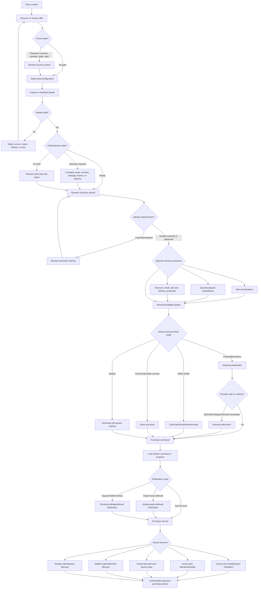

# End-to-End Purchase Coverage Matrix

Living, source-backed replacement for the purchase-flow Draw.io diagram.

> [!info] Source map complete; execution gaps remain
> Reachable unique behavior branches are mapped from backend rules and frontend reachability. **Source-mapped/Verified** does not mean every combination has run live. Provider, device, worker, race, rendered-artifact, and deployment-only proof remains explicitly listed in Open Gaps.

## Purpose

Answer four questions without flattening purchase into one linear journey:

1. Where can a buyer or seller start a purchase?
2. Which item, identity, configuration, payment, and fulfillment branches can apply?
3. Which transitions are valid, conditional, legacy, or unreachable?
4. Which source files prove each sequence?

The unit of coverage is a **unique behavior branch**, not every Cartesian permutation. A sequence is unique when it changes an API, validation rule, state transition, money path, issued outcome, or recovery path.

## Source Contract

- Backend source of truth: [[01 Repositories/Backend - web-app]]
- Frontend reachability: [[01 Repositories/Frontend - showpass-frontend]]
- Backend purchase overview: `web-app/docs/systems/ticket_basket_purchase_flow.md`
- Backend basket state: `web-app/docs/systems/ticket_baskets_checkout_state_and_inventory.md`
- Frontend route inventory: `showpass-frontend/packages/next-app/pages/`
- Frontend generated platform/item/gateway enums: `showpass-frontend/packages/core/src/shared/constants/enums/index.ts`
- Frontend public wizard: `showpass-frontend/packages/core/src/app-contexts/public/features/checkout/`

## How To Trace A Sequence

Build a sequence key from the applicable dimensions:

`ENTRY -> ITEM -> CONFIG -> IDENTITY -> BASKET -> CHECKOUT -> PAYMENT -> FINALIZE -> OUTCOME -> POST`

Example:

`E-WEB-EVENT -> I-TICKET -> C-GA -> A-GUEST -> B-PENDING -> C-QUESTIONS -> P-STRIPE-CARD -> F-WEBHOOK -> O-INVOICE+TICKET -> X-CONFIRMATION`

Use the IDs in the matrices below. Optional stages can be omitted. Interruptions such as login, password access, expiry, provider redirect, or inventory revalidation are inserted where they actually occur.

### Mapping Completion Contract

- **Source-mapped** means the entry, branch rules, purchase/finalization command, outcome, and negative boundary are supported by the referenced matrix/group rows and Evidence Index. It does not claim that a live provider/device/browser run was performed.
- **Execution pending** means source behavior is mapped but an environment-backed E2E, race, worker, rendered-artifact, or provider assertion remains in Open Gaps.
- **Candidate/unreachable/dormant** is reserved for a declared platform or model contract with no current consuming route/service, or for an intentionally impossible combination. It is not counted as a reachable purchase flow.
- A sequence row can cite a family rather than repeat every file path; its IDs resolve to the relevant grouped acceptance contract, configuration row, invalid rule, and backend/frontend anchor below.

## Canonical State Model

The diagram deliberately treats identity and provider authorization as conditional interruptions. They are not assumed to occur only once or at a universal fixed step.

## Backend Purchase Command Map

| ID | Command/action | Access and special rules | Converges on | Status |
| --- | --- | --- | --- | --- |
| API-U-BASKET | `POST /api/user/tickets/baskets/{id}/purchase/` | Basket access can be proved by session, authenticated owner, or basket UUID. Login is required when the basket disallows guest checkout, except Widget and legacy Facebook-order exceptions. `no_purchase` performs validation only. | `UserBasedTicketBasketInvoiceSaleSerializer` -> `UserBasedTicketBasketPurchaseService` | Verified |
| API-U-HOLD | `POST /api/user/tickets/baskets/holds/{tracking_link_slug}/purchase/` | Rejects expired links with `410` when hold expiry is enabled. Login is required when the held basket disallows guest checkout. `no_purchase` validates only. | Same user invoice-sale serializer/service | Verified |
| API-V-BASKET | `POST /api/venue/tickets/baskets/{id}/purchase/` | Requires seller basket access/box-office permission. `no_purchase` validates only and is not a terminal completion mechanism. | `VenueBasedTicketBasketInvoiceSaleSerializer` -> `VenueBasedTicketBasketPurchaseService` | Verified |
| API-V-HOLD | `POST /api/venue/tickets/baskets/{id}/hold/` | Creates basic/dynamic seller hold; expiry and async creation are feature-switch dependent. | Held `TicketBasket` later consumed by user hold or seller flow | Verified |
| API-U-STRIPE-PI | `POST /api/user/tickets/baskets/{id}/stripe/payment-intent/` | Creates/modifies PaymentIntent after basket validation. | Stripe webhook re-enters user purchase service as already paid | Verified |
| API-U-STRIPE-SI | `POST /api/user/tickets/baskets/{id}/stripe/setup-intent/` | Sets up an off-session/saved method lifecycle, including waitlist use cases. | Saved payment method state; later basket purchase | Verified family |
| API-U-YUNO | `POST/PUT /api/user/tickets/baskets/{id}/yuno/checkout-session/` | Creates/modifies Yuno checkout session and exposes eligible saved methods. | Yuno webhook re-enters user purchase service as already paid | Verified |
| API-U-INTERAC | `POST /api/user/tickets/baskets/{id}/interac/initial/` | Legacy/direct Interac initialization still exists in the viewset. | User purchase service with Interac charge/gateway data | Verified backend; UI unknown |
| API-V-TERMINAL-STATUS | `GET /api/venue/tickets/baskets/{id}/terminal-status/` | Classifies persisted terminal state as pending or final; does not itself finalize payment. | Square/Shift4 provider completion path | Verified |
| API-U-CLAIM | `POST /api/user/tickets/baskets/claim/` | Authenticated claim of a UUID-addressed basket after guest purchase. | Updates basket/order ownership | Verified |

Route registrations: `web-app/apps/users/api/routers.py`, `web-app/apps/venues/api/routers.py`, and `web-app/apps/main/api/routers.py`. Actions: `web-app/apps/tickets/api/user_based/viewsets.py` and `web-app/apps/tickets/api/venue_based/viewsets/viewsets.py`.

## Purchase-Service Invariants

| ID | Invariant | Sequence consequence | Backend evidence |
| --- | --- | --- | --- |
| B-LOCK | Purchase locks the basket row and rejects an existing `invoice_id` | Duplicate/replay attempts must not create a second invoice | `BaseTicketBasketPurchaseService.purchase()` |
| B-WAITLIST-EARLY | A waitlist basket exits before invoice/payment recording | Joining a waitlist is a purchase-command branch but not an ordinary paid invoice sequence | `purchase()` -> `_add_to_waitlist()` |
| B-WEBHOOK-PAID | Webhook purchase marks provider-confirmed basket state before invoice work and skips a second charge | Stripe/Yuno provider success must be traced separately from synchronous purchase submission | `_update_basket_for_webhook_purchase_success()` and `_perform_purchase()` |
| B-TOTALS | Basket and invoice totals are asserted before gateway/persistence completion | Every successful trace needs basket-to-invoice reconciliation | `_ensure_basket_totals_match_invoice_totals()` |
| B-SHIPPING | A required shipping address is inserted and validated before final save | Product/delivery configurations can block purchase after earlier checkout steps | `AddressUtils.needs_shipping_address()` branch |
| B-PAID | Final save attaches invoice, marks basket paid, copies billing/payment state, and rotates the checkout key | A completed sequence has one immutable invoice and a frozen paid basket | `_finalize_and_save_invoice_and_basket()` |
| B-CREDITS | Applied venue/exchange/gift-card credit is validated and consumed during save | Partial/full credit paths must validate scope, owner, amount, and remaining external tender | `_apply_credits_to_purchase()` |
| B-GIFTCARD | Gift-card credit generation happens after invoice items save | Gift-card success requires both paid invoice proof and stored-value proof | `GiftCardCreditGenerationService.generate()` |
| B-PRICE-LOCK | Purchased ticket types, product attributes, membership levels, gift-card denominations, and payment plans are price-locked | First purchase can change later editability; sequence verification must use locked purchase values | `_lock_price()` and `_lock_payment_plans()` |
| B-RETRY | Payment validation failure rotates idempotency outside the failed transaction | Retry should reuse the basket with a fresh key and still yield at most one paid result | `purchase()` exception path |
| B-TERMINAL-PENDING | First Square/Shift4 terminal call can intentionally return without a saved invoice while provider work is pending | Terminal initiation and terminal completion are separate states, not one request | `VenueBasedTicketBasketPurchaseService._post_purchase_tasks()` |
| B-POST-PAYMENT-FAIL | Provider payment can precede invoice/subscription/protection side effects; failures alert and re-raise | “Provider succeeded” is not sufficient proof of completed purchase | `UserBasedTicketBasketPurchaseService._post_purchase_tasks()` |

## Entry-Point Inventory

### Customer-Facing Web And Embedded

| ID | Surface | Concrete entry | Starts with | Status | Evidence / next proof |
| --- | --- | --- | --- | --- | --- |
| E-WEB-EVENT | Public event detail | `/[eventSlug]/` | Event/ticket discovery | Verified | `next-app/pages/[eventSlug]/index.tsx` |
| E-WEB-ATTRACTION | Public attraction hub | `/[eventSlug]/` when `attraction_event_config` exists | Ordered event/date/time-slot, direct-ticket, product, membership, redirect, and donation sections | Verified | attraction detail preset and `AttractionItemsTab.web.tsx` |
| E-WEB-SEATING | Public assigned seating | `/[eventSlug]/seating/` | Seat selection | Verified | `next-app/pages/[eventSlug]/seating/index.tsx` |
| E-WEB-PACKAGE | Public ticket package | `/[eventSlug]/ticket-package/` | Package selection | Verified | `next-app/pages/[eventSlug]/ticket-package/index.tsx` |
| E-WEB-MEMBERSHIP | Public membership detail | `/m/[membershipSlug]/` | Membership level | Verified | `next-app/pages/m/[membershipSlug]/index.tsx` |
| E-WEB-MEMBERSHIP-SEATING | Membership assigned seating | `/m/[membershipSlug]/seating/` | Membership/seat selection | Verified | `next-app/pages/m/[membershipSlug]/seating/index.tsx` |
| E-WEB-GIFTCARD | Organizer gift-card page | `/o/[venueSlug]/purchase-gift-card/` | Gift card/recipient | Verified | `next-app/pages/o/[venueSlug]/purchase-gift-card/index.tsx` |
| E-WEB-ORG-EVENT | Organizer profile event card | `/org/new/[venueSlug]/...` -> event card | Event detail feeder | Verified feeder | `OrganizerProfileEventCard.web.tsx` uses `getDiscoveryItemPath(event)`; purchase continues through `E-WEB-EVENT` |
| E-WEB-ORG-MEMBERSHIP | Organizer profile membership card | Organizer membership tab -> membership card | Membership detail feeder | Verified feeder | `OrganizerProfileMemberships.web.tsx` links to `frontend_details_url` or `/m/[slug]`; purchase continues through `E-WEB-MEMBERSHIP` |
| E-WEB-ORG-PRODUCT | Organizer profile product tab | Product category/search -> `ProductAddons.Products` | Direct product selection in a public basket | Verified | `OrganizerProfileProducts.web.tsx` creates `usePublicBasket()` with the embedded purchase platform and renders product add-on controls plus cart summary |
| E-WEB-ORG-GIFTCARD | Organizer profile gift-card modal | Organizer gift-card CTA -> `/o/[venueSlug]/purchase-gift-card/?gift_card_id=...` iframe/modal | Gift card/recipient | Verified | `OrganizerProfileGiftCardModal.web.tsx`; completion is reported by `showpass:gift-card-purchase:complete` |
| E-WEB-DISCOVERY | Showpass discovery/search | `/`, `/discover/...`, `/s/events...` | Event or membership detail feeder | Verified feeder family | Discovery cards use `getDiscoveryItemPath()`: event -> `/[slug]`, membership -> `/m/[slug]`; search result rows use backend `frontend_details_url`. These do not define a distinct basket/purchase service |
| E-WEB-SITE-EVENT | Website-builder direct event widget | `/site/[slug]/[[...page]]` -> `EventPurchase` button | Specific event; optionally restricted ticket-type IDs and keep-shopping mode | Verified | Puck `EventPurchase`/`ShowpassWidgetRenderer` |
| E-WEB-SITE-PRODUCT | Website-builder direct product widget | Site -> `ProductPurchase` button | Specific product | Verified | Puck `ProductPurchase` |
| E-WEB-SITE-MEMBERSHIP | Website-builder direct membership widget | Site -> `MembershipPurchase` button | Specific membership | Verified | Puck `MembershipPurchase` |
| E-WEB-SITE-CALENDAR | Website-builder calendar | Site -> button/modal or fully embedded `Calendar` | Venue/event-filtered calendar -> occurrence selection | Verified | Puck `Calendar`; `PuckEmbeddedCalendar` |
| E-WEB-SITE-LIST | Website-builder Event/Pass/Merchandise list | Filtered list/card -> purchase modal | Event, membership (`passes`), or product (`merchandise`) | Verified | `ShowpassListRenderer`; custom templates do not automatically mount the standard modal |
| E-WEB-SITE-CART | Website-builder cart button | Site `CartButton` with existing basket | Existing site basket | Verified | Puck `CartButton` |
| E-WEB-SITE-CHECKOUT | Website-builder embedded checkout | Site `Checkout` block | Existing basket -> cart summary/wizard | Verified | Puck `CheckoutRenderer`; configurable checkout/restart path |
| E-WEB-CHECKOUT | Existing basket | `/checkout/` | Rehydrated basket | Verified | `next-app/pages/checkout/index.tsx` |
| E-WEB-HOLD | Basic hold link | `/checkout/hold/[id]/` | Held basket review | Verified | `next-app/pages/checkout/hold/[id].tsx`; `BASKET_ON_HOLD_TYPE_MAP.BASIC` |
| E-WEB-DYNAMIC-HOLD | Dynamic hold | `/purchase-dynamic/?link=...` | Events/products/memberships in hold | Verified | `next-app/pages/purchase-dynamic/index.tsx`; dynamic hold basket serializer |
| E-WEB-TRACKING | Checkout/tracking link | `/checkout/link/[id]/` | Curated tracked basket | Verified | `next-app/pages/checkout/link/[id].tsx` |
| E-WEB-REFUND-PROTECTION | Post-purchase protection upsell | `/checkout/refund-protection/upsell/[token]/` | Protection-only follow-up | Verified | `next-app/pages/checkout/refund-protection/upsell/[token].tsx` |
| E-WEB-TRANSFER | Ticket transfer acceptance | `/checkout/transfers/[transaction_id]/` | Ownership/delivery acceptance, not a new paid sale | Classified non-purchase entry | Frontend route/auth/delivery and backend transfer claim mapped in `T-035`, `T-064`, `T-195`-`T-196` |
| E-ACCOUNT-MEMBERSHIP-RENEW | Customer membership detail | `/account/memberships/[membership_slug]` -> Renew | Existing Member(s) and level(s) | Verified | `MembershipDetailPage.web.tsx`; renewal modal adds `renewal_id` item groups |
| E-ACCOUNT-ORDER-RENEW | Customer order detail | `/account/my-orders/[transaction_id]/` -> Renew membership | Membership line from an earlier invoice | Verified | `AccountPurchaseItemActions.web.tsx`; same renewal modal |
| E-ACCOUNT-EXCHANGE | Customer order detail exchange | `/account/my-orders/[transaction_id]/` -> select eligible items -> start exchange -> browse venue events | Existing invoice items converted to exchange-credit context | Verified frontend family | exchange modal and `usePublicExchangeManager`; backend amount/eligibility proof pending |
| E-ACCOUNT-GIFTCARD-REDEEM | Customer credits page | `/account/credits` -> enter redemption code | Unclaimed gift-card credit becomes account-owned stored value | Verified | `RedeemGiftCardForm.web.tsx`; user-based `redeem-gift-card` action |
| E-WIDGET-EVENT | Event purchase widget | `/widget/tickets/events/purchase/[eventSlug]` | Password -> recurring child -> seats or ticket type -> custom package -> checkout; `steps` query can intentionally include only a subset | Verified | Route and `EventPurchaseContent.tsx` |
| E-WIDGET-EVENT-CHECKOUT | Widget checkout | `/widget/tickets/events/checkout/` | Existing widget basket | Verified | Next page route |
| E-WIDGET-EXPRESS | SDK express checkout | JavaScript SDK `expressCheckoutWidget()` -> configured express-checkout URL -> widget checkout | Existing basket and provider/browser eligibility | Verified SDK family | `sdk/features/checkout.ts`; configured URL exists although concrete Next page is not present in the page tree and needs rewrite proof |
| E-WIDGET-PRODUCT | Product purchase widget | `/widget/tickets/products/purchase/[productId]` | Product/variant selection | Verified | Next page route |
| E-WIDGET-MEMBERSHIP | Membership purchase widget | `/widget/tickets/memberships/[membershipSlug]` | Membership level | Verified | Next page route |
| E-WIDGET-CALENDAR | Calendar/attraction widgets | `/widget/calendar/...`, `/widget/tickets/events/calendar/...` | Calendar/date/time -> ticket type/quantity -> assigned seat or custom package -> checkout | Verified family | Routes and `CalendarWidget.tsx`; legacy vs heatmap variants still need comparison |
| E-SDK-CART | Embedded shopping-cart checkout | JavaScript SDK basket/cart -> `showpass.shopping-cart.checkout` -> checkout widget | Existing cross-widget basket | Verified SDK | `sdk/features/basket.ts` |
| E-SDK-PROVIDER-RETURN | Embedded provider redirect recovery | Parent page reload/redirect params -> SDK payment-redirect handler -> checkout widget reopens | Existing basket plus Affirm/Yuno/Alipay/other return parameters | Verified SDK family | `sdk/features/payment-redirect.ts`; provider-by-provider matrix pending |
| E-EXTERNAL-WORDPRESS | WordPress/custom site embedding a widget/link | External host -> widget/public URL | Same target as widget/link; no unique Showpass purchase command | Deployment-dependent indirect entry | Host code is outside inspected repos; widget/link target behavior is mapped under `E-WIDGET-*`/public routes |

### Buyer Mobile And Seller Surfaces

| ID | Surface | Starts with | Status | Evidence / next proof |
| --- | --- | --- | --- | --- |
| E-MOBILE-BUYER | Native buyer app Purchase screen | Event detail, membership URL, ordinary checkout, or direct tracking link loaded in WebView | Verified family | `mobile/src/screens/BuyerScreens/PurchaseScreen/PurchaseScreen.tsx`; WebView clears native cart and refreshes upcoming orders on `PURCHASE_COMPLETE` |
| E-BO-WEB | Dashboard web box office | Seller inventory/cart | Verified | `/manage/box-office/sell/` -> `/manage/box-office/checkout/` |
| E-BO-CUSTOMER-RENEW | Box-office customer membership renewal | Customer detail/memberships -> Renew -> keep/edit members and levels -> seller basket | Verified | `BoxOfficeMembershipRenewalAction.web.tsx`; `MembershipRenewalModal.web.tsx` with venue data provider |
| E-BO-DESKTOP | Electron desktop box office | Electron shell -> `/manage/box-office/sell` -> shared seller inventory/cart/checkout | Verified | `packages/desktop/src/main/window/MainWindow.ts`; preload exposes `ElectronView`, `getPlatform()` resolves `DESKTOP`, and `getBoxOfficePurchasePlatform()` selects `psp_desktop_box_office` |
| E-BO-MOBILE | Mobile box office | Dashboard -> Sell -> ticket/product/membership selectors -> cart/customer/discount -> checkout | Verified family | `MobileBoxOfficeScreen`; `useBoxOfficePurchase()` submits `psp_mobile_box_office` |
| E-POS-MOBILE | Mobile point of sale | POS device -> Sell/Checkin -> event/item selection -> cart -> payment | Verified family | `PointOfSaleScreen`; payment hook selects QPOS or mobile Square terminal platform |
| E-KIOSK | Kiosk | Event/recurring occurrence -> tickets/quantity/seats -> add-ons -> delivery -> cart -> email/phone -> Square payment -> confirmation | Verified family | `KioskNavigator`; footer submits `psp_square_kiosk` |
| E-SQUARE-QPOS | Square POS/QPOS handoff | Mobile POS seller cart -> Square QPOS payment | Verified mobile branch | `usePointOfSalePayment()`; current OAuth and deprecated platform IDs still require classification |
| E-TERMINAL | Square or Shift4 terminal | Seller cart -> asynchronous card-present payment | Verified family | Backend `square_terminal_box_office.md`; platform enum has web/desktop/mobile variants |

### Generated, API, And Legacy Sources

| ID | Source | Classification | Status | Notes |
| --- | --- | --- | --- | --- |
| E-AUTO | Auto-generated purchase/issuance | Non-interactive system branch | Verified family | Membership-generated tickets use auto-generated payment/platform values |
| E-API-USER | User basket API | API purchase surface | Verified family | User basket routes and `/purchase/` action; exact supported clients pending |
| E-API-VENUE | Venue basket API | Seller/API purchase surface | Verified family | Venue basket routes and `/purchase/` action |
| E-FACEBOOK | Facebook MPP | Legacy external commerce | Legacy | Generated platform enum marks deprecated |
| E-GOOGLE-RESERVE | Google Reserve | Legacy external commerce | Legacy | Generated platform enum marks deprecated |
| E-QPOS-LEGACY | Quick POS / old Square variants | Legacy seller commerce | Legacy | Preserve in historical/order analysis; do not count as current reachable UI without proof |

## Purchasable And Financial Item Types

Backend purchase outcomes and the generated frontend enum establish these basket item families.

| ID | Item type | Selection/configuration anchor | Purchase outcome | Current surface notes | Status |
| --- | --- | --- | --- | --- | --- |
| I-TICKET | `ticket` | Event -> TicketType; GA, assigned seating, attraction, package child/parent, resale/waitlist variations | Invoice + TicketItem(s) | Public, widget, seller, mobile, kiosk | Verified family |
| I-PRODUCT | `product` | Product -> ProductAttribute/variant; standalone or checkout add-on | Invoice + TicketItem(s), delivery/fulfillment state | Widget, dynamic hold, public add-on, seller | Verified family |
| I-MEMBERSHIP | `membership` | MembershipGroup -> MembershipLevel; new, renewal, seasonal branches, plus pre-purchase basket upgrade offers | Invoice + Member/benefits | Public, widget, holds, seller | Verified family |
| I-GIFTCARD | `gift_card` | GiftCard -> denomination/recipient | Invoice + UserCredit/stored value | Organizer page, seller; some platform exclusions | Verified family |
| I-DONATION | `donation` | Event/venue charity config attached to a basket that contains a sellable item | Invoice donation line | Public/widget/seller where configured; not a proven standalone offer | Verified attached-line family |
| I-TIP | `tip` | Provider-returned card-present tip, not an independently selected catalog item | Zero-ticket invoice tip line; delayed provider recovery can create a related tip invoice | Declared for Square/Shift4/POS platform families; end-to-end backend proof currently exists for Square QPOS | Verified Square QPOS family; other terminal families pending |
| I-USER-CREDIT | `user_credit` | Existing gift-card/account/exchange credit ledger | Applied value/payment component, not ordinarily a standalone public catalog offer | Identity and balance dependent | Candidate classification |
| I-PROTECTION | `protection` | Protected basket item group or tokenized post-purchase upsell | Protection invoice/item/policy linkage | Public/widget/mobile; post-purchase token route | Verified family |

## Source Platform Constraints

This is the current generated frontend contract. It is valuable for finding impossible combinations, but backend validation still decides final validity.

| Platform ID | Item types declared | Payment types declared | State |
| --- | --- | --- | --- |
| `psp_web` | ticket, product, donation, membership, gift card, protection | card, free, Affirm | Current |
| `psp_widget` | ticket, product, donation, membership, protection, gift card | card, Affirm, free | Current |
| `psp_mobile` | ticket, product, membership, gift card, donation, protection | card, free | Current |
| `psp_web_box_office` | ticket, product, membership, gift card, donation | cash, card, comp, free, other | Current |
| `psp_desktop_box_office` | ticket, product, membership, gift card, donation | cash, card, comp, free, other | Current |
| `psp_mobile_box_office` | ticket, product, membership | cash, card, comp, free, other | Current |
| `psp_square_terminal_oauth` | ticket, product, tip, membership, gift card, donation | card | Current |
| `psp_square_qpos_oauth` | ticket, product, tip, membership, gift card | cash, card, comp, free | Current |
| `psp_square_kiosk` | ticket, product, tip, membership | card, free | Current |
| `psp_square_terminal_desktop` | ticket, product, tip, membership, donation | card | Current |
| `psp_shift4_terminal` / `_desktop` | ticket, product, tip, membership | card | Current |
| `psp_square_terminal_oauth_mobile` | ticket, product, tip, membership | card | Current |
| `psp_facebook`, `psp_google_reserve`, `psp_qpos`, old Square QPOS/terminal | Narrow legacy declarations | Narrow legacy declarations | Deprecated |
| `psp_auto_generated` | No interactive declaration | No interactive declaration | Current system-only |
| `psp_unknown` | None | None | Diagnostic/fallback, not a target flow |

## Dynamic Public Checkout Sequence

The public checkout wizard registers steps conditionally; this is not a fixed five-step flow.

| ID | Step/interrupt | Registration rule found in frontend | Sequence effect | Status |
| --- | --- | --- | --- | --- |
| C-LOGIN | Login/guest decision | User is logged out and basket is not group sale | Login, signup, or guest resolution before later steps | Verified |
| C-ADDONS | Add-ons | Add-ons eligible, loaded, and present | Can add products, events, or donations and mutate basket | Verified |
| C-REVIEW | Review | Registered as core step | Validates delivery and required product/package selections | Verified |
| C-QUESTIONS | Questions/info | Enhanced info, address, custom questions, or per-guest info exists; excluded for group sale | Captures purchaser/guest/item data | Verified |
| C-PAYMENT | Payment/confirmation | Core step | Free, regular, waitlist, wallet, redirect, or saved-method branch | Verified |
| C-GROUP-SALE-SKIP | Group-sale hold | Logged-out group-sale basket | Wizard skips directly to payment | Verified |
| C-EXPRESS-SKIP | Express checkout return | `express_checkout=true` | Wizard navigates/returns directly to payment processing | Verified |
| C-PROVIDER-RETURN | Provider return | Stripe/Affirm PaymentIntent params or Yuno redirect params | Re-enters payment step | Verified |
| C-APPLY-CODE | Checkout summary discount/gift-card dialog | Buyer opens code dialog from an active basket | Discount code mutates pricing; gift-card code first claims account credit, refreshes balances, then applies eligible credit | Verified frontend; authentication interrupt must be traced |
| C-BASKET-ERROR | Basket invalidation | Empty/expired outside valid processing/confirmation exception | Error state; recovery required | Verified |

### Widget Selection Steps Before Checkout

| ID | Step | Registration / branching rule | Status |
| --- | --- | --- | --- |
| W-PASSWORD | Password protection | Registered when event is password protected and the widget has not authorized it | Verified |
| W-CHILD-EVENT | Recurring child event | Registered when event has child events or is a recurring parent | Verified |
| W-SEATING | Assigned seating | Registered when selected parent/child event has assigned space | Verified |
| W-EVENT-DETAIL | Ticket type/quantity | Used when the selected event is not assigned seating | Verified |
| W-CUSTOM-PACKAGE | Custom package choice | Registered after a selected ticket type exposes the custom package target | Verified |
| W-CALENDAR | Calendar/date/time/quantity | Calendar widget selects occurrence and quantity before seating/package/checkout | Verified family |
| W-CHECKOUT | Embedded checkout | Runs login/guest, add-ons, review, questions, and payment steps; logged-out login step is forced to guest UI | Verified |
| W-SUBSET | Caller-defined partial wizard | Event widget `steps` query may omit normal steps, including checkout; such a configuration is an offer/selection embed, not necessarily a completed purchase entry | Verified |

Widget routes accept a valid `purchase_source_platform` query value and otherwise default to `psp_widget`. This makes embedded platform attribution configurable and requires backend validation; it is not safe to infer platform only from the URL.

Source: `useCheckoutWizard.ts`, `CheckoutContent.web.tsx`, and the files under `components/CheckoutSteps/`.

## Identity And Authentication Contexts

| ID | Context | Where it can interrupt | Behavior to trace | Status |
| --- | --- | --- | --- | --- |
| A-ANON | Anonymous before basket | Access-gated offer, direct URL, or selection | May resolve password/access without account auth; later checkout can remain guest or interrupt for auth | Verified backend/frontend family |
| A-GUEST | Guest purchaser | Public login step only when venue permits guest checkout and basket is not waitlist; Widget forces guest UI for logged-out buyers | Purchaser info stored on basket/invoice; guest order staging/claim path. Backend has a Widget guest exception independent of ordinary venue guest permission. | Verified family |
| A-LOGIN-PASSWORD | Existing account, email/password | Public checkout login step, transfer acceptance, account-only action, expired session, or native-login handoff | Basket ownership/rehydration and saved credits/methods can change. Native buyer screen reloads the purchase WebView after native login. | Verified family; edge recovery pending |
| A-LOGIN-OTP | Existing account requiring email OTP | Password submit returns `requires_otp`; six-digit verify or timed resend occurs inside the same authentication container | Only successful OTP invokes auth completion; invalid code clears input and remains in the interrupt | Verified frontend |
| A-PASSWORD-RESET | Existing account forgot-password flow | Login container swaps to reset screen and returns to login | Does not itself advance checkout; basket remains mounted while user resets and then logs in | Verified frontend; email-link round trip pending |
| A-LOGIN-GOOGLE | Existing/new account, Google OAuth | Checkout authentication container when feature enabled | Popup callback uses a broadcast channel, then checkout must refresh user/basket state without losing selection | Verified frontend branch; end-to-end recovery pending |
| A-LOGIN-FACEBOOK | Existing/new account, Facebook OAuth | Checkout authentication container when available; hidden on Android WebView | Popup callback returns to checkout; Android native buyer path cannot use this branch | Verified frontend constraint |
| A-LOGIN-SSO | Existing account, organization SSO | Login form -> SSO email/provider resolution | External SSO return must preserve basket/session | Verified frontend branch; provider matrix pending |
| A-SIGNUP | New account by form, Google, or Facebook | Checkout auth UI or external auth callback | Basket must survive account creation and return | Verified frontend family; persistence proof pending |
| A-LOGGED-IN | Authenticated customer | Entry or post-interruption | Saved cards, credits, memberships, purchase limits, ownership apply | Verified family |
| A-GROUP-SALE | Group-sale recipient | Hold link/payment | Logged-out flow can skip login and go to payment | Verified |
| A-MEMBER | Authenticated/identified member | Member-only offer, benefit, renewal, hold link | Eligibility and benefit state can gate selection or issuance | Candidate cross-flow |
| A-SELLER | Venue employee/seller | Box office/POS/kiosk setup | Venue permissions, seller access, customer selection, tender choices apply | Verified family |
| A-PROVIDER | External payment authorization | 3DS, redirect method, wallet, Yuno, Affirm | Return may occur after session/basket state changes | Candidate matrix |
| A-CLAIM | Guest order claim/connect | Post-purchase claim URL/account connection | Must attach only to matching authorized account | Verified family |

### Authentication Interrupt And Re-entry Matrix

Account authentication is an interrupt that can be invoked by several surfaces. It must return to the calling state and operate on the same basket/artifact; it is not a fixed node that always occurs before item selection.

| Interrupt ID | Trigger location | Allowed resolution branches | Re-entry behavior | Status |
| --- | --- | --- | --- | --- |
| AUTH-I01 | Ordinary public checkout reaches login step while auth state is false | Password, password+OTP, Google, Facebook except Android WebView, SAML, signup, password reset then login, or guest when venue allows | Auth profile is refetched; checkout writes id/name/email/phone onto the existing basket, marks step valid, and advances | Verified frontend |
| AUTH-I02 | Widget checkout is logged out | Forced guest form rather than ordinary account tabs | Persist guest customer on existing widget basket, then advance | Verified frontend/backend exception |
| AUTH-I03 | Waitlist checkout is logged out | Account login/signup/OAuth/SSO; guest button is hidden | Authenticated identity and optional saved/off-session method are required before subscriber state | Verified frontend family |
| AUTH-I04 | Group-sale basket is logged out | No login step | Wizard may go directly to payment; backend group-sale rules remain authoritative | Verified frontend |
| AUTH-I05 | Transfer acceptance loads before auth profile resolves or while logged out | Shared authentication container; no guest resolution | Login step registers for `undefined` or false auth so accept cannot race into 401 | Verified frontend |
| AUTH-I06 | Customer opens account renewal, exchange, credits, or order action without a valid session | Account route authentication, then return/retry action | Existing Member/invoice/credit artifact must be reloaded before commerce mutation | Verified entry family; return URLs pending |
| AUTH-I07 | Public checkout applies gift-card code while logged out | Authenticate, claim code to account, refresh credits, retry/apply | User-scoped redemption cannot become anonymous basket credit; box-office code-only is the explicit exception | Verified backend family; UI return pending |
| AUTH-I08 | Google/Facebook OAuth popup authenticates | Broadcast message or popup-close session reconciliation | Refetch auth profile; only invoke purchase caller success if a profile exists | Verified frontend |
| AUTH-I09 | SAML login on normal browser | Resolve organization by email, open popup, then broadcast/popup-close reconciliation | Same profile-refetch and basket-customer update as other account auth | Verified frontend |
| AUTH-I10 | SAML login in native WebView | Resolve organization, then full-page navigation to provider | Provider return must restore WebView basket/session and invoke auth completion | Frontend outbound branch verified; return proof pending |
| AUTH-I11 | Native purchase WebView sends `LOGIN` | Arm reload flag, navigate to native `LoginScreen`, return focus | If native JWT exists, bump WebView key and reload original event/membership/checkout URL; otherwise clear flag without remount | Verified mobile frontend |
| AUTH-I12 | Desktop box office login | Password/OTP/SSO; signup link hidden on desktop | Authenticated dashboard resumes shared seller route and retains Electron platform detection | Verified frontend family |
| AUTH-I13 | Provider 3DS/wallet/BNPL redirect | External payment authorization, not Showpass account auth | Re-enter payment state with same basket/provider intent; a concurrent Showpass session change must still refetch basket | Payment return mapped; auth-change race pending |

### Authentication Completion Contract

1. Resolve auth without discarding the caller's basket/artifact identifier.
2. Refetch the authenticated profile rather than trusting only a popup/native success signal.
3. Update or reload the existing basket customer and auth-dependent pricing, limits, credits, methods, and memberships.
4. Resume the invoking step: selection gate, login step, transfer accept, account action, code application, or payment return.
5. Revalidate inventory, hold expiry, access, totals, and provider state because they may have changed during the interrupt.
6. Do not create a second basket merely because identity changed.

### Guest Order Claim Rules

Claim is post-purchase ownership migration, not another payment. A successful claim atomically moves the basket, invoice, ticket items/groups, members and their unowned benefit hold baskets, protection record, voucher credits, and shipping-address creator to the matching account. It also creates virtual-session purchaser participation where required.

| Rule ID | Condition | Result | Status |
| --- | --- | --- | --- |
| CLAIM-001 | Request is anonymous | Reject with authentication error | Verified test |
| CLAIM-002 | Basket already has an owner | Reject as already claimed | Verified model/test |
| CLAIM-003 | Account email differs from guest basket email | Reject and direct buyer to matching account; comparison is case-insensitive | Verified model/test |
| CLAIM-004 | Account email matches and basket is unclaimed | Transfer ownership of all linked artifacts in one transaction | Verified model/test |
| CLAIM-005 | Claim URL requested before invoice exists | No claim URL is produced | Verified model |

## Payment And Finalization Branches

### Tender / Method

| ID | Method | Eligibility / surface | Finalization pattern | Status |
| --- | --- | --- | --- | --- |
| P-FREE | Free/zero total | Supported public/widget/mobile/seller platforms | Direct purchase service | Verified family |
| P-COMP | Complimentary | Seller platforms | Direct purchase service | Verified family |
| P-CASH | Cash | Seller platforms | Synchronous venue purchase | Verified family |
| P-OTHER | Configured other tender | Seller platforms | Synchronous venue purchase with other-payment metadata | Verified family |
| P-CARD-MANUAL | Manual card entry | Public and seller card-capable paths | Gateway-dependent | Verified family |
| P-CARD-SAVED | Saved card | Logged-in; gateway/account eligibility | Stripe or Yuno token path | Verified family |
| P-WALLET | Apple Pay / Google Pay express wallet | Wallet/browser/gateway eligibility | Stripe-style express/redirect return | Candidate detail |
| P-AFFIRM | Affirm | Venue enabled, redirect allowed, minimum amount met; web/widget enum | Redirect and return to payment/finalization | Verified family |
| P-ALIPAY | Alipay | Stripe, CAD/USD basket+gateway, waffle enabled, redirects allowed | Redirect and return | Verified frontend eligibility |
| P-WECHAT | WeChat Pay | Stripe, CAD/USD basket+gateway, waffle enabled, redirects allowed | Redirect and return | Verified frontend eligibility |
| P-CREDIT | User/gift-card/exchange credit | Balance, ownership/code, and basket applicability | Partial or full coverage; may combine with external tender | Candidate matrix |
| P-PAYMENT-PLAN | Payment plan | Eligible configuration and schedule | Initial checkout plus recurring lifecycle | Verified family |
| P-TERMINAL | Square/Shift4 card-present | Seller paired terminal/platform | Async poll/webhook finalization | Verified family |
| P-INTERAC | Interac Online | Backend venue defaults, callback code, invoice/refund metadata, and historical orders remain | Current `usePaymentOptions()` never appends Interac; root API registration is commented and no inspected dashboard URL registers `interac_funded` | Dormant purchase path; supported historical artifact |
| P-AFTERPAY | Afterpay | Public catalog requests still ask backend for Afterpay pricing; venue flag, fee totals, Stripe PaymentIntent invoice sync, and refunds remain | Current `usePaymentOptions()` never appends Afterpay and the handler factory has no Afterpay-specific redirect handler | Backend-supported/dormant selection; not a current UI entry |

### Gateway / Orchestrator

| ID | Gateway | Evidence | Status |
| --- | --- | --- | --- |
| G-STRIPE | Stripe | Generated gateway enum; PaymentIntent and webhook purchase services | Verified |
| G-INTERNAL | Internal/Showpass no-processor gateway | Current payment factory uses it for free baskets and waitlists without card verification | Verified frontend |
| G-AUTHNET | Authorize.net | Current payment factory and Accept.js UI; regular-payment handler | Verified current frontend family |
| G-BEANSTREAM | Beanstream/Bambora | Backend gateway, Interac completion helper, refund/reconciliation, and stored gateway records remain; current public `PaymentGatewayFactory` has no implementation | Dormant/historical backend artifact; no current frontend confirmation path |
| G-BRAINTREE | Braintree | Backend gateway and Facebook MPP integration remain; current public `PaymentGatewayFactory` has no implementation | Legacy Facebook/invoice artifact; no current public checkout confirmation path |
| G-SQUARE-QPOS | Square QPOS gateway | OAuth/current and deprecated platform declarations; seller transaction lookup, purchase metadata, tip extraction, and recovery tests | Verified backend family; client/provider-version classification partial |
| G-YUNO | Yuno | Generated gateway enum; checkout session and webhook finalization | Verified family |
| G-SQUARE-TERMINAL | Square terminal integration | Backend terminal system doc | Verified family |
| G-SHIFT4-TERMINAL | Shift4 terminal using venue terminal state | Backend terminal system doc and platform enum | Verified family |

### Dormant And Historical Payment Contracts

| Contract | Code that remains | Current reachability finding | How to treat in coverage |
| --- | --- | --- | --- |
| Interac Online | CAD venue default flag, Beanstream completion callback, payment type, refunder, reports | No option in current checkout; root API registration is commented; inspected URL modules do not register callback | Test historical refunds/reporting and migrations; do not advertise as a current buyer sequence without an external route proof |
| Afterpay | Venue flag, alternate fee total, price queries, Stripe PaymentIntent invoice sync, refund rules | Catalog APIs still calculate it, but current option builder and handler set expose Affirm instead | Test persisted Afterpay orders and backend calculations; mark new checkout initiation unreachable |
| Beanstream/Bambora | Gateway class/factory, Interac helper, gateway-info models, reconciliation/refund code | Current frontend gateway factory rejects it | Preserve operational/regression coverage for old orders; no current public-entry trace |
| Braintree | Gateway class/factory, gateway-info models, Facebook MPP serializer | Current frontend gateway factory rejects it; associated Facebook platform is deprecated | Preserve historical Facebook/refund coverage; no current public-entry trace |

### Checkout Payment Orchestration

The current public checkout selects a business handler first, then a concrete gateway. This prevents invalid combinations even when both values exist independently in generated enums.

| Handler ID | Selection condition | Allowed gateways | Confirmation/finalization | Status |
| --- | --- | --- | --- | --- |
| H-FREE | Basket is zero-cost | Internal only | Synchronous basket purchase; no third-party processor; invoice then retrieved | Verified frontend |
| H-WAITLIST-NOCC | Waitlist does not require card verification or is zero-cost | Internal only | Purchase creates waitlist state without invoice; frontend polls basket until waitlisted | Verified frontend |
| H-WAITLIST-CC | Waitlist requires future card charge | Stripe only | Setup mode saves a method and confirms deferred/off-session use; setup-intent success precedes subscriber state; frontend polls basket, not invoice | Verified frontend/backend family |
| H-AFFIRM | Basket payment type is Affirm | Stripe only | Stripe BNPL confirmation; redirect/asynchronous confirmation and capture; invoice polling after return | Verified frontend |
| H-REGULAR-STRIPE | Ordinary paid basket on Stripe | Stripe | PaymentIntent create/modify and confirm; success webhook locks basket and calls normal purchase service without charging twice; invoice polling handles delay | Verified family |
| H-REGULAR-AUTHNET | Ordinary paid basket on Authorize.net | Authorize.net | Accept.js tokenization with bounded transient recovery followed by synchronous auth-capture basket purchase; regular handler then invoice retrieval | Verified frontend/backend family; sandbox browser E2E pending |
| H-REGULAR-YUNO | Ordinary paid basket on Yuno | Yuno | Checkout session plus SDK one-time/vaulted token; payment purchase webhook can finalize through normal purchase service; frontend awaits SDK result and invoice | Verified family |
| H-REGULAR-UNKNOWN | Ordinary paid basket on any other generated gateway | None in current factory | Frontend throws payment configuration error before confirmation | Verified frontend unreachable |

### Stripe PaymentIntent State Branches

| State/event | Basket behavior | Retry/idempotency expectation | Status |
| --- | --- | --- | --- |
| Intent absent or previously canceled | Create a new intent | New intent ID becomes basket payment object | Verified API |
| Existing usable intent | Retrieve/modify amount and metadata | Reuse avoids duplicate intent creation | Verified API |
| `payment_intent.succeeded` | Webhook resolves and row-locks basket, marks webhook-paid state, and invokes purchase service | External charge is skipped; repeated success against paid basket must not create another invoice | Verified backend/tests |
| `payment_intent.payment_failed` | Store failure/cancel or requires-payment-method state depending on basket/hold context | Held basket in purchase-in-progress remains retryable; already released hold stays expired | Verified backend/tests |
| `payment_intent.canceled` | Store canceled outcome and allow a future intent where basket remains eligible | Held in-progress basket retains enough state for retry | Verified backend/tests |
| Gateway changes while intent exists | Clear incompatible Stripe intent state | New gateway must initialize its own payment object | Verified integration test |
| Provider success followed by Showpass post-payment failure | Alert/re-raise after payment; invoice/side effects may be incomplete | Requires operational reconciliation, not blind customer retry | Verified purchase-service invariant |

### Provider Failure And Replay Acceptance Groups

| Acceptance group | States to trace | Retry/replay contract | Status |
| --- | --- | --- | --- |
| PAYPROV-AUTHNET-SDK | Accept.js loading, loaded, missing/misconfigured keys, missing card elements, transient `E_WC_14`/empty response, terminal input/credential error, stale SDK | Await one in-flight load; retry a frozen card snapshot at most twice for transient errors; one stale-SDK hard reload; never retry terminal input/credential errors automatically | Verified frontend |
| PAYPROV-AUTHNET-SUBMIT | Opaque nonce created, backend auth-capture approved, invalid credentials, declined/validation response, null response, test-mode transaction ID, fraud-review 252/253, duplicate submission | Reuse one in-flight confirm promise client-side; provider duplicate window is rollout-controlled; backend separates merchant auth errors from card/payment errors and alerts accepted review holds | Verified backend/frontend family |
| PAYPROV-STRIPE | Intent create/reuse/modify, requires action, succeeded, failed, canceled, webhook replay, stale PIP recovery | Intent ID and basket lock are idempotency anchors; success finalizes already-paid basket once; failure returns eligible basket to pending/hold; stale state is reconciled operationally | Verified backend/frontend family |
| PAYPROV-YUNO | Session create/update, SDK one-time/vaulted method, purchase `SUCCEEDED/DECLINED/PENDING/CANCELED/MANUALLY_REVIEW/EXPIRED/ERROR/unknown`, cancel webhook, missing/multiple basket, local post-payment error | Success row-locks and finalizes once; cancel resets then expires; non-success purchase statuses are logged and await their matching lifecycle event; lookup/post-payment failures alert/log rather than guessing | Verified backend/frontend family |
| PAYPROV-SQUARE | Terminal request create, pending, completed, canceled, failed, webhook replay, missing basket/device, zero/multiple payment IDs, payment-detail fetch failure | First request creates no invoice; webhook/poll uses stored checkout ID and row lock; final states are idempotent; non-payment terminal outcome returns same basket to pending and clears stale checkout on retry path | Verified backend family |
| PAYPROV-SHIFT4 | Async task queued, in-progress marker, blocking device sale, success response, API/network failure, local finalization failure | Basket row is locked by manager; success stores terminal token/response then finalizes same basket; provider exception marks canceled/pending; local post-payment failure must be reconciled, not blindly resubmitted | Verified backend family |
| PAYPROV-REPLAY | Double click, duplicate webhook, polling plus webhook, task retry, paid-basket purchase retry, stale provider return | Client in-flight guard plus basket row lock, provider/session ID, invoice guard, and rotated checkout key must yield at most one invoice and one entitlement set | Verified cross-provider invariant |
| PAYPROV-POSTPAY | Provider says paid but Showpass invoice/entitlement/protection/subscription work fails | Preserve external evidence, emit critical alert/error log, and enter reconciliation; customer retry is permitted only after proving no provider payment | Verified cross-provider invariant |

### Wallet And Redirect Eligibility

| Method | Additional conditions | Blocking/re-entry behavior | Status |
| --- | --- | --- | --- |
| Apple Pay / Google Pay | Browser/device wallet availability, credit tender, compatible Stripe or Yuno wallet element | Basket update, terms, optionally protection choice, and Yuno manual shipping address can block click; provider success feeds purchase data | Verified frontend family |
| Alipay | Stripe gateway, redirects allowed, basket and gateway currency eligible, venue flag enabled | Uses wallet confirmation strategy and redirect return | Verified frontend |
| WeChat Pay | Stripe gateway, redirects allowed, basket and gateway currency eligible, venue flag enabled | Uses wallet confirmation strategy and redirect return | Verified frontend |
| Affirm | Venue option enabled, redirects allowed, total meets minimum, Stripe gateway | Dedicated BNPL handler; return parameters re-enter payment/invoice polling | Verified frontend |
| Saved Stripe card | Logged-in method belongs to current gateway | Regular handler reuses stored method; may still require asynchronous confirmation | Verified frontend family |
| Saved Yuno card | Yuno SDK returns vaulted method for current customer/session | Regular Yuno handler purchases with vaulted token | Verified frontend family |

### Payment Validation Rules

| Rule ID | Condition | Backend result | Sequence implication | Status |
| --- | --- | --- | --- | --- |
| PAY-001 | `free` tender with a non-zero basket | Reject `payment_type` | Free is an outcome of totals, not merely a UI choice | Verified |
| PAY-002 | Full user/exchange credit | Credit must be applied and reduce total to zero; backend then persists the corresponding credit payment type | No external card payload is required for a truly full-credit basket | Verified; rollout flag has legacy branch |
| PAY-003 | Partial user/exchange credit | Remaining total requires a normal payment type | Trace must contain both credit application and external/seller tender | Verified |
| PAY-004 | System/card tender in seller context | Seller and inventory must permit credit-card sales | Platform declaration alone does not authorize the seller | Verified |
| PAY-005 | Cash tender | Seller venue/user inventory permissions must allow cash | Seller permission denial is a distinct failure state | Verified |
| PAY-006 | Other tender | Seller context must permit it and an `other_custom_type` is required | “Other” must trace its subtype; subtype is invalid on every other tender | Verified |
| PAY-007 | Complimentary tender | Payment venue must be the seller venue and seller needs comp permission | Cross-venue comp is invalid | Verified |
| PAY-008 | System gateway on GBP basket | Gateway currency must also be GBP | Currency mismatch blocks finalization | Verified |
| PAY-009 | System/card tender without card payload | Reject unless a saved method exists or the path is terminal, QPOS, wallet, Yuno webhook, Facebook MPP, or waitlist | Provider-specific state can replace local card input | Verified |
| PAY-010 | `Other` on a zero-value basket with no subtype and auto-resolve switch enabled | Coerce payment type to free | Feature-flag state changes otherwise invalid input into a free purchase | Verified |

## Fulfillment And Delivery Matrix

Checkout delivery is evaluated per item group, not once per basket. Mixed baskets can therefore contain several delivery selections and one shared shipping address requirement.

| ID | Mode | Eligible item families | Checkout behavior | Post-purchase behavior | Status |
| --- | --- | --- | --- | --- | --- |
| F-ELECTRONIC | `st_print`, displayed as Electronic ticket | Ticket, product, membership | Public checkout does not require a shipping-mode choice when this is the only option; ticket UI offers email/print delivery variants | Electronic confirmation, printable artifact, digital pass, or account item depending on family | Verified frontend family |
| F-WILL-CALL | `st_will_call` | Ticket, product, membership | Review displays will-call/pickup; branding can rename the label | Organizer/seller fulfills or admits at venue | Verified frontend family |
| F-DELIVERY | `st_delivery`, displayed as Standard shipping | Ticket, product, membership | Review requires delivery selection and shipping address; allowed countries, blocked regions, and quantity threshold apply | Invoice exposes shipping address and fulfillment status | Verified frontend family; backend rules partial |
| F-MIXED | Multiple allowed shipping types on one or more groups | Ticket, product, membership | Buyer must resolve each pending group; selected methods are persisted for checkout recovery | Each item group retains its selected method | Verified frontend |
| F-NONE | Financial/non-shippable line | Donation, tip, protection, user credit | Excluded from delivery-method selection | Financial or policy/ledger outcome only | Verified frontend classification |
| F-GIFT-EMAIL | Gift-card recipient delivery | Gift card | Recipient data and immediate/scheduled notify date are collected separately from basket shipping | Generated code/stored value is emailed immediately or by scheduled task | Verified backend family |
| F-SEAT/BARCODE | Ticket activation/delivery variants | Ticket/package | Can combine electronic/will-call/delivery with delayed, external, universal, customer-activated, parent, or child barcode rules | Determines when and which barcode becomes usable | Partial |

### Fulfillment Constraints To Trace

- Delivery method selection is required only for eligible item groups whose allowed methods are unresolved; public `st_print` alone is treated as electronic delivery without a shipping-mode decision.
- A delivery-selected item makes shipping address validation required at payment.
- Venue allowed-country, blocked-region, and shipping-quantity settings can invalidate an otherwise purchasable basket.
- A basket over its shipping quantity limit must have valid fallback delivery modes for affected items; otherwise backend validation rejects it.
- Transfer acceptance can independently prompt the recipient for updated shipping information when transferred items require it.

## Mixed-Basket Compatibility Matrix

`Allowed` means the source proves the combination can coexist at basket level. It does not imply every platform, discount, gateway, or delivery combination is valid.

| Rule ID | Composition / modifier | Result | Reason / effect | Status |
| --- | --- | --- | --- | --- |
| MIX-001 | Ticket + product + membership | Allowed in ordinary and dynamic-hold basket models | Purchase produces item-specific outcomes; membership presence forces member creation before confirmation dispatch | Verified backend family |
| MIX-002 | Ticket + product + membership + compatible flat discount | Allowed where all selected items have discount permissions and compatible fee calculation | Discount applies to eligible groups | Verified venue basket test |
| MIX-003 | Ticket + donation | Allowed when charity and donation processing are valid | Donation is attributed to the ticket event/venue and does not count toward ticket purchase quantity | Verified backend/tests |
| MIX-004 | Product or membership + donation without event ticket | Rejected by current donation cleaner | Donation V1 derives venue from a ticket type and explicitly excludes product/membership-only parent context | Verified backend |
| MIX-005 | Eligible protected item + protection group | Allowed after tokenized update | Protection group links to a covered group and is excluded from ordinary discount state | Verified backend/tests |
| MIX-006 | Protection-only post-purchase upsell basket | Allowed only for the dedicated upsell record | Any non-protection mutation is rejected | Verified backend |
| MIX-007 | Gift card purchase + any applied user/gift/exchange credit | Rejected when legacy credit validator is active | Stored value cannot be bought using stored value in the same basket | Verified backend/test; itemized rollout branch pending |
| MIX-008 | Ordinary purchasable items + partial credit | Allowed when credit is valid and gateway/itemized rules permit it | Credit reduces total and remaining amount uses normal tender | Verified backend family |
| MIX-009 | Seller box-office gift card + ticket/product/membership without applied stored-value credit | Allowed in the current venue basket; gift-card sender/customer stays attached, while group-sale/hold conversion is disabled | One invoice can issue stored value and ordinary artifacts; public-web mixed creation remains unproven | Verified backend model/frontend box-office reachability; purchase E2E pending |
| MIX-010 | One sold-out waitlist ticket type only | Allowed | Purchase command creates subscriber state, not invoice | Verified backend |
| MIX-011 | More than one waitlist type | Rejected | One waitlist type is allowed per basket | Verified backend/test |
| MIX-012 | Waitlist ticket + ordinary ticket | Rejected | Waitlist and immediate purchase have incompatible completion semantics | Verified backend/test |
| MIX-013 | Regular-fee + itemized-fee groups with no sensitive modifier | Basket can exist | Totals retain both calculation paths | Verified model family |
| MIX-014 | Mixed fee-calculation groups + flat discount | Rejected; process one side separately | Discount cannot safely span different fee calculations; protection-only regular side is a specific exception | Verified backend/tests |
| MIX-015 | Mixed fee-calculation groups + applied credit | Rejected; process one side separately | Credit allocation cannot span calculation methods | Verified backend/test |
| MIX-016 | Mixed fee-calculation groups + payment plan | Rejected; process plan item separately | Installment math cannot span calculation methods | Verified backend/test |
| MIX-017 | Payment-plan basket + discount | Rejected independently of mixed calculation mode | Payment plan and discount are incompatible | Verified backend |
| MIX-018 | Seller basket + cash/card/comp/other across items | Allowed only when every item inventory and seller permission permits tender | Permission is checked against all item groups | Verified backend family |
| MIX-019 | Assigned-seating hold + split operation | Rejected | Current hold splitting cannot safely partition seat claims | Verified backend/test |
| MIX-020 | Attraction container event ticket added directly | Rejected | Buyer must select a concrete attraction occurrence/child | Verified backend/test |

### In-Basket Upgrade Offer Acceptance Groups

Current source uses “upgrade” for a mutable-cart upsell. It is not an action on a paid TicketItem/Member and does not create exchange credit or a source-invoice adjustment.

| Group ID | Scope to exhaust | Acceptance contract | Primary evidence |
| --- | --- | --- | --- |
| UPGRADE-PATH | Ticket -> ticket, ticket -> membership, membership -> membership; model also permits membership -> ticket | Exactly one source kind and one target kind; source and target cannot be the same object; both belong to the active venue, required venue modules are enabled, ticket events are not cancelled, and neither side is archived | `UpgradePath`; `VenueBasedUpgradePathSerializer` |
| UPGRADE-CARDINALITY | Number of paths per source | Database permits at most one `UpgradePath` for each source TicketType or MembershipLevel, even though public payloads expose option arrays | conditional unique constraints; upgrade-path tests |
| UPGRADE-DISCOVERY | Public ticket detail/list and membership-group serialization | Detail includes current options; ticket list includes them only when requested; sold-out targets are excluded; display config is sanitized and non-recursive | public ticket/membership serializers and upgrade-display helper |
| UPGRADE-ELIGIBILITY | Mutable basket item group and target reachability | Frontend suppresses concrete seat/location groups, seated source ticket types, and seated ticket targets; membership assigned-seating filtering is an explicit TODO; product upgrades are unimplemented | `BasketUpgradesService` |
| UPGRADE-MUTATION | Buyer accepts the offer in cart | Remove original mutable item group, create target group with the same quantity, set `is_upgraded=true`, persist, then rerun ordinary basket inventory/selection/delivery/question/pricing validation | `useItemGroupUpgrade`; `useBasket.upgradeItemGroup()` |
| UPGRADE-PRICE | Offer amount and charged amount | UI computes `target price - source price` for messaging, but the persisted target group uses its full target price; no source credit or prior-payment value exists | `BasketUpgradesService.toUpgradeOption()`; basket mutation |
| UPGRADE-PRESENTATION | Structured/legacy message, image/position, colors, button text/variant, analytics | Unsafe HTML/config is normalized; offer substitutes target/delta display data; acceptance logs from/to IDs/types while `is_upgraded` remains an attribution flag | upgrade path model/serializers; `UpgradeOffer`; analytics utility |

### Credit Compatibility Rules

- User credit requires a system gateway; a custom gateway is rejected.
- Ordinary user/gift credit requires authenticated ownership, except seller contexts and the explicit box-office physical gift-card code-only path.
- Referral credit and exchange credit have distinct identity/context checks and are not interchangeable with universal user credit.
- Credit amount must be positive and cannot exceed the validated usable balance/application rules.
- A partial credit leaves the basket on a normal payment type; only complete coverage results in backend `USER_CREDIT` or `EXCHANGE_CREDIT` tender.

### Price-Tier Lifecycle Acceptance Groups

Price tiers are backend-owned price/fee snapshots for a TicketType, ProductAttribute, or MembershipLevel. They are not public checkout choices and are distinct from the organization's commercial subscription/pricing tier.

Canonical tier order: `venue flag -> sellable save/enablement generation -> published tier matching current item price -> basket price and fee resolution -> basket retains matching tier -> purchase locks tier -> invoice and adjustment rows preserve tier`.

| Group ID | Scope to exhaust | Acceptance contract | Primary evidence |
| --- | --- | --- | --- |
| TIER-ENABLE | Venue flag off, null, or on; flag enabled after existing catalog creation | Disabled venues use the sellable's direct price/fees; enabling generates missing active tiers for eligible existing ticket types, product attributes, and membership levels | venue flag/save hook; `PriceTierBulkGenerationService` |
| TIER-IDENTITY | TicketType, ProductAttribute, or MembershipLevel; no target or multiple targets | A tier belongs to exactly one supported sellable; generated tiers copy that sellable's venue, and membership seasonal tiers may snapshot the current RenewalSeason | `PriceTier` fields/check constraint; `PriceTierMixin.get_info_for_price_tier()`; `clean_renewal_season()` |
| TIER-GENERATE | New sellable, no active tier, unlocked active tier, locked active tier | Save creates a tier when none exists; matching unlocked tier is reusable/updateable; a locked active tier is immutable and catalog change produces a new tier | `PriceTierGenerationService`; `PriceTierUpdateService` |
| TIER-RESOLVE | Multiple historical tiers, unpublished tiers, same price revisited | Active resolution chooses the newest published tier for that exact sellable and current price; bulk resolution preserves sellable type/ID boundaries | `PriceTierRetrievalService` |
| TIER-BASKET | Add ticket/product/member; basket refreshed after catalog price change; renewal target changes | Enabled venue resolves active tier into item-group price/tier; a matching retained tier keeps that basket's snapshot, but a tier for a different renewed sellable is rejected as stale | `TicketItemGroup.get_pre_calc_price_and_tier()` |
| TIER-OVERRIDE | PWYC amount, free PWYC, package child, transfer child, payment-plan copy | Valid PWYC overrides charged base while retaining the matching tier for reporting; child/transfer groups remain zero-priced with tier context; payment-plan installment price has no tier | item-group pre-calculation precedence |
| TIER-FEE | Tier custom/internal fees and fee-calculation config before/after lock | Basket fee retrieval prefers its tier; unlocked tier uses current venue fee-calculation config, while purchase lock freezes tier price/fee configuration for historical calculation | `PriceTier.retrieve_*`; basket `_retrieve_fees()` |
| TIER-LOCK | Purchase by public, venue, Facebook/MPP, or held-basket path | Purchase locks each root/non-child, non-auto-generated tier once; ticket/product/member sellables are also locked through their ordinary price-lock path | purchase service `_lock_price()`; purchase tests |
| TIER-INVOICE | Sale invoice item and revenue-realization rows | Purchased item group and invoice item retain the same tier ID; package revenue realization uses tier context without re-resolving today's catalog price | invoice-item creation; revenue-realization factories/tests |
| TIER-ADJUST | Refund, void, exchange, dispute, settlement/reporting | Adjustment/negation rows propagate the source tier ID so historical price/fee cohorts reconcile without being relabeled as the current tier | refunders, voiders, invoice exchange, dispute and price-tier tests |

### Payable-Total Acceptance Groups

These acceptance groups replace a single "verify subtotal/fees/total" check. Each group owns a distinct calculation or reachability contract and can be traced independently through the sequences and invalid cases below.

| Acceptance group | Scope to exhaust | Required invariant | Primary evidence |
| --- | --- | --- | --- |
| MONEY-BASE | Fixed/free/PWYC/tier price, quantity, package parent/child, seller subtotal override | Resolve and snapshot the authoritative pre-adjustment price; `subtotal_1` is the rounded sum before discount | `TicketBasketFinancialsService.calculate_item_group_subtotal()`; itemized override |
| MONEY-DISCOUNT-SELECT | Regular, voucher credit, tiered, membership, auto-applied, referral; code, generated, or automatic selection | Only active, public, in-window, permitted, under-limit discounts attach to eligible groups | `Discount`; basket serializer discount cleaners; `AutoDiscountService` |
| MONEY-DISCOUNT-CALC | Amount and percentage; apply-to-each and apply-once; legacy cascade or proportional allocation; itemized partial split | Discount is capped to eligible value and fee-safe line floors; it cannot make a line's payable basis negative | calculator discount methods; `ItemizedPartialApplyToEachDiscountService` |
| MONEY-FEE | Internal company/processing/discovery/resale fees, organizer/custom fees, commission, payment-plan fee; flat/percent and payment/platform rate card | Fees are selected from the resolved item, tender, platform, seller, and package context after discount | basket configured/itemized fee calculations |
| MONEY-TAX | Item tax, fee tax, shipping tax, absorbed tax, tax-disabled shipping flag | Tax uses the post-discount fee basis and the configured taxable components; tax-on-fee stays separately attributable | `calculate_group_taxes_and_fees()`; `tax_shipping` branch |
| MONEY-ABSORB | Matched/customer-paid versus organizer-absorbed fee and tax; all-in presentation | Absorption changes accounting/display allocation, not the externally payable total; display fields exclude hidden absorbed amounts | group `display_*` calculation and absorb flags |
| MONEY-SHIPPING | Per-item/per-group/flat override, parent-child de-duplication, selected delivery, quantity-cap suppression, optional shipping tax | Charge shipping once for the authoritative delivery artifact and only while delivery remains selected/allowed | calculator shipping initialization/override; shipping limit service |
| MONEY-CREDIT-SELECT | Exchange, gift card, venue credit, universal credit; public priority and manual toggle | One credit family is selected per basket in current public checkout: exchange > gift card > venue > universal | frontend `CheckoutCreditService.getCreditToApply()` |
| MONEY-CREDIT-CALC | Available balance, venue/currency/identity/source scope, amount requested, partial/full coverage | Validate/cap usable balance, allocate only to purchased groups after fees/taxes, and never reduce amount due below zero | `UserCredit.validate_credits()`; calculator credit allocation |
| MONEY-EXCHANGE | Source invoice, equal/greater replacement, overflow, itemized per-item allocation, full-credit fee context | Preserve source tender/fee context; settle the source credit once and route permitted surplus explicitly | exchange validation/allocation/deduction services |
| MONEY-TOTAL | Legacy or itemized group roll-up, mixed merge, rounding residual, commission, financing and payment-plan variants | `total_price = subtotal_2 + service_fees + taxes - credit_applied + applicable commission`; each Decimal component merges exactly once | `update_basket_totals_from_groups()`; `TicketBasketDataMergingService` |
| MONEY-DISPLAY | Item/subtotal/discount/credit/fee/tax/shipping rows, checkout due, recurring plan total, confirmation/invoice | UI renders backend `display_*`/total fields and never recomputes provider amount from labels; invoice assertions reconcile the paid amount | frontend basket fee helpers/checkout summary; purchase-service total assertions |
| MONEY-TENDER | Positive, zero, partial-credit, full-credit, comp, seller tender, provider-specific financing total | Re-evaluated amount selects free/full-credit/normal/provider tender and updates or clears incompatible provider state | payment validation; payment manager/handler family |

#### Authoritative Calculation Order

`initialize shipping -> resolve base price/subtotal_1 -> allocate discount -> calculate fees/taxes and subtotal_2 (including shipping) -> allocate one credit family -> roll up/round totals -> choose or refresh tender/provider amount -> assert invoice/provider reconciliation`

This order is behavioral. A basket mutation that changes quantity, discount, delivery, credit, payment type, platform, or seller context must repeat the affected downstream stages; clients must not keep an earlier PaymentIntent/session amount.

### Tip Creation And Reconciliation

Tips are not a normal pre-checkout basket choice in the inspected web/mobile code. The proven implementation derives the amount from Square's completed transaction and adds the financial group during purchase reconciliation.

| Tip ID | Trigger / state | Backend transition | Accounting outcome | Status |
| --- | --- | --- | --- | --- |
| TIP-001 | Square QPOS transaction returns one or more tenders with `tip_money` | Sum tender tips, convert cents to dollars, call `TicketBasket.add_tip()` before invoice finalization | Quantity-one tip group with `quantity_included_in_total=0`; no TicketItems | Verified backend/test |
| TIP-002 | Square QPOS transaction has no positive tender tip | No tip group is added | Ordinary invoice only | Verified backend branch |
| TIP-003 | Provider total includes a tip | Compare `provider final amount - provider tip` to the pre-tip basket total | Prevents treating the tip as catalog subtotal or accepting a payment for a different basket | Verified backend assertion |
| TIP-004 | Tip is available during the initial provider lookup | Tip group finalizes into the same sale invoice | `Invoice.tip_money` and a separate tip InvoiceItem reconcile with final amount; organizer revenue remains separate | Verified backend/test |
| TIP-005 | Initial Square lookup fails and dead-letter recovery is enabled | Local purchase may complete without tip; later provider recovery creates a related invoice containing the recovered tip | Original sale remains unchanged and related tip invoice restores eventual accounting consistency | Verified backend/test |
| TIP-006 | Internal fees apply to a tip | Tip fees are absorbed; customer-added tip total is not increased after device confirmation | Tip amount is reduced by applicable absorbed fees; tip is excluded from organizer item revenue | Verified backend model |
| TIP-007 | Square/Shift4 terminal and kiosk platform declarations include `tip` | Platform contract permits the item family | User/device trigger, provider payload, and recovery behavior still need provider-specific proof beyond Square QPOS | Declared, not fully traced |

## Basket Lifecycle And Recovery Matrix

Basket status is authoritative backend state. `abandoned` is not a `TicketBasket.status`; it is a recoverability artifact created after an eligible basket becomes `expired`.

| State / contract ID | Authoritative state or condition | Allowed next behavior | Inventory and client consequence | Status |
| --- | --- | --- | --- | --- |
| BSTATE-PENDING | `pending` (default mutable basket) | Add/remove/update groups, extend expiry, put on hold, join a waitlist, or begin purchase | Reserves quantity/seating while mutable; frontend persists and rehydrates it | Verified backend/frontend |
| BSTATE-SELECTION | `selection_required` | Complete custom-package, seat, location, or product-variant choices; serializer returns to `pending` only after all required selections resolve | Still expirable and inventory-holding; purchase validation rejects unresolved selection | Verified backend/frontend family |
| BSTATE-PIP | `purchase_in_progress` | Provider confirmation/webhook -> `payed`; explicit/client failure reset -> `pending` or metadata-backed `on_hold`; stale recovery reconciles, cancels, expires, or finalizes | Basket updates and a second purchase are blocked while provider outcome is uncertain; inventory remains held | Verified backend/frontend |
| BSTATE-HOLD | `on_hold` plus hold metadata/link and optional `hold_expiry_date` | Seller/user purchase -> `payed`; release/hold expiry -> `expired`; payment failure can restore `on_hold` | Ordinary expiry worker excludes holds; held inventory, seats, customer/group-sale identity, and provider reset fields have distinct lifecycle | Verified backend/frontend |
| BSTATE-WAITLIST | `waitlisted` after purchase command exits early | Queue selection can create a separate held purchase opportunity; cancellation/expiry/fulfillment is subscriber-driven | No invoice is created by the join command; ordinary basket editing and expiry are not the completion model | Verified backend/frontend family |
| BSTATE-PAID | `payed` with non-null invoice | Read/claim/fulfill or enter an eligible post-purchase action; never return to mutable checkout | Backend requires an invoice and rotates the checkout key; frontend treats the basket as terminal and clears persisted active-cart state | Verified backend/frontend |
| BSTATE-EXPIRED | `expired` | Start a new basket or enter eligible abandoned-cart reconstruction; never revive the expired basket in place | Releases item quantities, seats/locations, discounts, resales, exchange credit, distributed inventory, gift-card recipient reservations, and external placeholder booking | Verified backend/frontend |
| BSTATE-EXPIRY | Ten-minute default or sixty-minute extended `expiry_date`; hold and waitlist exceptions | Any ordinary save recalculates expiry; eligible customer can request more time through a no-item basket update; async payment preparation enables extended expiry | Frontend timer clears local state at deadline and rehydrate clears any non-active server status; provider return parameters defer initial rehydrate | Verified backend/frontend |
| BSTATE-IDEMPOTENCY | Row lock plus `checkout_idempotency_key` on basket update; invoice guard and checkout-key rotation on purchase | Current key update succeeds and receives a new key; stale key or lock conflict returns a recoverable concurrency error | Prevents two client mutations from silently overwriting inventory/checkout state; a missing update key is currently logged but tolerated | Verified backend; tolerated-missing-key behavior noted |
| BSTATE-PROVIDER-PENDING | Stripe/Yuno intent or Square/Shift4 terminal state exists without a finalized invoice | Poll/webhook/final purchase re-entry, explicit reset on failure, or scheduled PIP recovery | Provider success is not equivalent to local completion; Square terminal pending/completed baskets are protected from ordinary expiry | Verified backend/frontend family |
| BSTATE-ABANDONED | Eligible expired basket -> `AbandonedCartEmailRecipient` + tracking link | Scheduled/manual email or push -> tracking entry -> reconstruct current offer into a new referred basket -> normal purchase | Requires email, venue/user permission, paid item groups, eligible events, and no hold/recovery-loop origin; newer overlapping carts and later purchase invalidate stale recovery | Verified backend; frontend tracking entry already mapped |

### Basket Mutation Acceptance Groups

Every persisted add, quantity change, removal, upgrade replacement, seat/location edit, and dependent-package rebuild follows the same acceptance order:

`active mutable basket -> current checkout key + row lock -> normalize requested groups -> rebuild dependencies -> identify deleted/detached rows -> save final group/usages shape -> release removed reservations -> lock and reserve positive deltas -> enforce limits -> recalculate modifiers/totals -> rotate key -> return authoritative basket`

| Group ID | Scope to exhaust | Acceptance contract | Primary evidence |
| --- | --- | --- | --- |
| BMUT-GUARD | Pending/selection-required mutable basket, simultaneous saves, stale client state | PUT update locks the basket `nowait`; current checkout key succeeds and rotates, stale key/lock collision rejects, PATCH is disabled; missing key remains a logged compatibility bypass | `BaseTicketBasketViewSet.update()` |
| BMUT-QUANTITY | Ticket/product/member/gift-card quantity, per-guest split rows, display quantity | Requested `quantity` is 1..3000 on persisted rows; operational `quantity_included_in_total` initializes from it, while `display_quantity` can aggregate/suppress split rows and later operational counts can diverge | `TicketItemGroup` fields/build/update methods |
| BMUT-ZERO | Buyer sets editable quantity to zero; waitlist/payment-plan/tip operational lines | Frontend removes zero/undefined requested groups before persistence; backend does not accept an ordinary persisted `quantity=0` row. Legitimate zero semantics use `quantity_included_in_total=0`, payment-plan copies, or non-admission financial lines without making the row a normal purchasable unit | `removeEmptyItemGroups`; model validators; waitlist/payment-plan/tip paths |
| BMUT-REMOVE | Remove a complete standalone group or the last group | Omitted saved IDs become deleted rows; deletion releases renewal/external inventory relations, gift-card recipient reservations, resales, discounts, and associated usage. An empty mutable basket may persist/expire, but purchase rejects no items | `_get_deleted()`/`_ensure_delete()`; `ItemGroupDeletionService`; purchase serializer |
| BMUT-DEPENDENCY | Ticket package parent/children, product package parent/variant children, protected group, split guest rows | Frontend removes the customer-visible dependency set; backend rebuilds configured children from retained parents and deletes detached descendants. Independently purchased children are retained or filtered according to rollout rules rather than guessed by visual grouping | package helpers; `build_groups()`; multi-layer deletion switches |
| BMUT-SELECTION | Concrete seats/locations, custom-package choices, product preset/variant, delivery selection | Removing or changing the selection releases old seat/location usages/permissions, reserves the new set, and leaves the basket `selection_required` until every required target choice resolves | seating cleanup/releaser; selection state; preset validation |
| BMUT-DELTA | Add/increase, decrease, removal, same-quantity renewal-level/location change | Quantity-change map is computed against initial saved values by event, type, membership, product, gift denomination, and location; only positive deltas require new capacity, while decreases release owned reservations | `_generate_quantity_changed_map()`; `has_quantity_change` |
| BMUT-INVENTORY | Legacy counters versus distributed `InventoryItem` rows | Deleted distributed rows release before deletion; increases atomically take ticket/event/location/permission rows, decreases release them, dynamic-hold children move ownership to/from parent, and legacy inventory locks the base inventory before counting all active operational quantities | `InventoryItemReservationService`; legacy ticket limit path |
| BMUT-LIMITS | Event/type/product/member/gift denomination, public/seller/per-user/email/password/location limits | After the final basket shape is saved, lock only affected/increased resources and validate authoritative `quantity_included_in_total`; decreases do not fail because unrelated inventory is now sold out | `perform_purchase_limit_check()` and family limit cleaners |
| BMUT-ROLLBACK | Inventory exhaustion, invalid dependency/selection, stale key, database contention, external booking failure | The atomic save rolls back rows, counters, reservations, usages, and totals; counter manager explicitly rolls back, and lock timeout returns a retry/smaller-quantity message rather than a partial basket | serializer `save()` exception paths |
| BMUT-RECALCULATE | Any accepted composition/quantity/delivery/discount/credit/protection mutation | Backend returns the new authoritative groups, shipping state, discounts, fees, taxes, credit, provider amount, expiry, and key; frontend replaces local state and resets failed optimistic quantity | basket serializer/save; `useBasket`/`useBasketItemGroup` |
| BMUT-PURCHASE | Mutation followed by purchase, or inventory/config changes between review and submit | Purchase rejects an empty basket and reruns item terms, guest info, preset choice, totals, payment, and issuance guards; held reservations are verified/consumed rather than trusting the last rendered cart | invoice-sale serializer and purchase service |

## Traceable Sequence Catalog

These are canonical representatives. More sequences will be added as configuration rules are verified.

| Trace ID | Sequence | Expected issued result | Status |
| --- | --- | --- | --- |
| T-001 | `E-WEB-EVENT -> I-TICKET -> C-LOGIN/A-GUEST -> C-REVIEW -> C-PAYMENT -> P-CARD-MANUAL -> G-STRIPE -> webhook -> invoice+TicketItem -> confirmation` | Paid invoice and issued ticket(s) | Source-mapped; live E2E pending |
| T-002 | `E-WEB-SEATING -> I-TICKET/assigned seat -> basket selection_required -> seat reservation -> checkout -> payment -> invoice+seat TicketItem` | Paid invoice, ticket, and durable seat ownership | Source-mapped; map/race E2E pending |
| T-003 | `E-WEB-HOLD -> held ticket basket -> hold expiry check -> checkout -> payment -> invoice+TicketItem` | Held inventory converted to paid issuance | Source-mapped; expiry/payment E2E pending |
| T-004 | `E-WEB-DYNAMIC-HOLD -> mixed events/products/memberships -> required selections -> checkout -> payment -> item-specific outcomes` | One reconciled invoice and all applicable issued outcomes | Source-mapped; mixed-hold E2E pending |
| T-005 | `E-WIDGET-PRODUCT -> I-PRODUCT/variant -> widget basket -> guest/auth -> delivery/questions -> payment -> invoice+TicketItem` | Product fulfillment line and delivery state | Source-mapped; widget E2E pending |
| T-006 | `E-WEB-MEMBERSHIP -> I-MEMBERSHIP/level -> questions -> payment -> invoice -> Member/benefits` | Member lifecycle initialized | Source-mapped; membership E2E pending |
| T-007 | `E-WEB-GIFTCARD -> I-GIFTCARD/recipient+denomination -> checkout -> payment -> invoice -> stored value/email` | Gift card credit generated for intended recipient | Source-mapped; purchase/email E2E pending |
| T-008 | `E-BO-WEB -> mixed seller basket -> customer/guest -> cash/card/comp/other/terminal -> venue purchase -> invoice+outcomes` | Seller-attributed invoice and each fulfillment line | Source-mapped; tender/device E2E pending |
| T-009A | `eligible basket -> quoted protection token -> update existing basket -> protected-item group(s) -> normal checkout -> paid invoice+protection linkage` | Covered original items and protection charges on the same purchase | Backend path verified; UI proof pending |
| T-009B | `post-purchase upsell link -> dedicated protection-only basket -> token verification -> payment -> linked protection invoice/policy` | Protection linked to original eligible order without duplicate ticket | Backend path verified; UI proof pending |
| T-010 | `sold-out ticket -> waitlist basket -> identity+saved/off-session method -> purchase -> subscriber -> inventory event -> hold/auto purchase` | One fulfilled entitlement or clean expiry/failure | Source-mapped; worker/provider E2E pending |
| T-011 | `public ticket selection -> resale matcher -> gateway override if applicable -> purchase -> buyer ticket + seller payout lifecycle` | Valid buyer issuance and one resale settlement path | Source-mapped; worker/finance E2E pending |
| T-012A | `account membership detail or order detail -> Renew -> keep existing members/levels -> basket membership group with renewal_id -> checkout -> Member renewal` | Correct member term and benefits; no duplicate unrelated member | Frontend entry verified; backend completion pending |
| T-012B | `account membership detail or order detail -> Renew -> edit members/levels -> optional membership seating selection -> checkout -> Member renewal` | Selected memberships renew at selected eligible levels/seats | Frontend entry verified; backend completion pending |
| T-012C | `box office customer -> memberships -> Renew -> keep/edit members and levels -> seller basket -> seller tender -> Member renewal` | Seller-attributed renewal for the selected customer | Frontend entry verified; backend completion pending |
| T-013 | `E-WEB-EVENT -> recurring parent -> child occurrence -> GA ticket -> checkout -> payment` | Ticket belongs to the selected child event, not the recurring parent shell | Frontend branch verified; backend proof pending |
| T-014 | `E-WEB-EVENT/widget calendar -> attraction date/time/location -> quantity -> checkout -> payment` | Ticket tied to selected attraction occurrence/location | Source-mapped; calendar E2E pending |
| T-015 | `event -> preset package parent -> automatic child groups/ratios -> required delivery/questions -> checkout -> invoice -> parent/child barcode policy` | Package invoice and ticket children match configured ratios and visibility | Backend model verified; full proof pending |
| T-016 | `event -> custom package -> buyer selects required options -> assigned child seat if required -> checkout -> invoice` | Only valid chosen child items issue and satisfy package constraints | Backend/frontend branch verified; full proof pending |
| T-017 | `event -> PWYC ticket -> buyer-entered allowed amount -> totals/fees -> checkout -> invoice` | Paid/free result reflects validated amount without bypassing limits | Source-mapped; payment E2E pending |
| T-018 | `eligible ticket/membership -> payment-plan selection -> initial charge -> invoice/subscription -> scheduled installment lifecycle` | Initial entitlement plus correct recurring schedule and later payment state | Backend family verified; frontend reachability pending |
| T-019 | `E-WIDGET-EVENT/PRODUCT/MEMBERSHIP/CALENDAR -> embedded selection -> forced guest or existing auth -> checkout widget -> provider -> parent-window completion event` | Paid order and one completion notification to embedding host | Frontend SDK family verified; backend proof pending |
| T-020 | `E-MOBILE-BUYER -> native login interruption if needed -> purchase WebView reload -> checkout -> PURCHASE_COMPLETE -> native cart/order refresh` | Paid order visible in native upcoming orders; stale native cart removed | Frontend sequence verified; backend proof pending |
| T-021 | `public/widget event basket -> product/event/donation add-on -> mixed review/delivery/questions -> one checkout -> one invoice with all lines` | Each line has correct issuance/fulfillment and reconciled totals | Frontend add-on branch verified; compatibility matrix pending |
| T-022 | `E-WIDGET-PRODUCT -> product variant -> required delivery/questions -> checkout -> product fulfillment` | Product-only invoice and fulfillment line | Frontend entry verified; backend proof pending |
| T-023 | `eligible basket with ticket -> charity donation amount -> checkout -> invoice ticket+donation -> later refund/void` | Donation attributed separately; refund does not incorrectly refund donation | Backend rules verified; UI proof pending |
| T-024 | `gift-card purchase -> denomination/recipient/schedule -> checkout -> invoice -> UserCredit/code generation -> immediate/scheduled email` | Correct stored value, purchaser, recipient, balance, and delivery time | Backend lifecycle verified; full proof pending |
| T-025 | `gift-card/account credit redemption -> apply partial balance -> external tender remainder -> purchase` | Credit ledger decrement plus gateway charge equals final total | Backend family verified; full proof pending |
| T-026 | `gift-card/account/exchange credit -> apply full balance -> backend sets credit payment type -> purchase without card` | Zero-total paid invoice and exact ledger decrement | Backend rule verified; full proof pending |
| T-027 | `E-ACCOUNT-EXCHANGE -> select eligible prior items -> exchange credit -> browse/select replacement -> partial/full credit -> checkout -> source/new invoice linkage` | Old item state and new issuance reconcile without duplicate usable entitlement | Frontend entry verified; backend proof pending |
| T-028 | `mutable basket ticket/membership group -> configured upgrade offer -> replace source group with target at same quantity -> is_upgraded -> persist/revalidate -> checkout` | Basket contains only the selected target group; displayed price delta is not exchange credit or a prior-payment adjustment | Frontend mutation/backend path config verified; purchase E2E pending |
| T-029 | `waitlist-enabled sold-out item -> basket purchase command -> subscriber only/no invoice -> queue selection -> inventory increase/resale bridge -> hold/auto purchase -> expiry or issuance` | Exactly one subscriber terminal outcome and no premature invoice | Backend lifecycle verified; full proof pending |
| T-030 | `existing ticket -> resale submission -> pending resale -> public basket matcher -> buyer payment/issuance -> seller payout follow-up` | Buyer owns valid replacement ticket; source ticket and payout transition once | Backend lifecycle verified; full proof pending |
| T-031 | `membership purchase/renewal -> issue-ticket benefit generation -> organizer event batch -> generated ticket or hold -> member schedule/claim` | Member-specific batch and entitlement preserve seat/season ownership | Backend lifecycle verified; UI proof pending |
| T-032 | `seller inventory -> mixed basket -> customer selection -> questions/delivery -> cash/comp/other -> synchronous venue purchase` | Permission-authorized seller invoice with correct tender metadata | Backend/frontend family verified; tender variants pending |
| T-033 | `seller inventory -> card-present terminal -> pending checkout/no invoice -> poll/webhook retry -> paid invoice or recoverable failure` | One invoice after provider success; no duplicate on polling/retry | Backend terminal family verified; provider variants pending |
| T-034 | `guest paid order -> invoice staging/claim link -> login/signup/OAuth -> email match -> atomic ownership migration` | Basket and all linked artifacts become account-owned once | Backend claim verified; auth-return proof pending |
| T-035 | `paid order -> eligible transfer -> recipient login if needed -> accept -> optional shipping-address prompt -> ownership change` | Ticket ownership and delivery state move without a new payment unless separately proven | Frontend transfer branch verified; backend proof pending |
| T-036 | `E-KIOSK -> event/recurring child -> GA or assigned seat -> optional add-on -> delivery -> contact -> Square kiosk card -> confirmation/reset` | Paid invoice, delivered entitlement, and kiosk returns to clean start state | Frontend sequence verified; backend proof pending |
| T-037 | `E-BO-MOBILE -> ticket/product/membership basket -> customer/discount -> permitted cash/card/comp/free/other -> venue purchase` | Mobile seller-attributed invoice with platform-compatible item type and tender | Frontend platform verified; combination proof pending |
| T-038 | `E-POS-MOBILE -> seller basket -> QPOS or Square terminal mobile -> provider handoff/poll -> confirmation` | Exactly one card-present invoice with correct Square platform attribution | Frontend branch verified; backend proof pending |
| T-039 | `paid public basket -> Stripe manual/saved card -> PaymentIntent confirm -> optional 3DS/redirect -> succeeded webhook -> locked purchase service -> invoice poll -> confirmation` | One paid invoice; webhook retry is idempotent | Verified family; full scenario proof pending |
| T-040 | `paid public basket -> Authorize.net card fields -> Accept.js token -> regular purchase endpoint -> invoice retrieval -> confirmation` | One paid invoice with Authorize transaction metadata | Frontend family verified; backend proof pending |
| T-041 | `paid public basket -> Yuno checkout session -> manual or vaulted card -> SDK confirmation -> payment.purchase webhook -> locked purchase service -> invoice poll` | One paid invoice with Yuno identifiers and no duplicate gateway charge | Verified family; full scenario proof pending |
| T-042 | `eligible Stripe basket -> Alipay/WeChat -> PaymentIntent wallet method -> external redirect -> SDK parent-page recovery if embedded -> webhook -> invoice` | One paid invoice after cross-page return; basket/session retained | Frontend/backend family verified; full proof pending |
| T-043 | `eligible Stripe basket -> Affirm -> BNPL redirect/confirmation -> provider return -> webhook/invoice polling -> confirmation` | One paid invoice and Affirm payment classification | Frontend family verified; full proof pending |
| T-044 | `waitlist with card verification -> Stripe setup mode -> save method -> setup_intent.succeeded -> waitlisted basket/no invoice -> later off-session PaymentIntent -> issuance or failure/hold expiry` | Subscriber state first, then exactly one later paid entitlement or terminal failure | Verified family; full proof pending |
| T-045 | `Stripe/Yuno wallet-ready basket -> validate terms/protection/address -> Apple Pay/Google Pay -> provider success -> webhook/invoice polling -> confirmation` | One paid invoice; missing prerequisite blocks before wallet confirmation | Frontend family verified; provider-specific proof pending |
| T-046 | `Puck Event/Product/Membership widget -> purchase modal -> optional keep shopping -> site cart -> Puck Checkout/custom checkout path -> payment` | Paid order remains inside branded site flow and cart state survives modal transitions | Frontend sequence verified; backend proof pending |
| T-047 | `Puck Event/Pass/Merchandise list -> filter/select card -> purchase modal -> basket -> embedded/site checkout` | Selected list item maps to the correct event, membership, or product purchase wizard | Frontend sequence verified; backend proof pending |
| T-048 | `Puck Calendar button or embedded calendar -> venue/event-filtered occurrence -> ticket/seating/package -> site checkout` | Paid ticket for selected occurrence with website attribution | Frontend sequence verified; backend proof pending |
| T-049 | `event ticket type with membership substitute -> event selection -> basket converts to MembershipLevel -> checkout -> Member/benefits` | Membership outcome with event-origin attribution; no ordinary TicketItem for substitute parent | Backend model family verified; full proof pending |
| T-050 | `parent ticket -> optional sub-option offer -> add zero/more eligible child tickets -> checkout -> parent+selected children` | Parent remains required and only selected optional children issue | Backend model verified; frontend/full proof pending |
| T-051 | `ticket/product requiring external booking/content -> checkout -> paid invoice -> chained external booking task -> confirmation -> later refund/void integration cleanup` | Local invoice and external booking stay correlated | Backend task/model family verified; provider-specific proof pending |
| T-052 | `E-WEB-DISCOVERY or E-WEB-ORG-EVENT/MEMBERSHIP -> detail URL -> established event/membership selection flow -> checkout` | Discovery/source channel is attribution; issuance follows the target detail flow without a separate discovery purchase service | Frontend feeder transition verified; backend attribution proof pending |
| T-053 | `Electron launch -> E-BO-DESKTOP -> shared box-office sell/cart/checkout -> getPlatform(DESKTOP) -> psp_desktop_box_office -> cash/card/comp/free/other` | Same seller workflow as web with desktop platform attribution and desktop integrations | Frontend entry/platform verified; tender variants pending |
| T-054 | `E-POS/QPOS -> ordinary seller basket -> device card payment plus tip -> provider transaction lookup -> add_tip -> venue purchase -> sale invoice containing ticket/product/etc plus tip InvoiceItem` | One sale invoice whose provider total equals basket total plus tip and whose tip has no TicketItems | Verified backend Square QPOS sequence; frontend/device initiation pending |
| T-055 | `E-POS/QPOS -> provider lookup unavailable -> purchase completes without tip -> dead-letter retry -> provider transaction recovered -> related tip-only invoice` | Original sale plus one correlated recovery invoice reconcile the late tip without mutating catalog issuance | Verified backend Square QPOS recovery test |
| T-056 | `E-WEB-GIFTCARD/E-WEB-ORG-GIFTCARD -> for a friend -> one or more recipients -> independently choose denomination, quantity, message, delivery date -> review -> add groups -> checkout -> paid invoice -> positive credits -> due emails` | Each recipient receives one code representing `quantity * value`; no email is sent before its scheduled venue-local time or more than once | Frontend selection and backend issue/email branches verified; full purchase proof pending |
| T-057 | `E-WEB-GIFTCARD -> for me -> name/email/denomination/quantity -> checkout -> paid invoice -> code/credit -> self redemption` | Purchaser can claim the issued stored value without friend-only message/date fields | Frontend branch verified; full issue/claim proof pending |
| T-058 | `E-ACCOUNT-GIFTCARD-REDEEM or C-APPLY-CODE -> authenticated code claim -> refresh venue/universal gift-card balance -> apply partial/full credit -> purchase -> negative lifecycle credit` | Account owns the lifecycle; deduction retains original purchase references and exact used-on invoice linkage | Backend/frontend family verified; authentication-return proof pending |
| T-059 | `E-BO-WEB/DESKTOP -> seller gift-card code lookup -> available amount -> apply selected amount without customer login -> seller purchase -> negative lifecycle credit/settlement adjustment` | Code-only box-office purchase uses validated venue credit and preserves lifecycle/settlement trace | Frontend/backend family verified; full tender proof pending |
| T-060 | `active public basket -> AUTH-I01 password login -> optional A-LOGIN-OTP verify/resend -> refetch auth profile -> update same basket customer -> resume next checkout step` | Basket id/items survive and authenticated pricing, customer, limits, credits, and saved methods are re-evaluated | Frontend sequence verified; backend state-delta proof pending |
| T-061 | `active public basket -> Google/Facebook popup -> broadcast success or popup-close reconciliation -> profile refetch -> update same basket customer -> resume` | Exactly one auth completion; popup closure without authenticated profile does not advance | Frontend sequence verified; browser/session E2E pending |
| T-062 | `active basket -> SAML email resolution -> browser popup or native full-page provider -> session/profile reconciliation -> resume caller` | Organization-authenticated account returns to the original basket and invoking auth step | Browser outbound/reconcile verified; native return pending |
| T-063 | `E-MOBILE-BUYER WebView -> LOGIN message -> native LoginScreen -> return focused with JWT -> remount original source URL -> basket cookie/session rehydrate -> checkout resumes` | Same buyer basket remains purchasable; failed/cancelled native login clears reload flag without false auth completion | Mobile frontend sequence verified; cookie/session E2E pending |
| T-064 | `E-WEB-TRANSFER -> AUTH-I05 while auth undefined/logged out -> shared auth completion -> transfer accept -> optional delivery update -> claim` | Transfer cannot race into anonymous 401 and only authenticated recipient claims the artifact | Frontend guard verified; backend completion pending |
| T-065 | `E-WEB-MEMBERSHIP/E-WIDGET-MEMBERSHIP -> published public group -> visible level -> quantity within limit -> basket membership_level -> per-member questions -> checkout -> invoice -> one Member per split item group -> benefit fanout` | Each purchased person has an identity snapshot, expiry/season, renewal link, barcode/wallet state, and the union of group- and level-scoped benefits | Selection and backend lifecycle verified; full purchase E2E pending |
| T-066 | `published group with info_collect_per_ticket=false -> select level quantity N -> one grouped item group -> checkout -> invoice -> grouped member quantity/benefit caps` | Multi-quantity membership remains one grouped identity contract and positive benefit caps scale by quantity; it is not silently split into N unrelated answers | Backend grouped-member tests verified; current organizer control not found and classified configuration-only |
| T-067 | `renewable monthly/quarterly/half-year/yearly member -> account/order/box-office Renew -> active same-level renewal_id -> optional auth/customer interrupt -> checkout -> Member.renew()` | Existing member advances expiry and refreshes benefits/reminders without consuming normal new-sale inventory or creating a duplicate member | Backend limit exception/frontend entries verified; term variants pending |
| T-068 | `soft-window renewal -> purchase at reference time -> add frequency delta` **or** `hard-window renewal -> venue-local calendar boundary -> checkout` | Same frequency produces the configured rolling or fixed-boundary expiry and an auditable renewal invoice | Backend expiry calculation verified; organizer control reachability pending |
| T-069 | `seasonal new purchase -> current on-sale season -> checkout -> current_season + season expiry -> MemberSeasonPurchase` | Sale-window choice and access expiry are both preserved; later edits affect only new members unless organizer runs season-member sync | Backend model/serializer verified; full purchase E2E pending |
| T-070 | `seasonal renewal during next-season sale window -> renewal_id -> retain/change eligible seat -> immediate benefit move or MemberSeasonalBenefitRollover -> scheduled rollover task` | Exactly one from-season/to-season rollover preserves protected seat/usage state and ultimately moves the member to the purchased season | Backend rollover uniqueness and renewal family verified; timing variants pending |
| T-071 | `membership purchase -> event-scan or daily-scan benefit fanout -> venue/user scan endpoint -> scan in/out or repeated daily use -> cap/inventory enforcement` | Member access counters and history change without generating an ordinary sale ticket; exhausted limits reject further access | Backend access model verified; scanner clients pending |
| T-072 | `membership purchase -> discount benefit fanout -> later eligible event basket -> member discount application -> checkout -> use counter/per-event cap` | Later invoice receives only the permitted discount and member transfer/exchange state reflects consumed value | Backend benefit family verified; frontend benefit-discount discovery pending |
| T-073 | `membership purchase/renewal -> GA or assigned-space issue-ticket rows -> organizer ticket/hold batch -> per-member MemberTicketBatch -> generated ticket/hold -> member event schedule/claim` | Generated artifacts retain member, benefit, level, seat/season, batch, and auto-generated purchase attribution | Backend issue-ticket system verified; organizer/browser E2E pending |
| T-074 | `mutable membership basket group -> configured MembershipLevel target -> cart offer -> replace source group at same quantity/full target price -> checkout -> target Member and benefits` | No source Member exists yet and no upgrade/exchange credit is created; existing-member level changes must use a separately proven renewal/exchange path | Backend option serialization/frontend mutation verified; purchase E2E pending |
| T-075 | `public event ticket basket -> first charity-enabled event/cause -> suggested preset or custom positive donation -> quantity-1 donation group -> checkout -> ticket+native donation invoice lines` | Donation amount is separately attributed and reported without increasing ticket inventory/count; zero selection removes the line | Backend/frontend flow verified; payment E2E pending |
| T-076 | `seller or dynamic-hold event basket -> donation add-on -> system tender -> invoice -> later partial refund or void` | Refund can process eligible commerce lines without returning donated value; void follows its distinct donation cleanup contract | Backend test family verified; seller UI E2E pending |
| T-077 | `eligible paid ticket order -> upsell email/order CTA -> token details -> widget quote -> protection-only basket create -> normal checkout -> separate protection invoice/policies -> upsell sold` | Original tickets are not reissued; each selected eligible item gains one policy linking original protected line to the new protection line | Backend/frontend upsell orchestration verified; provider E2E pending |
| T-078 | `upsell CTA -> existing pending/paid usable upsell basket` **or** `stale empty/expired basket -> clear link -> fresh quote/create -> checkout` | Re-entry reuses one usable basket, while stale state recovers without duplicate paid protection or duplicate source-order mutation | Backend row lock/frontend callback guards verified |
| T-079 | `protected ticket -> provider policy/claim/payment webhook -> BasketProtectionItemHistory -> transfer/refund/void attempt` | Policy history remains auditable; active claim or claimed coverage blocks incompatible ownership/refund operations and valid cancellation reaches provider | Backend lifecycle family verified; provider webhook E2E pending |
| T-080 | `E-WIDGET-PRODUCT/Puck product -> product modal -> choose one or more variants and quantities -> submit variant map -> checkout -> invoice+product TicketItems` | Every selected variant preserves product, attribute, SKU, unit price, quantity, fee, and source attribution; an unselected variant issues nothing | Frontend selection verified; backend purchase E2E pending |
| T-081 | `event ticket basket -> event-scoped allow/include/not-excluded product add-on -> variant quantity -> mixed review/delivery/questions -> checkout` | Product and ticket issue on one invoice only when the event satisfies product scope; product quantity does not alter ticket admission inventory | Backend queryset/frontend add-on family verified; full E2E pending |
| T-082 | `membership basket -> module/flag-enabled membership-scoped product add-on -> variant quantity -> membership questions+delivery -> checkout` | One invoice creates Member/benefits plus product fulfillment line; group/level scope controls offer visibility | Backend queryset/frontend configuration verified; full E2E pending |
| T-083 | `product with delivery -> checkout address/method/cost -> paid Product TicketItem pending fulfillment -> seller fulfillment update -> account action reevaluation` | Item and invoice expose correct fulfillment state; transfer/refund/void availability changes after fulfillment without creating a second sale | Frontend lifecycle surfaces verified; backend state-transition proof pending |
| T-084 | `existing ResDiary booking reference -> configured product add-on basket + phone -> checkout -> invoice reference -> chained recreate_resdiary_booking_for_basket` | Local product invoice and external booking remain correlated; retry/void/refund cannot create an unrelated booking | Backend sequence family verified; integration E2E pending |
| T-085 | `future-sale public ticket -> detail card + sale-start badge/no quantity control -> time passes -> public quantity selection -> backend sale-window recheck -> checkout` | Offer becomes selectable only inside its effective interval; a stale page cannot bypass backend timing | Backend/frontend sale-window family verified; browser boundary E2E pending |
| T-086 | `future-sale ticket with box-office bypass -> seller identity -> web/desktop/mobile box office -> early quantity -> seller basket -> permitted tender` | Early sale is seller-attributed and accepted; the same pre-sale mutation from public checkout remains rejected | Backend bypass test/frontend seller family verified |
| T-087 | `hidden/sellers-only ticket + valid visibility_flip_datetime -> periodic flip task -> public serialization -> ticket selection -> checkout` | Timestamp is rounded/cleared and eligible recurring children/public discovery reflect the committed public state once | Backend serializer/task/model tests verified; task-to-browser E2E pending |
| T-088 | `public buyer -> quantity within min/max -> logged-in account or guest email per-user check -> inventory lock -> basket -> checkout` | Customer and inventory limits remain valid under concurrent updates; changing email triggers a fresh customer-limit check | Backend limit/locking path verified; concurrency E2E pending |
| T-089 | `seller organization/employee -> delegated ticket -> quantity within box-office max -> organization allocation lock -> employee allocation lock -> seller checkout` | Sale consumes global inventory and both delegated counters without exceeding either scope | Backend seller-limit path verified; distributed/legacy variants pending |
| T-090 | `PWYC ticket -> buyer selects valid positive custom price -> quantity -> basket stores pay_what_you_can_price -> fees/totals -> paid checkout` | Issued ticket uses buyer-selected unit amount while retaining the configured ticket identity and inventory behavior | Backend tests/frontend wiring verified; full payment E2E pending |
| T-091 | `PWYC ticket with free allowed -> buyer selects zero -> zero-total basket or mixed paid basket -> free/full-credit/external remainder path -> invoice` | PWYC line is free without being discarded; mixed-basket tender follows final basket total | Backend PWYC tests verified; mixed-tender E2E pending |
| T-092 | `password-protected event entry -> access check returns not_authenticated -> exact password -> 60-minute event grant -> permitted ticket types revealed -> quantity -> basket sends password_session_id -> checkout` | Event and basket use the same unexpired session; selected groups snapshot the password that authorized them and remain attributable to its aggregate cap | Backend grant/basket path and frontend web propagation verified; browser expiry E2E pending |
| T-093 | `public GA, assigned-seat, attraction, or seller inventory -> protected ticket row/seat -> inline regex password -> parent-ticket grant -> item controls revealed -> selection -> basket` | Only configured ticket types become authorized; recurring child and inherited protection resolve to the correct parent scope | Backend normalization and shared frontend component reachability verified; surface cross-product E2E pending |
| T-094 | `existing basket -> encounter protected event -> successful event password -> web authorizeBasket(password_session_id) -> basket update -> continue current checkout` **or** `grant expires -> access denied -> re-enter password` | Authorization is an interrupt on an already active flow, not a mandatory first step; basket identity/items survive a valid update | Frontend web branch/backend expiry verified; mobile/desktop shared hook intentionally performs no basket update |
| T-095 | `shared limited password -> multiple authorized baskets select tickets -> locked aggregate password-use count -> first quantities consume cap -> later basket mutation/purchase rejected at cap` | Reveal permission and inventory availability cannot bypass the password's global item allocation; distributed scopes lock the password row before counting | Backend enforcement verified; concurrency E2E pending |
| T-096 | `event tracking URL with bypass_password_protection -> access query validates link -> scoped grant -> protected inventory revealed -> linked-event basket -> link purchase-limit check -> checkout -> bypass grants cleared post-purchase` | Bypass remains event-bound and capacity-bound; completing the referred purchase removes session grants created for bypass access | Backend access, basket, and cleanup paths verified; frontend URL E2E pending |
| T-097 | `membership batch/system workflow -> PLATFORM_AUTO_GENERATED basket -> protected generated ticket -> password and ordinary basket-limit bypass -> generated entitlement/invoice or hold` | System issuance does not require a buyer password; auto-generated attribution is required and downstream member/batch ownership remains authoritative | Backend bypass and membership-generated family verified |
| T-098 | `logged-in buyer owns applicable voucher -> voucher-only ticket becomes selectable -> frontend auto-selects voucher/code -> voucher-only basket -> credit sufficiency validation -> checkout -> voucher decrement + ticket issuance` | Every selected group is voucher-only and credits cover total quantity; an ordinary ticket cannot share this basket | Backend validation/frontend selection verified; multi-voucher choice E2E pending |
| T-099 | `preset package parent quantity N -> basket rebuild -> each configured child quantity N * ticket_count -> recursive inventory/seat validation -> checkout -> parent+child issuance` | Child lines cannot drift from the parent entitlement; changing/removing the parent rebuilds or removes its dependent tree | Backend basket expansion verified; public purchase E2E pending |
| T-100 | `reverse-ratio package parent quantity N -> basket -> child quantity ceil(N / parent_ratio) -> checkout` | Multiple GA parent tickets share the configured child entitlement without fractional or zero child issuance | Backend ratio validation/expansion verified; frontend organizer reachability pending |
| T-101 | `custom package parent quantity -> selector categories -> auto-select no-choice categories + buyer completes exact remaining choices -> basket persists option IDs -> child groups -> checkout` | Every category satisfies its own exact count and revisiting the selector reconstructs current choices from the basket | Backend/frontend custom-selection flow verified; E2E pending |
| T-102 | `custom package choices include assigned seating -> child groups return selection_required -> package map(s) -> complete every seat/location entitlement -> basket ready -> checkout` | Seat ownership is unique across selected options; same-space mappings and per-child answers survive group rebuilds | Backend/frontend map flow verified; multi-map browser E2E pending |
| T-103 | `multi-layer preset package with venue flag -> root parent -> package child that is also a bundle -> recursive child expansion/save order -> checkout -> nested ticket tree` | Each descendant is generated once with correct parentage, quantities, inventory, barcode flags, and revenue allocation | Backend recursion/save ordering verified; public UI E2E pending |
| T-104 | `ticket package with one eligible bundled-product variant -> parent quantity -> auto-created product children -> ticket checkout -> invoice with ticket and product fulfillment lines` | Product child quantity follows its multiplier and does not require a separate catalog entry | Backend expansion verified; product fulfillment E2E pending |
| T-105 | `ticket package with multiple eligible bundled-product variants -> temporary preset child -> product-choice step replaces every preset -> purchase validation -> invoice/fulfillment` | No arbitrary first variant may be purchased; all generated product entitlements must resolve to buyer-selected variants | Backend preset guard verified; frontend choice surface pending |
| T-106 | `single-barcode package -> parent+children generated -> only package credential presented/scanned -> optional child invoice-line hiding` **or** `all-items-redeemable package -> parent and each child independently scannable` | Barcode, printing, shipping quantity, scan history, and customer-visible lines follow the configured redeemability mode | Backend generation/scan/print family verified; scanner E2E pending |
| T-107 | `parent ticket added to basket -> backend serializes optional sub-option children -> public list switches to sub-options -> child quantity fixed to parent quantity -> return to checkout` | Optional add-on child is unreachable before its parent and remains distinct from mandatory package expansion | Backend serializer/frontend context verified; full E2E pending |
| T-108 | `assigned-seating event -> public/seller map -> concrete seat -> choose ticket type when seat has multiple permissions -> optional item password/resale selection -> basket reserves TTSeatPermission -> checkout -> sold seat` | Exactly one compatible permission and usage owns the seat; shared/package permissions become blocked and no competing basket can claim it | Backend reservation/frontend map family verified; browser race E2E pending |
| T-109 | `assigned-space event -> GA location/section -> ticket type + quantity -> TTLocationPermission usage -> location and permission capacity locks -> checkout` | Quantity consumes capacity without assigning individual seats; ordinary ticket group uses one matching location permission | Backend location-limit/frontend map family verified; concurrency E2E pending |
| T-110 | `best-available enabled -> event/package/membership scope -> quantity + optional ticket mix/segment/accessibility -> ranked consecutive seat groups -> choose result -> normal basket reservation -> checkout` | Suggested seats still pass exact permission, limit, availability, full-location, and race validation when written to the basket | Backend endpoint/frontend feature verified; filter cross-product E2E pending |
| T-111 | `best-available request -> no eligible concrete group but eligible scored GA location -> choose location result -> quantity usage -> checkout` | Best available may resolve to capacity inventory instead of seats while preserving price range, segment, and requested item mapping | Backend location service/frontend result family verified; browser E2E pending |
| T-112 | `location marked full_purchase_required -> map selects one seat -> UI expands/prompts for full table -> basket includes every seat permission in location -> checkout` | The location sells atomically as a complete set; partial table selection never reaches issuance | Backend full-location validation/frontend modal behavior verified; E2E pending |
| T-113 | `basket A reserves seat -> realtime/map marks unavailable for basket B -> A removes/expires/fails and releaser unblocks seat/shared/package siblings` **or** `A purchases -> permission sold` | Each reservation has one terminal transition; released seats return to eligible inventory without leaving related permissions blocked | Backend state machine/frontend realtime family verified; multi-client E2E pending |
| T-114 | `dynamic-hold URL -> held event -> GA or assigned-seat modal -> child basket references hold parent -> select within held min/max/inventory -> checkout -> decrement parent held usage` | Child consumes only inventory reserved by the hold and cannot overdraw or introduce unrelated seating/items | Backend hold validator/frontend hold page verified; expiry/concurrency E2E pending |
| T-115 | `E-WEB-ATTRACTION/E-WIDGET-CALENDAR -> attraction event section -> V1 event wizard or V2 heatmap calendar -> date -> child event/time slot -> optional ticket type/quantity -> seating/package if required -> checkout` | Basket contains the concrete child occurrence, never the non-sellable attraction container, and inherits its actual inventory/time/price rules | Backend hierarchy/frontend V1/V2 flow verified; A/B browser E2E pending |
| T-116 | `attraction single-event section -> Find Tickets -> ticket modal for configured event -> ticket type/quantity -> basket -> checkout` | One configured event bypasses calendar selection while still issuing that concrete event's tickets | Frontend direct modal/backend ID validation verified; full E2E pending |
| T-117 | `attraction direct-ticket section -> configured event IDs + optional item_ids -> available then sold-out ticket cards -> quantity -> ordinary basket/checkout` | Only configured tickets are displayed; each purchase retains its source event and follows normal password/voucher/limit rules | Frontend ticket section/backend config validation verified; password TODO remains on this specialized card |
| T-118 | `attraction product or membership section -> configured card slider -> product variant or membership level modal -> shared public basket -> checkout` | Attraction is a discovery container; resulting Product/Member outcomes use the normal item lifecycle and do not create an attraction ticket implicitly | Frontend section reachability/backend venue-ID validation verified; full E2E pending |
| T-119 | `attraction redirect section -> configured external URL -> leave Showpass` | No Showpass basket or invoice is created unless the destination independently returns through another documented entry | Frontend redirect/config contract verified; external destination out of scope |
| T-120 | `any mutable entry -> create pending basket -> reserve item/seat/location -> persist {id, uuid} -> leave page -> global observer rehydrates server basket -> resume selection/checkout` | The same active basket and authoritative expiry return; invalid/terminal lookup clears all aliased local providers instead of reviving stale contents | Backend status model/frontend observer verified; cross-tab E2E pending |
| T-121 | `custom package/assigned selection incomplete -> basket pending -> serializer detects unresolved requirement -> selection_required -> buyer completes exact options/seats/locations -> update -> pending -> checkout` | No invoice is created until every selection is complete; inventory remains reserved during the recoverable interrupt | Backend serializer and frontend selection surfaces verified |
| T-122 | `pending basket -> pre-payment validation/no_purchase -> purchase_in_progress -> provider requires action or confirms -> success webhook row-locks basket -> pending-for-finalization -> purchase service -> payed+invoice -> frontend clears active basket` | One paid invoice and immutable basket; external provider charge is not repeated during webhook finalization | Backend/frontend orchestration verified; browser/provider E2E pending |
| T-123 | `purchase_in_progress -> provider/payment call fails -> frontend reset endpoint` **or** `Stripe failure webhook -> pending` **or** `metadata-backed hold -> on_hold -> refresh -> retry with new/valid provider state` | Retry occurs on the same eligible basket without allowing concurrent edits during the uncertain provider window | Backend reset/failure handlers and PaymentManager error path verified |
| T-124 | `purchase_in_progress becomes stale -> scheduled PIP recovery partitions no-intent and intent-backed baskets -> retrieve/reconcile or cancel intent -> already-succeeded intent finalizes; uncharged basket expires/resets; cancel-success webhook handles terminal transition` | Recovery yields at most one invoice, otherwise releases an uncharged basket; ambiguous provider state is alerted for operational reconciliation | Backend recovery services/querysets verified; scheduler E2E pending |
| T-125 | `pending or selection_required reaches expiry+buffer -> worker locks basket -> expire -> release item quantities, distributed inventory, seats/locations, discounts, resale/exchange claims, recipient reservations, and external placeholder -> expired -> frontend clears local basket` | All inventory/credit claims have one release path and the old basket cannot be purchased | Backend expire transaction/frontend timer verified; multi-resource race E2E pending |
| T-126 | `seller pending basket -> basic/dynamic/group-sale hold -> on_hold with link/customer/expiry metadata -> purchaser or seller opens hold -> payment` **or** `explicit/dated release -> expired + fresh checkout key` | Paid hold consumes reserved inventory once; released hold cannot be reused and held counters/seats return consistently | Backend hold model/tasks and public/seller hold surfaces verified |
| T-127 | `pending basket within final two minutes + venue enable_customer_basket_extend -> buyer selects Add More Time -> empty item mutation persists current basket -> backend save recalculates expiry -> frontend reschedules clear timer` | Items remain unchanged and the active basket receives a later authoritative expiry; ineligible venues expose no extension command | Backend save expiry/frontend timer eligibility verified |
| T-128 | `eligible paid-item basket expires -> abandoned recipient invalidates older overlapping unsent recovery -> scheduled email/push -> abandoned tracking link -> event/seating/attraction-aware reconstruction -> new pending referred basket -> checkout -> paid -> recovery marked in venue stats` | The expired basket stays terminal; recovery purchases through a new basket and stale/repeated recovery links do not create another recipient loop | Backend abandoned-cart model/tasks/stats verified; email-click browser E2E pending |
| T-129 | `two updates use same basket version -> row lock serializes requests -> first update rotates checkout_idempotency_key -> second stale-key request receives concurrency error -> client refreshes basket -> retries intended mutation against new key` | Exactly one mutation wins; quantity, seats, totals, and provider setup do not silently diverge | Backend viewset verified; multi-request frontend recovery E2E pending |
| T-130 | `public basket has one or more non-per-ticket info items -> backend merges required purchaser fields and same-title/type applicable questions -> one questions form -> basket-level answers -> disperse to applicable item groups -> purchase` | First name, last name, and email satisfy standard validation; phone remains part of standard collection but is backend-optional; unrelated item questions do not receive the answer | Backend merge/disperse and frontend single-form path verified |
| T-131 | `ticket quantity N with info_collect_per_ticket -> basket creates/preserves N info_required groups -> questions step renders attendee 1..N -> buyer optionally copies purchaser info then completes each attendee -> purchase` | Every attendee remains an independently validated and reportable item group; decreasing quantity removes only the corresponding trailing attendee groups | Backend info scope and frontend split/update utilities verified; browser quantity-edit E2E pending |
| T-132 | `enhanced-info item -> questions step renders only enabled fields -> buyer supplies enabled standard/additional fields + home address city/country when configured -> basket saves group or merged answers -> purchase` | Every configured enhanced field is present; enabling home address cannot be satisfied by a partial address without city and country | Backend enhanced validator/frontend form verified |
| T-133 | `mixed-event or membership basket -> combined questions step -> filter each dynamic question by its configured child item IDs -> answer required/optional inputs -> persist response snapshots -> disperse to matching event/member groups -> purchase` | Equal-title/type basket questions may merge their applicability, but responses remain attached only to eligible groups and retain input metadata for reporting | Backend question merge/disperse and frontend applicability rendering verified; server requiredness caveat in open gaps |
| T-134 | `seller box office item with enforce_box_office_info_collection=false -> checkout may omit attendee answers -> purchase` **or** `same item with enforcement=true -> box-office questions/attendee form -> validation -> purchase` | Venue-based enforcement is organizer-configurable; public collection and ordinary purchaser identity are not disabled by this seller-only switch | Backend venue-based branch and dashboard checkout reachability verified |
| T-135 | `mixed basket contains event and/or membership level with require_terms_acceptance -> purchaser section lists each applicable terms URL -> buyer accepts every required item-group term -> basket update -> purchase` | Each required group records acceptance; accepting one event's terms does not satisfy another event or membership's independent contract | Backend item-group validation/frontend terms service verified |
| T-136 | `payment venue has ordered consent items -> purchaser section shows browserwrap disclosure and clickwrap checkboxes -> buyer resolves required clickwrap -> basket materializes immutable consent snapshots -> purchase -> customer venue email/SMS state derives from mapped responses` | Browserwrap stores null selected value plus accepted-by-purchase; clickwrap stores a boolean; inactive-but-existing consent snapshots survive later organizer edits for reporting | Backend consent service/frontend purchaser section verified |
| T-137 | `basket groups expose only st_print -> checkout displays Email or Print-at-home presentation -> normalized st_print selection -> no shipping address -> purchase -> electronic/delayed/activation credential lifecycle` | UI presentation subtype does not invent a backend shipping mode or charge; barcode configuration independently determines when/how the credential becomes usable | Backend shipping constants/frontend normalization verified; artifact E2E pending |
| T-138 | `mixed ticket/product/membership basket exposes different fulfillment options -> checkout groups customer-visible lines -> buyer selects st_print, st_will_call, or st_delivery per related group -> basket persists each shipping_type -> review` | Review remains blocked while a mixed group is unresolved; groups are charged according to their authoritative per-item/per-group/flat-rate configuration | Backend option validator/frontend delivery hook verified |
| T-139 | `at least one group selects st_delivery -> shipping section -> buyer enters destination or uses an eligible billing-address fallback -> normalize country/region -> validate venue country allowlist and blocked subdivisions -> purchase` | Delivery has a usable address inside the permitted destination; electronic/will-call-only baskets do not require or validate a shipping destination | Backend serializer/destination service and frontend shipping section verified; billing-only fallback E2E pending |
| T-140 | `venue shipping cap active -> basket canonical-counts ticket/product/membership artifacts, including package parent/children -> below-or-at cap permits delivery` **or** `above cap + fallback -> remove delivery cost + selection_required -> buyer chooses print/will-call` | Delivery-only groups over the cap fail instead of silently changing fulfillment; parent-barcode and all-items-redeemable packages contribute the intended artifact count | Backend service/tests and frontend cap review verified; package browser E2E pending |
| T-141 | `default barcode delivery resolves ticket type -> event -> venue -> purchase -> TicketItem is_activated=true -> confirmation/account order exposes barcode -> scan` | The issued item snapshots the resolved delivery mode and is immediately usable subject to ordinary event/status/scan rules | Backend ticket generation/account serializer verified; scan E2E pending |
| T-142 | `delayed activation resolves delay hours -> purchase outside event-minus-delay window -> TicketItem inactive/barcode hidden -> scheduled activation threshold -> is_activated=true -> confirmation resent without receipt -> scan` **or** `purchase already inside threshold -> activate immediately` | Delayed delivery never requires a second purchase; activation is idempotent state release and the original receipt is not duplicated | Backend model/manager/task verified; scheduler/email E2E pending |
| T-143 | `third-party venue customer-activation ticket -> paid inactive TicketItem -> account order shows Activate Barcodes -> select eligible tickets from one invoice/basket -> POST activate -> mark active -> ticket-only confirmation email -> barcode returned/displayed` | UI limits selection to future paid customer-activation tickets; backend prevents empty, already-active, cross-owner, and cross-basket activation | Backend action/frontend modal verified; authorization-negative browser E2E pending |
| T-144 | `external-barcode ticket type with available valid codes -> purchase -> generator reserves/uses code -> creates TicketItem -> links ExternalBarcode.ticket_item -> account/PDF/scan uses provider code` **or** `send_universal_code -> issued artifact uses owning user's universal code` | Credential identity follows the configured source without creating two independently scannable codes; external code inventory contributes to sold-out capacity | Backend generator/external model/query paths verified; PDF/scan E2E pending |
| T-145 | `st_delivery ticket/member purchase -> issued items shipping_not_fulfilled -> seller fulfills subset -> invoice item/invoice partially_fulfilled -> fulfill remaining items -> fulfilled` **or** `eligible seller conversion to electronic -> group st_print + item/invoice shipping_not_applicable -> confirmation resent` | Physical work rolls up from items without changing purchase ownership; conversion clears fulfillment state only for eligible active groups/items | Backend fulfillment serializers/viewsets and roll-up tests verified; dashboard UI E2E pending |
| T-146 | `guest or account checkout -> purchaser section validates full name + email + phone and required consent/terms -> normalize apostrophe variants/trim/collapse spaces -> basket purchaser update -> payment -> invoice/guest-claim contact` | Purchaser identity remains distinct from per-attendee answers; invalid prefills reopen editing instead of silently reaching a gateway | Frontend purchaser components/backend basket purchase guards verified |
| T-147 | `paid public manual card or Affirm -> billing source manual` **or** `shipping selected + same-as-shipping -> billing source shipping -> complete normalized address -> card cleanup + blocked-country validation -> charge/invoice` | A direct public system-card purchase has a complete billing address unless an explicit backend exception owns the data; shipping reuse copies the actual shipping address rather than fabricating a country | Backend purchase service/frontend billing source/build options verified |
| T-148 | `saved card selected -> use stored card billing address (including null) without reading manual form` **or** `Stripe/Yuno wallet, webhook, QPOS/Terminal, Facebook MPP, or Shift4 -> provider/card-present context supplies or bypasses local card cleanup -> callback/finalization` | Client does not overwrite provider-owned billing identity with stale manual/same-as-shipping state; any address that reaches validation still obeys the switch-gated blocked-country rule | Backend provider exceptions/frontend billing-source tests verified; provider E2E pending |
| T-149 | `purchase finalization -> basket name from explicit purchaser or info/user fallback -> info_required group name from attendee first+last else basket -> TicketItem name from its own info, then group, then basket -> invoice/account/PDF/report` | Each issued ticket has a stable non-empty fallback while per-attendee names can differ from purchaser/order contact | Backend name models/generation verified; rendered artifact E2E pending |
| T-150 | `venue allow_edit_name_on_ticket + owned paid ticket -> account order Edit Name -> frontend filters active future non-virtual/non-transfer/non-resale eligibility -> PUT ticket -> wallet/account artifact refresh` **or** `seller active-venue bulk name change -> scoped items/groups updated` | Name changes do not transfer ownership or alter purchaser identity; user and seller reachability follow distinct guards | Backend viewsets/frontend edit-name modal verified; server/UI guard mismatch recorded |
| T-151 | `active waitlist ticket -> public GA or assigned-segment selection -> one waitlist quantity within list cap -> purchaser info -> no-card Showpass handler -> purchase command locks price -> subscriber pending + optional segment rows -> basket waitlisted -> confirmation` | Join creates no invoice and counts no sale inventory; the long-lived basket/subscriber pair is the queue identity | Backend join/frontend handler and seating cart verified |
| T-152 | `cc_verification_required Stripe waitlist -> checkout setup mode -> save payment method + confirm deferred setup -> join -> basket waitlisted -> poll basket then subscriber` | SetupIntent/payment method proves future off-session eligibility without charging for tickets or generating an invoice at join | Backend model/frontend WaitlistPaymentHandler verified; Stripe browser E2E pending |
| T-153 | `legacy or distributed inventory increases -> schedule queue using FIFO/random -> select whole subscriber quantities that fit -> subscriber scheduled -> reserve/decrement supply -> worker locks subscriber+basket -> waitlisted to pending -> ordinary basket revalidation -> off-session PaymentIntent -> webhook -> invoice -> subscriber completed` | Inventory is allocated once, queue history is auditable, and successful fulfillment creates the first sale invoice for that subscription | Backend ordering/inventory subscriber services verified; worker E2E pending |
| T-154 | `scheduled subscriber lacks verified card, list does not require verification, force-hold is required by resale gateway, or off-session card declines -> pending basket validates -> seller-attributed 24-hour hold + tracking link/email -> buyer opens hold -> pays -> subscriber completed` | Inventory remains reserved during the bounded opportunity; hold expiry/cancellation returns it if the buyer does not complete | Backend subscriber hold flow/public hold family verified; email-click E2E pending |
| T-155 | `waitlist-resale automation enabled -> pending resale + pending subscriber -> queue-aware exact/combined resale match -> matched resale rows/basket in progress -> subscriber basket pending -> gateway normalization -> off-session charge or forced hold -> resale-backed invoice` | Waitlist demand consumes matching resale supply before leftover listings become ordinary public inventory; a failed attempt unlinks the resales | Backend resale scheduler/matcher/subscriber purchase verified |
| T-156 | `pending subscriber -> account waitlist cancel -> row-lock status recheck -> subscriber cancelled -> force-expire waitlisted basket -> release any reserved location/inventory -> cancellation confirmation` | Cancellation is terminal for that queue entry and cannot race a scheduled/in-progress fulfillment into double release | Backend cancel service/account waitlist API family verified; browser E2E pending |
| T-157 | `inventory-backed subscriber processing fails after allocation -> atomic rollback -> restore inventory delta -> subscriber pending -> retry later` **or** `resale-backed processing fails -> clear resale basket links + rows pending -> subscriber pending` | Failed automation does not strand supply in scheduled/in-progress state; operational alerting identifies manual reconciliation cases | Backend failure handlers verified; injected-failure E2E pending |
| T-158 | `eligible account ticket -> resale modal filters/selects same-type same-invoice paid active future tickets -> quote refund amount -> create user submission -> tickets resale_pending/resale_in_progress -> GA count or resale seat/location permission exposed` | Original credential becomes unusable for conflicting actions while listed; refund amount and original ownership remain snapshotted | Backend serializer/process service/frontend modal verified |
| T-159 | `assigned seat or standing-location resale -> submission restricted to one segment or one location -> original usage/permission converted to resale permission/capacity -> public map exposes exact resale scope` | Listing never mixes seated and standing inventory or silently changes the original assigned place | Backend assigned-resale services/frontend account selection verified; map E2E pending |
| T-160 | `public buyer selects resale ticket type quantity -> basket rematch -> exact pending submission` **or** `GA only: combine complete submissions whose quantities sum exactly -> rows in_progress linked to basket -> checkout` | No submission is split; assigned seating requires an exact whole-submission match and stale prior matches are released before rematching | Backend `ResaleMatcherService` verified; public browser E2E pending |
| T-161 | `resale ticket type has pending listings but requested GA quantity has no exact/combined match -> calculate genuine non-resale inventory excluding listed rows -> enough regular GA supply -> ordinary basket` **or** `not enough/seat/location -> reject with available quantities/exact-seat message` | Regular inventory fallback cannot consume capacity that belongs to a resale permission or hide a seated/location mismatch | Backend matcher fallback verified |
| T-162 | `resale-backed buyer basket -> paid invoice -> post-commit resale task -> original user refund/credit or system-origin no second refund -> original tickets resold/non-counted -> matched rows completed -> submission completed/in-progress/refund_failed -> buyer tickets remain paid` | Buyer success and original-seller reimbursement are separate auditable steps; partial submission purchases do not prematurely complete remaining rows | Backend refund resale service/tasks verified; finance-provider E2E pending |
| T-163 | `pending user resale not yet matched -> Cancel Resale -> row/status validation -> ticket paid and resale flag cleared -> GA count removed or original seat/location permission/usage reconstructed -> submission/rows cancelled` | Original owner regains the same entitlement exactly once; system, in-progress, and completed submissions do not expose this cancellation path | Backend cancel service/frontend cancel modal family verified |
| T-164 | `original payment reversal fails after buyer purchase -> internal refund record without provider reversal -> resale row completion + submission refund_failed -> user supplies owned payout preference -> banking_info_submitted -> payout export/import/reconciliation` | Buyer entitlement is not rolled back because seller payout needs manual/bank handling; finance state exposes the unresolved obligation | Backend refund/payout services and account payout action verified; operational E2E pending |
| T-165 | `select fixed/tier/PWYC item quantities -> initialize authoritative shipping artifacts -> resolve price and subtotal_1 -> round basket base` | Every downstream adjustment starts from a snapshotted item price and quantity; a seller/PWYC override preserves the original subtotal for audit/display | Backend financial calculator verified; public/seller display E2E pending |
| T-166 | `eligible code discount -> attach eligible groups -> apply-to-each amount/percentage per unit -> cap at each line value -> subtotal_2 basis` **or** `apply-once -> compute one basket maximum -> legacy cascade/proportional allocation -> rounded residual on a deterministic line` | Only permitted value is discounted, no line becomes negative, and allocation mode is visible at group/invoice level | Backend discount model/calculators verified |
| T-167 | `basket mutation -> evaluate active auto-discount rules by item quantity, total basket quantity, or purchase amount -> choose matching rule -> rule amount/percentage -> recalculate` **or** `tiered discount quantity enters/leaves min/max -> attach/remove tier` | Automatic value follows the current authoritative basket, not a stale earlier quantity; code entry is not required | Backend auto-discount/rule services verified; live UI message E2E pending |
| T-168 | `itemized group quantity N + apply-to-each discounts M where 0 < M < N -> normalize into discounted quantity M + full-price remainder -> preserve guest/package/seat identity -> per-unit fee/tax calculation -> invoice itemization` | Partial discount does not smear savings across every unit or duplicate/lose assigned seats, guest answers, or package meaning | Backend partial-split service/tests verified; checkout display E2E pending |
| T-169 | `discounted subtotal -> resolve internal/custom flat+percentage fee cards by root item, payment type, other subtype, platform, and seller -> calculate item/fee/shipping tax -> matched amounts customer-paid` **or** `absorbed amounts moved into organizer economics and display subtotal` | Accounting fee/tax totals plus the buyer-visible price equal one payable result; absorbed fee floors prevent negative organizer value | Backend configured/itemized calculators verified |
| T-170 | `one or more delivery groups -> choose highest authoritative per-item/per-group or flat override according to config -> de-duplicate package child shipping -> optionally tax shipping -> include in subtotal_2` **or** `delivery suppressed/changed by cap -> remove charge and recalculate` | Shipping is charged once for each intended fulfillment boundary and cannot survive after the corresponding delivery selection becomes invalid | Backend shipping calculator/limit service verified; mixed browser E2E pending |
| T-171 | `checkout review -> enter discount code -> persist basket -> backend validates code/scope/window/limits -> returns recalculated discount, fee, tax, and total -> payment manager refreshes amount` | A successful code changes the authoritative basket before provider confirmation; an invalid code leaves the prior basket payable state intact | Frontend apply-code/useBasket plus backend cleaner verified |
| T-172 | `logged-in buyer enters unclaimed gift-card code -> authenticated redemption assigns code credit -> refetch credit balances -> choose gift-card family -> apply usable venue/universal amount -> basket recalculates` | Claiming stored value and spending it are separate state changes; only credit applicable to this venue/currency enters the basket | Frontend `useDiscounts`; gift-card/UserCredit services verified |
| T-173 | `authenticated checkout loads balances -> select first positive applicable family: exchange, else gift card, else venue credit, else universal credit -> buyer applies/removes that family` | Current public UI never combines credit families; removing credit restores the uncredited total and incompatible provider amount is refreshed | Frontend `CheckoutCreditService`/`useDiscounts` verified; browser race E2E pending |
| T-174 | `usable credit < post-fee/tax purchased-item total -> allocate largest-group-first legacy or proportional itemized with final residual -> remaining total > 0 -> normal card/wallet/seller tender -> one invoice records credit + external payment` | Credit and provider amounts sum to the authoritative total; partial stored value never selects a full-credit tender | Backend allocation/payment validation verified; gateway cross-product pending |
| T-175 | `usable credit exactly covers payable purchased groups -> credit allocation makes total zero -> purchase-time payment type becomes user-credit or exchange-credit -> no external card charge -> invoice consumes ledger balance` | A full-credit sale still runs fee-context, invoice, entitlement, and ledger finalization exactly once | Backend fee-context/payment/purchase service verified; rollout variants pending |
| T-176 | `exchange source invoice -> replacement total equal to or above available exchange value -> validate user/venue/source -> apply source credit -> preserve original Cash/Card/Other fee context where enabled -> remaining amount normal tender or zero` | Replacement does not recalculate full-credit fees against a nonexistent credit rate card and cannot spend another venue's source value | Backend exchange validator/fee-source resolver verified; public/box-office E2E pending |
| T-177 | `exchange value exceeds replacement -> overflow disabled -> reject lower-value replacement` **or** `overflow enabled -> settle full exchange balance -> apply replacement amount -> return surplus as regular credit` **or** `configured rollout -> create venue surplus invoice item` | Excess source value is never silently discarded or double-spendable; the chosen surplus outcome is explicit and balanced | Backend exchange validation/deduction verified |
| T-178 | `venue itemization enabled + homogeneous item groups -> legacy or itemized calculator -> roll up` **or** `compatible mixed regular/itemized groups -> calculate separately -> Decimal/list/bool merge -> one checkout total` | Every financial field appears once in the merged basket; incompatible discount/credit/payment-plan mixtures fail before payment | Backend split/validation/merge services verified |
| T-179 | `backend returns subtotal, negative discount, credit, non-absorbed fee/tax, shipping, commission, display and total fields -> checkout summary groups non-zero lines -> provider uses total_price/provider-specific total -> purchase asserts basket/invoice totals -> confirmation repeats invoice result` | UI labels cannot become a second calculator; displayed components, charged amount, and invoice reconcile despite absorbed and tax-on-fee presentation shifts | Backend roll-up/assertions and frontend fee helpers/summary verified; rendered E2E pending |
| T-180 | `authorized seller/group-sale chooses override greater than zero and no greater than current subtotal -> normalize override across selected groups -> apply discount/fee/tax/tender context -> review shows original and overridden subtotal -> cash/card/comp/other purchase` | Override changes the intended base, not item identity or quantity, and the invoice retains enough data to reconcile the manual price decision | Backend override validation/normalization/frontend box-office controls verified; tender matrix E2E pending |
| T-181 | `Authorize.Net basket -> load Accept.js + register card elements -> freeze card/address snapshot -> dispatch opaque nonce -> backend authCaptureTransaction -> approved real transaction ID -> save invoice/card metadata -> retrieve confirmation` | Raw card data is not submitted to Showpass; one nonce/charge produces one invoice and normalized last-four/card type | Backend gateway/frontend Authorize gateway verified; sandbox browser E2E pending |
| T-182 | `Accept.js returns E_WC_14 or empty-message transient -> exponential retry using identical frozen card snapshot (maximum two retries)` **or** `instant transient after SDK idle >30s -> one hard script/window reload -> one fresh dispatch -> continue/fail` | Tokenization recovery cannot reread changing form state or create parallel backend purchases; retry exhaustion remains pre-charge and is safe for the buyer to retry | Frontend retry/classification implementation/tests verified |
| T-183 | `Authorize.Net input/credential/unknown terminal tokenization error -> immediate typed checkout error` **or** `backend invalid merchant credentials -> GatewayAuthenticationError` **or** `decline/null/test-mode transaction -> PaymentValidationError -> basket retry` | Terminal errors are not masked by token retries; no local invoice is created without an approved real provider transaction ID | Frontend classifier/backend response parser verified |
| T-184 | `seller selects paired Square terminal -> purchase call stores checkout ID/in-progress response and returns no invoice -> frontend polls` **or** `terminal.checkout.updated COMPLETED -> resolve basket -> row lock -> persist response -> already-paid venue purchase -> fetch one payment detail -> invoice/items -> terminal final` | The same basket bridges device prompt and local completion; polling and webhook completion cannot create two invoices | Square terminal service/purchase service/doc verified; device E2E pending |
| T-185 | `Square checkout pending -> retain PIP/inventory -> later completed` **or** `CANCELED/FAILED webhook -> basket pending + extended expiry off -> retry clears stale checkout ID/response -> new terminal request` | An uncharged terminal outcome is retryable on the same basket while paid/final state is immutable | Square webhook and `_clean_square_terminal_checkout()` verified |
| T-186 | `Square COMPLETED response has exactly one payment ID -> fetch payment -> finalize` **or** `zero/multiple IDs -> alert + reject for manual refund/reconciliation` **or** `completed checkout has no basket -> paired-device alert` | Ambiguous provider payment evidence never generates guessed invoice/card data | Square validation/webhook alert branches verified |
| T-187 | `seller Shift4 terminal checkout -> commit pending basket with in-progress terminal marker -> async task row-locks basket -> device sale blocks until response -> store universal token/completed response -> venue purchase service -> invoice/items` | The async task, stored terminal state, and basket lock make one Shift4 device result the completion evidence for the same seller basket | Shift4 manager/handler and venue purchase service verified; device E2E pending |
| T-188 | `Shift4 API/network/non-2xx failure -> handler writes canceled terminal state + basket pending -> seller retries` **or** `provider success stored but local purchase validation fails -> propagate error for reconciliation` | Pre-payment provider failure is retryable; a success followed by local failure is not treated as an ordinary decline | Shift4 client/manager/handler verified; operational alert coverage partial |
| T-189 | `Yuno payment.purchase SUCCEEDED -> lookup by basket UUID -> row lock -> extract provider billing/webhook data -> user/venue already-paid purchase -> invoice` **or** `payment.cancel -> reset status/outcome -> expire/release basket` | Success and cancel are distinct terminal events; repeated cancel on expired basket is a no-op and success never performs a second gateway charge | Yuno webhook services verified; SDK/webhook E2E pending |
| T-190 | `Yuno purchase DECLINED/PENDING/CANCELED/MANUALLY_REVIEW/EXPIRED/ERROR/unknown -> log exact state and await lifecycle/recovery` **or** `missing/multiple basket -> alert` **or** `local success-finalization validation error -> critical ErrorLog` | Non-success observation alone does not invent an invoice or silently release inventory; unresolved external/local divergence is operationally visible | Yuno purchase/retriever/error-handler services verified |
| T-191 | `double click/concurrent confirm -> client reuses active promise where supported -> one provider request` **and/or** `duplicate webhook/poll -> row-lock basket -> terminal/provider final guard -> invoice guard -> no-op/error after first completion` | Every current provider family converges on at-most-one paid invoice even when delivery is duplicated or reordered | Authorize active promise; Stripe/Yuno/Square locks; purchase invoice guard verified |
| T-192 | `provider confirms money -> Showpass save/post-purchase side effect fails -> preserve charge/webhook/terminal identifiers -> alert/ErrorLog -> operations reconcile/finalize/refund` | Buyer must not be told to resubmit until the external charge is proven absent; provider-paid/local-unpaid is a first-class state | purchase-service post-payment alerts and Yuno error log verified |
| T-193 | `paid guest basket + invoice -> staged order URL -> matching-email user signs in/creates account -> atomic claim -> invoice, ticket/product/member, protection, credit, and shipping ownership migrate -> account order view` | Claim changes ownership once without regenerating credentials, money, fulfillment, or confirmation artifacts; a claimed or email-mismatched order is rejected | guest claim service/viewset verified; browser re-entry pending |
| T-194 | `owned paid redeemable credential -> activation/time/status gate -> first scan -> usage/history update` **or** `multiscan -> accept until configured limit -> reject next scan` **or** `package parent/children -> only configured credential scope redeems` | Admission consumes only the credential's allowed usage; non-redeemable, inactive, terminal, wrong-scope, or exhausted credentials never create admission | TicketItem/scanner serializers and package barcode rules verified; scanner-device E2E pending |
| T-195 | `owned paid transferable ticket/product/member -> no resale/claim/conflicting transfer -> create pending transfer -> recipient claims/accepts -> ownership and applicable credential/shipping state move -> sender/recipient history` | A transfer moves one entitlement without changing the source invoice's purchaser or financial ownership and cannot leave both parties with usable credentials | user transfer serializers/viewsets and transfer services verified; cross-client E2E pending |
| T-196 | `pending transfer -> sender cancels -> original ownership remains` **or** `eligible accepted/group transfer -> recipient returns to sender/group -> ownership, assigned seat, and delivery state reconcile` | Cancellation/return is state-aware and idempotent; voided, resold, protected-claim, or otherwise terminal items cannot be restored through transfer return | cancel/return serializers and `ReturnTransferService` verified; assigned-seat browser E2E pending |
| T-197 | `owned eligible source order -> exchange window/state/venue validation -> create source-linked exchange credit -> replacement basket -> apply credit -> pay positive difference or resolve allowed surplus -> replacement invoice -> source adjustment/settlement correction` | Exchange is a new purchase with explicit source linkage; source value is consumed once and both entitlement and settlement effects remain balanced | exchange credit services/refunder/invoice settlement correction verified; UI cross-product pending |
| T-198 | `mutable public basket group -> load configured non-sold-out target -> render sanitized offer and target-minus-source delta -> accept -> remove source group -> add target group at same quantity/full target price with is_upgraded -> persist -> ordinary checkout` | Current upgrade never acts on a paid entitlement or source invoice; it is an attributed pre-purchase basket replacement | `BasketUpgradesService`; `useItemGroupUpgrade`; `useBasket.upgradeItemGroup()` verified |
| T-199 | `venue user with refund permission -> refundable sale invoice/item -> select full refund variant -> auto-include refundable tickets/members and adjustment rows -> validate tender/gateway/payout/protection/integration -> refunder formula -> provider or record-only reversal -> refund invoice + terminal item states` | Full refund variants return exactly their configured buyer/organizer/company components and cannot exceed remaining `*_stat` values | venue refund serializer and refunder families verified |
| T-200 | `venue user -> one refundable invoice item -> partial amount <= amount_earned_stat - amount_refunded_stat -> selected ticket/member belongs to that item -> absorbed-fee and integration checks -> partial refund invoice/provider result` | Partial refund cannot span invoice items, exceed remaining value, smuggle unrelated items, or imply a full entitlement cancellation unless explicitly selected | refund serializer/refunder verified |
| T-201 | `eligible refundable sale -> choose refund-to-credit -> validate payment/item/credit rules -> refund accounting -> UserCredit generated from source invoice -> no original-gateway reversal` | Stored-value refund is a distinct ledger outcome linked to the sale; subsequent spending is a separate purchase and cannot recreate the refund credit twice | `BaseRefunder._generate_credits()` and UserCredit service verified |
| T-202 | `Square terminal/QPOS card refund request -> invoice/items refund_in_progress -> provider callback success -> refund invoice + refunded states` **or** `provider cancel/failure/admin reset -> clear request and in-progress flags -> restore eligible prior item states` | Async refund initiation is not final customer refund evidence; callbacks and resets are replay-safe and retain already-final refunded items | Square refund branch and refunder in-progress methods verified; live terminal E2E pending |
| T-203 | `venue user selects full invoice-item, selected-ticket, or selected-member void -> permission/ownership/type/status/integration/protection validation -> lock invoice -> void credits/items -> create void rows/invoice -> protection/booking cleanup + inventory refresh` | Void is an auditable entitlement/accounting transition, not a payment refund shortcut; each selected sold item and dependent artifact is processed once | void serializer and `BaseVoider`/`TicketItemVoider` verified |
| T-204 | `issued eligible protection policy -> claim submitted -> claim lifecycle/status history -> ticket transfer/resale/full-refund/void conflict gates apply -> approved/denied/cancelled provider outcome -> financial/item follow-up` | Protection and another value-recovery action cannot both consume the same covered entitlement; policy and claim state remain independently auditable | protection models/integration tasks and refund/void/resale guards verified; provider claim E2E pending |
| T-205 | `active renewable member -> frequency/window/season/level validation -> immediate renewal purchase and member update` **or** `seasonal protected/mid-season branch -> MemberSeasonPurchase rollover -> scheduled execution -> benefit/expiry refresh` | Renewal creates source-linked commerce and benefit history exactly once; lifetime/one-time, paused, ineligible-window, terminal, or duplicate rollover states cannot renew | membership renewal service/tasks and account/box-office family verified |
| T-206 | `eligible basket selects payment plan -> initial invoice/subscription/schedule -> installment due -> off-session charge -> installment invoice/status update` **or** `decline/failure -> retry/delinquency path` **or** `price/rate-card change -> plan refresh` | Initial purchase and later installments remain one subscription lifecycle; retries cannot create duplicate installment invoices or silently retain obsolete plan math | payment-plan models/builder/tasks verified; current frontend and recurring-worker E2E pending |
| T-207 | `shipping/pickup item starts not_fulfilled -> organizer fulfills subset -> item/invoice partially_fulfilled -> fulfill remainder -> fulfilled` **or** `eligible active group converts to electronic -> shipping_not_applicable + confirmation resend` | Fulfillment is item-scoped and rolls up monotonically without changing ownership or payment; terminal/refunded/voided or already-completed work is not re-fulfilled | fulfillment serializers/viewsets and roll-up tests verified |
| T-208 | `provider dispute event with charge mapping -> lock invoice -> persist provider status/reason/evidence deadline/amount -> create dispute mirror and fee invoices -> convert related refund/exchange accounting -> optional system resale/item action -> settlement impact` | Duplicate dispute delivery cannot create duplicate dispute invoices/fees; missing charge mapping alerts rather than attaching the dispute to an arbitrary sale | financial manager/invoice dispute methods and lock verified; provider E2E pending |
| T-209 | `eligible unsettled sale/refund/void/dispute/resale/gift-card/payment-plan invoice items -> selector uses payout date and current *_stat values -> aggregate by payout service -> create settlement invoice/items -> link source payout_invoice_item` | Each eligible accounting row settles once, after all known adjustments; base purchase values are not substituted for reporting-safe statistics | settlement selector/payout services verified; finance reconciliation E2E pending |
| T-210 | `one artifact becomes transfer_pending/resale_pending/refund_in_progress/protection_claim_submitted/voided/refunded/resold -> refresh account/dashboard actions -> expose only state-compatible next actions -> terminal completion -> retain read-only history/documents` | Mutually exclusive value/ownership operations cannot race into two successful outcomes; server validation remains authoritative even if a stale client still shows an action | cross-action serializers/status filters and frontend eligibility utilities verified; concurrency E2E pending |
| T-211 | `ticket basket group -> ticket-to-ticket UpgradePath -> public serializer excludes sold-out target -> cart offer -> accept -> same quantity target ticket group -> ordinary inventory/questions/delivery/price validation -> purchase` | One configured source path produces at most one current offer and cannot bypass target purchase rules | backend path/serializer and frontend basket service verified |
| T-212 | `ticket basket group -> ticket-to-membership UpgradePath -> events+memberships modules -> membership target offer -> accept -> ticket group removed + membership group added -> membership questions/terms/seating/delivery -> purchase -> Member` | Cross-family upsell changes the actual purchased artifact before payment; it does not issue then exchange a TicketItem | backend cross-type model/serializer and frontend mapping verified |
| T-213 | `membership basket group -> membership-to-membership UpgradePath -> non-sold-out target -> accept -> same quantity target membership group -> persist/revalidate -> purchase -> target Member/benefits` | Membership upgrade offer is pre-purchase and subject to target group/level purchase rules; assigned-seating target filtering remains a known frontend gap | public membership serializer/frontend service verified |
| T-214 | `ticket/member group has no path, target sold out, concrete seat/location, seated source/target ticket, already-upgraded group, missing mappings/currency, or unsupported product target -> no actionable offer` | Absence/suppression leaves the original group unchanged and cannot block ordinary checkout | public serializers, `BasketUpgradesService`, and CartItem guard verified |
| T-215 | `pending basket quantity N -> current checkout key -> increase to N+K -> row lock -> save new group shape -> reserve positive delta -> lock/check item/event/user/location limits -> recalculate -> rotate key` | Exactly K additional operational units are reserved; totals and expiry reflect N+K and a concurrent stale client cannot overwrite them | basket update/idempotency and limit paths verified |
| T-216 | `pending basket quantity N -> decrease to M>0 -> save -> release N-M legacy/distributed/seat/location reservation -> recalculate` | Decrease succeeds even if remaining catalog inventory is now sold out because it consumes no new capacity | quantity-change map and reservation service verified |
| T-217 | `editable quantity -> 0 -> frontend consolidation removes group from payload -> backend detects omitted saved ID -> delete/release dependent state -> authoritative basket response` | No ordinary zero-request group remains; released capacity and modifier totals are visible on the returned basket | frontend removal helpers/backend deletion path verified |
| T-218 | `remove last group -> persist empty mutable basket or expire -> later purchase attempt -> no-items rejection` | Empty cart owns no active purchasable inventory and cannot create a zero-line invoice | basket remove flow and invoice-sale serializer verified; client expiry variant pending |
| T-219 | `remove package parent/customer-visible product package -> frontend includes dependent groups -> backend rebuild finds no retained parent -> delete descendants -> release external/distributed inventory + seats/locations -> recalculate` | Package removal cannot strand hidden charged/fulfillment/credential children or independently release only part of the configured package | package helpers/build/delete service verified |
| T-220 | `remove one concrete seat from multi-seat group -> filter permission/usage -> retain remaining group` **or** `remove final seat -> remove group -> release permission` | Only selected seat ownership is released; other seat and basket reservations remain stable | frontend `removeSeatPermissions`; backend seating releaser verified |
| T-221 | `split per-guest/itemized group display quantity N -> buyer sets displayed M -> split-display helper selects rows to retain/remove/update -> backend rebuilds rows and guest/discount state -> total M` | Display aggregation never causes hidden rows to survive or loses retained attendee/discount identity | split-display utilities and item-group split/update methods verified; browser E2E pending |
| T-222 | `waitlist group requested quantity N -> backend stores quantity_included_in_total=0 -> join -> subscriber` **or** `payment-plan ticket copy quantity=0 for provider line-item purposes` **or** `tip financial row operational zero` | Legitimate zero operational count does not reserve/sell another ordinary admission unit and is not pruned as an empty requested cart choice | waitlist cleaner, payment-plan copy, tip/Stripe line-item docs verified |
| T-223 | `two clients update same basket with same current key -> first acquires lock, saves and rotates key -> second lock/key check rejects -> refetch authoritative basket -> retry intentional change` | Concurrent UI actions cannot silently lose groups or double-reserve inventory | `BaseTicketBasketViewSet.update()` verified; browser race pending |
| T-224 | `two baskets request last legacy/distributed unit -> ordered inventory/resource lock -> first reserves -> second sees insufficient capacity -> whole save rolls back -> smaller/different selection retry` | At most one basket owns the unit and the losing basket retains no partial group, counter, or permission mutation | legacy inventory lock/DI allocation/rollback verified; database race E2E pending |
| T-225 | `basket update deletes old groups then later limit/booking/discount validation fails inside atomic block -> database rollback + counter rollback -> client resets optimistic quantity/refetches` | Failed mutation leaves the previously committed basket and reservations intact rather than a half-pruned cart | serializer atomic/counter rollback and frontend error reset verified |
| T-226 | `reviewed mutable basket -> catalog/inventory/config changes or stale local summary -> purchase -> no-items/terms/info/preset/total/payment/inventory guard -> reject or finalize current authoritative basket` | The last rendered UI is not purchase authority; only locked current basket plus successful final validation can issue invoice/items | invoice-sale serializer/purchase service verified; injected-race E2E pending |
| T-227 | `price_tiers_enabled off/null -> public ticket/product/member add -> direct sellable price and configured fees -> basket -> purchase` | Tier absence is valid when the venue feature is disabled; no tier ID is invented for reporting | item-group price fallback and generation tests verified |
| T-228 | `existing eligible catalog -> venue enables price tiers -> bulk generation -> newest published exact-price tier becomes active -> public API/basket exposes tier-derived pricing` | Enabling the feature makes every eligible current sellable resolvable without requiring a buyer-visible tier choice | venue save hook, generation/retrieval/API tests verified |
| T-229 | `unlocked active tier -> organizer edits fee-related settings without changing price -> update same tier -> new basket uses updated fee snapshot` | An unused tier can track current catalog configuration without producing unnecessary history | update-service tests verified |
| T-230 | `basket with tier A -> first purchase locks A -> organizer changes sellable price/fee settings -> tier B created -> new basket uses B; old invoice remains A` | A purchased cohort is immutable and later catalog edits create a new cohort | update and purchase tests verified |
| T-231 | `basket captures tier A -> organizer changes catalog to tier B before checkout -> basket update/purchase retains matching A and its price -> invoice item A` | A valid basket snapshot does not silently reprice merely because the active catalog tier changed mid-purchase | mid-purchase price-change test verified |
| T-232 | `membership renewal changes target level/season -> retained tier belongs to old sellable -> stale-tier match fails -> current target tier resolves -> renewal purchase` | Renewal cannot attach an old level's tier to a different purchased MembershipLevel; seasonal reporting keeps the resolved season | item-group stale-tier guard and tier model verified; renewal E2E pending |
| T-233 | `tier-enabled PWYC ticket/product/member -> buyer supplies valid custom/free amount -> basket charges PWYC -> matching tier retained -> invoice/report cohort preserved` | PWYC amount overrides base price but does not erase the tier identity used for fee/report context | pre-calculation precedence verified; cross-family E2E pending |
| T-234 | `tier-enabled package/transfer child -> resolve parent/sellable tier context -> child price zero -> purchase` **or** `payment-plan copy -> installment flat price and no tier` | Derived zero/installment rows cannot charge the active tier price as another ordinary unit | pre-calculation precedence verified |
| T-235 | `tiered pending or held basket -> public/venue/Facebook purchase -> lock root/non-child tier and sellable -> copy tier to invoice item -> revenue realization` | Every supported purchase surface converges on the same immutable tier and fee snapshot | parameterized purchase/held-basket/revenue tests verified |
| T-236 | `tiered sale -> refund/void/exchange/dispute -> adjustment invoice items -> settlement/report export` | Every financial derivative preserves the source tier ID and historical cohort instead of resolving the current active tier | refund/void/exchange/dispute/revenue tests verified |
| T-237 | `public/calendar/box-office ticket list -> group by patron type and option -> select at least one independent patron plus optional dependent patrons -> concrete occurrence -> basket recheck -> checkout` | Patron labels/options choose the correct TicketTypes and a composition made entirely of “requires another” patron types cannot proceed | backend serializer/tests and public/calendar/box-office selectors verified |
| T-238 | `owned package root -> account/customer bulk transfer -> resolve root TicketItems -> automatically stage all bundle descendants -> recipient accepts -> root/children ownership and package barcode visibility reconcile` | Package ownership moves as one dependency set; direct selection of a child cannot create a partial package transfer | bulk-transfer serializer and account package filtering verified; acceptance E2E pending |
| T-239 | `public product detail/widget/site/attraction -> active product -> choose one or several variants/quantities -> variant limit+inventory lock -> delivery/questions/terms -> checkout -> invoice + Product TicketItems` | Only positive selected variants issue and every artifact retains variant/SKU/price/tier/source | product selectors/model/limit/purchase family verified |
| T-240 | `event or membership basket -> add-ons query -> allow-all/include/exclude parent scope -> select eligible product variants -> mixed basket -> purchase` | Add-on cannot appear or persist outside its configured parent scope; product quantity remains independent of admission/member quantity | product permission queries/forms and mixed basket verified |
| T-241 | `product with print/will-call/delivery options -> choose method -> optional shipping address/cost -> purchase -> unfulfilled/partial/fulfilled seller updates -> account actions refresh` | One Product TicketItem progresses through fulfillment without duplicate issuance; delivery state gates transfer/refund actions | product delivery UI and fulfillment/account family verified |
| T-242 | `existing ResDiary booking -> eligible configured product add-on + required phone/reference -> purchase -> invoice reference -> external recreate task -> refund/void cleanup` | Local product and external booking remain correlated; missing/wrong booking context cannot create a standalone integration side effect | ResDiary serializer/task family verified |
| T-243 | `ticket package parent -> configured SubProductInfo quantity/variant/fee inclusion -> basket builds product child -> required variant preset/delivery -> purchase` | Product descendants match package entitlement and cannot survive parent removal or issue an unselected variant | package product builder/generator verified; selector E2E pending |
| T-244 | `owned transferable Product TicketItem -> account/bulk transfer -> recipient claim -> maximum-one-transfer and fulfillment guards -> new owner artifact` | Exactly one current owner receives the same product artifact; invoice/variant/fulfillment history remains stable | bulk transfer and account eligibility verified |
| T-245 | `public membership -> level quantity N -> info_collect_per_ticket=true split` **or** `false grouped -> questions/terms/delivery -> checkout -> Member rows/quantity + benefit fanout` | Member identity cardinality and positive benefit caps follow the configured grouping mode | public selector, grouped-member and purchase tests verified |
| T-246 | `monthly/quarterly/half-year/yearly member -> renewal enabled + soft/hard window -> account/order/box-office renew -> keep/switch eligible level -> expiry/benefits advance once` | Renewal targets the owned Member, applies the configured boundary, and does not consume new-member identity twice | renewal UI/model/services verified |
| T-247 | `seasonal group -> on-sale current/next season -> new purchase or renewal -> immediate update` **or** `deferred protected rollover -> scheduled task` | Selected sale season, access expiry, seat and benefit transition remain distinguishable and idempotent | season forms/serializers/rollover tests verified |
| T-248 | `membership level/benefit requires assigned seat/location -> public or renewal map -> select/retain/change permission -> basket -> purchase -> Member seat usage -> transfer/refund/expiry release` | One membership owns each required permission and lifecycle transitions release or move it exactly once | membership seating UI/services verified; map race E2E pending |
| T-249 | `membership purchase -> group + level access/discount/issue-ticket benefits -> later scan/discount basket/event batch -> finite/unlimited/per-event counters -> generated ticket/hold` | Benefit definitions fan out once and later consumption/generation remains Member-, level-, season- and batch-linked | benefit and batch systems/tests verified |
| T-250 | `membership with delivery/wallet/reminders -> purchase -> Member/card/barcode/PDF/email -> fulfillment/transfer/renewal -> refreshed artifacts` | Artifact availability follows current owner, status and fulfillment without creating another paid membership | membership shipping/model/account family verified; artifact render E2E pending |
| T-251 | `box office existing ticket/product/member basket -> select sender customer -> add one/more gift-card recipients -> ordinary seller checkout -> one invoice -> ordinary artifacts + gift-card credits/emails` | Mixed issuance preserves each item family; gift-card sender cannot be cleared and hold/group-sale conversion remains unavailable | box-office GiftCardModal/basket/checkout guards and backend mixed item model verified; full purchase E2E pending |

## Post-Purchase Action Matrix

| Action ID | Entry and eligible artifact | Core guards / branches | Resulting state or new commerce entry | Status |
| --- | --- | --- | --- | --- |
| PP-VIEW | Confirmation, invoice staging, account order detail, native upcoming order | Guest uses staged URL; account owner uses order detail | Read-only order/invoice and item state | Verified frontend family |
| PP-CLAIM | Unowned guest basket with invoice | Authenticated matching email; not already claimed | Atomic ownership migration across invoice, items, members, protection, credits, shipping | Verified backend |
| PP-RESEND | Account order or event resend-confirmation route | Valid order/contact; optional language selector | New confirmation email/PDF dispatch, no new sale | Verified frontend family |
| PP-DOWNLOAD | Account order | Artifact type and item status allow order/ticket/product document | Downloaded order, ticket, or product document | Verified frontend family |
| PP-WALLET-APPLE | Eligible issued ticket/order | Apple pass enabled and compatible browser/native handoff | `.pkpass`/Apple Wallet pass; ticket ownership unchanged | Verified family |
| PP-WALLET-GOOGLE | Eligible issued ticket/order | Google Wallet enabled and compatible browser/native handoff | Google Wallet save link/pass; ticket ownership unchanged | Verified family |
| PP-SCAN | Redeemable TicketItem, membership scan benefit, daily/event access, or package barcode | Status, event/time, scan limits, parent/child barcode, auto-checkin, seat/location rules | Scan history and admission usage; no new purchase | Verified backend family |
| PP-TRANSFER | Owned transferable ticket/item | Not already in transfer/resale; transfer enabled; no active protection claim; item-specific eligibility | Pending transfer -> recipient acceptance/ownership, cancellation, edit, or resend | Verified family |
| PP-TRANSFER-RETURN | Pending/accepted transfer where return is allowed | Assigned seating and voided/other terminal states impose restrictions | Ownership returns and seat/shipping state reconciles | Verified backend family; browser partial |
| PP-EXCHANGE | Eligible non-refunded order/item within venue/event/date policy | Exchange visibility, purchase-date/event-start limits, item state, feature flags | Exchange credit context -> replacement purchase (`T-027`) | Verified frontend family/backend credit family |
| PP-UPGRADE | **Not a current post-purchase action:** mutable public basket ticket/membership group | Configured non-sold-out target, venue modules, no assigned ticket seating, not already upgraded | Source basket group replaced before payment (`T-028`, `T-198`, `T-211`-`T-214`) | Reclassified; verified pre-purchase family |
| PP-RESALE | Owned resale-enabled ticket | Not transfer/resale in progress; ticket/state/config eligibility | ResaleSubmission -> buyer match -> payout/cancel/manage bank method | Verified family |
| PP-REFUND | Venue transaction/invoice | Permission, refund throttle, refundable item/member state, prior refunds, payout policy, provider rules, protection claim | Full/partial/charges variant; card, async provider, or refund-to-credit result | Verified backend family |
| PP-REFUND-CREDIT | Eligible refund path | Credit refund validation and item/payment restrictions | New UserCredit ledger entry instead of gateway reversal | Verified backend family |
| PP-VOID | Venue invoice/ticket/member | Venue ownership/permission, explicit all vs selected type, voidable state, external-booking restrictions | Item void/resale state, void invoice/lines, inventory/protection/booking cleanup | Verified backend family |
| PP-RENEW | Renewable Member from account/order/box office | Renewals enabled; frequency/time/season eligibility; lifetime/one-time excluded | New renewal purchase (`T-012A-C`), immediate or deferred seasonal rollover | Verified family |
| PP-PROTECTION-CLAIM | Protected eligible invoice item | Policy/claim rules and item state | Claim lifecycle; active claim blocks transfer and full refund | State/conflict family verified; provider lifecycle partial |
| PP-DISPUTE | Gateway charge/invoice | Provider dispute/chargeback event and current invoice/item state | Dispute records, possible item cancellation/system resale, financial adjustment | Verified backend grouped contract; provider E2E pending |
| PP-PAYMENT-PLAN | Invoice/subscription with schedule | Installment due/retry/failure/refresh rules | Recurring charge and subscription/item status updates | Verified backend grouped contract; worker E2E pending |
| PP-FULFILL | Shippable/pickup product, ticket, or membership | Shipping method/address and organizer workflow | Fulfillment status, shipment/pickup completion | Verified backend family; seller UI partial |
| PP-SETTLEMENT | Paid/refunded/voided invoice stats | Payout date, rate card, gateway, gift card/donation/resale/payment-plan accounting | Settlement/payout invoice and organizer amount owed | Verified backend family |

### Post-Purchase Eligibility Acceptance Groups

Evaluate these groups in order for every post-purchase action. An action is reachable only when every applicable group accepts; later side effects never compensate for a failed earlier gate.

| Group ID | Acceptance boundary | Required branches | Stable outcome |
| --- | --- | --- | --- |
| POST-ARTIFACT | Identify the authoritative object before evaluating a button or route | Basket/order, sale/refund/void/dispute/settlement invoice, invoice item, TicketItem/product, Member/benefit, UserCredit/gift card, transfer, resale submission, protection item, subscription/installment, or fulfillment row | Action is scoped to concrete IDs and their source links; display grouping is never treated as ownership |
| POST-ACCESS | Resolve actor, venue, and ownership authority | Guest staged token; matching-email claim; account owner; transfer sender/recipient; venue permission; superuser/system/provider callback | Read access, customer mutation, seller mutation, and webhook/system execution remain distinct capabilities |
| POST-STATE | Resolve current lifecycle state under lock where money, ownership, inventory, or usage can change | Paid/active/inactive; transfer/resale/waitlist/refund in progress; refunded/voided/resold/expired; fulfillment state; subscription/claim/provider state | Only transitions allowed from the current state execute; stale UI and duplicate delivery become rejection or idempotent no-op |
| POST-PAYMENT | Resolve the original and remaining financial context | Cash/card/free/comp/other/credit/exchange/payment plan; gateway present/refundable; prior refund/void/dispute; remaining `*_stat`; payout generated/not generated | Financial action uses the correct refunder/voider/provider/ledger path and never exceeds unsettled or unadjusted value |
| POST-PROTECTION | Resolve policy and claim state before entitlement/value recovery | No policy; created/not issued; issued no claim; submitted; approved; denied/cancelled; provider void/cancel | Transfer, resale, full refund, and void honor claim conflicts; protection side effects remain linked to covered items |
| POST-INTEGRATION | Resolve external owner of booking, payment, credential, or fulfillment state | Native Showpass; ResDiary; external supplier; ConnectNGo; Stripe/Yuno/Square/Authorize/Shift4; external barcode; wallet | External capability and all-or-nothing rules run before local terminal state; failure is visible for reconciliation |
| POST-DOCUMENT | Decide whether the operation is observational or mutating | View/stage, resend, PDF/download, Apple/Google wallet, receipt/confirmation language | Re-render/resend does not create a sale, change ownership, reset usage, or duplicate a receipt unless the explicit action requires it |
| POST-ADMISSION | Resolve credential activation and usage scope | Immediate/delayed/customer activation; generated/external/universal; parent vs child package; single/multiscan; membership/daily benefit; event/time/seat/location | One accepted scan consumes only its configured usage; activation and fulfillment do not mint a second credential |
| POST-OWNERSHIP | Resolve whether ownership may move | Claim unowned order; ticket/product/member transfer; transfer cancel/return; assigned seat/shipping reconciliation; name edit is not ownership | Exactly one current owner receives the usable entitlement while purchaser and financial audit identity remain stable |
| POST-RECOMMERCE | Resolve source-to-new-purchase actions | Exchange, renewal, resale buyer match, waitlist fulfillment; current “upgrade” is excluded because it replaces an unpaid basket group | New basket/invoice retains explicit source linkage; source value/inventory/entitlement is consumed or restored exactly once |
| POST-REFUND | Resolve refund selection and formula | Full; full without charges; full without company charges; company charges only; partial one-item; refund-to-credit; synchronous/async; record-only | Remaining customer, organizer, company, tax, fee, shipping, credit, and provider values reconcile to refund invoices and item states |
| POST-VOID | Resolve non-refund cancellation scope | Full invoice-item, selected tickets, selected members; renewal member; credits; system resale; protection; booking; async inventory update | Sold items become voided/resold with void-side accounting and dependent cleanup, without implying tender reversal |
| POST-RECURRING | Resolve ongoing membership/payment-plan eligibility | Renewable vs lifetime/one-time; immediate vs seasonal rollover; installment due/retry; subscription cancel/refund; plan refresh | Each renewal/installment is a source-linked commerce event and benefits/schedules advance once |
| POST-FULFILLMENT | Resolve physical work independently from payment/ownership | Not applicable, not fulfilled, partially fulfilled, fulfilled; delivery/pickup; conversion to electronic | Item changes roll up to invoice status; repeated or terminal-item fulfillment cannot reopen completed work |
| POST-DISPUTE | Resolve provider-driven involuntary adjustment | Charge mapping, status/reason/deadline/amount, prior refunds/exchanges, dispute fee, system resale/item action | One dispute accounting chain and fee set is linked to one sale; missing/ambiguous mapping alerts |
| POST-SETTLEMENT | Resolve payout eligibility only after prior adjustments | Payout date, unsettled source row, `*_stat` values, item category, gateway, refund/void/dispute/exchange/resale/plan effects | Settlement invoices aggregate each eligible source row once and link it back for later refund blocking/reconciliation |

Canonical post-purchase decision order:

`artifact/source links -> actor/venue authority -> locked lifecycle state -> payment/remaining value -> protection -> external integration -> action-specific transition -> dependent side effects -> invoice/item/history reconciliation -> refreshed action eligibility`

Conflict precedence is state-based, not button-based: an accepted claim/transfer/resale/refund/void/dispute transition writes the state that blocks incompatible operations. Read-only view, resend, download, and history can remain available where their artifact/status rules allow.

### Refund Branches That Must Remain Distinct

- Full, full without charges, full without company charges, company-charges-only, and partial refunds use different formulas.
- Partial refund is more restricted and targets one invoice item at a time.
- Refund-to-credit creates a ledger outcome rather than reversing the original tender.
- Some gateway refunds remain in progress until a provider callback; Square terminal/QPOS has its own rules.
- Full refunds are blocked when protection items have claimed coverage.
- Credit-paid purchases and code-only gift-card/card splits have special restrictions; the latter is rollout-controlled.
- Payout-completed items can be blocked when the venue does not allow refunds after payout.
- External supplier and ResDiary orders have booking-specific refund/partial-refund guards.

### Void Branches That Must Remain Distinct

- Full invoice-item void, selected-ticket void, and selected-member void are separate selections.
- Void changes sold item state and can create void invoice lines; it is not merely a zero-dollar refund.
- Void side effects can include system resale, ticket-credit cancellation, protection cancellation, membership renewal rollback, booking cleanup, and asynchronous inventory refresh.
- ResDiary partial void is rejected because only full booking cancellation is supported.

## Ticket And Package Behavior Matrix

These are branch-shaping configurations found in the backend model. Cosmetic/report-only fields are intentionally excluded unless they change selection, validation, pricing, issuance, fulfillment, or post-purchase behavior.

### Ticket-Journey Acceptance Groups

Every ticket configuration maps into the same ordered journey; a branch may skip a stage, but it cannot bypass a later authoritative guard.

| Group ID | Scope to exhaust | Acceptance contract | Primary evidence |
| --- | --- | --- | --- |
| TICKET-DISCOVER | Public detail/discovery/org/site/widget/calendar; seller web/desktop/mobile/POS/kiosk; account renewal/exchange; waitlist/resale/hold/system feeder | The source resolves an event/occurrence and visible seller-appropriate TicketType, or explicitly classifies the offer unreachable; source/platform attribution survives into the basket | entry inventory; public/seller querysets and routes |
| TICKET-AUTHORIZE | Guest/account/seller/system identity; event/type password; member/voucher/discount/hold/resale permission | Authorization reveals or reserves only its scoped ticket inventory and is rechecked on basket update/purchase; an auth interruption can resume the same basket | auth matrix; `TCFG-ACCESS-*`; permission services |
| TICKET-SELECT | GA quantity; concrete seat; GA location; best available; attraction/recurring occurrence; patron option; package/custom/product child | Selection resolves one concrete sellable shape and every required seat/location/choice before purchase; unresolved work keeps `selection_required` | seating/attraction/package/patron serializers and frontend selectors |
| TICKET-COMPOSE | Standalone, package parent/child, optional sub-option, membership substitute, add-ons, upgrade replacement, mixed basket | Dependency expansion creates only configured child/artifact rows at the correct ratios; basket mutation rebuilds or removes the whole owned dependency set | `TCFG-PACKAGE-*`; `TCFG-SUBOPTION`; basket build/delete services |
| TICKET-VALIDATE | Visibility/window; inventory; public/seller/customer/password limits; terms/info/consent; delivery; integration | Final basket shape is validated against current source truth under required locks; stale discovery or UI eligibility never authorizes purchase | basket serializers, limit/reservation services, purchase serializer |
| TICKET-PRICE | Fixed/free/PWYC/tier; discounts/fees/taxes/shipping/credit; comp/payment plan/provider amount | Backend derives the authoritative payable total after every composition/context mutation and snapshots the price/tier/fee lineage used for the invoice | `TIER-*`; `MONEY-*`; calculator/purchase service |
| TICKET-FINALIZE | Free/credit/card/seller/provider/deferred path; sync/async/replay | Exactly one successful command converts the locked basket to an invoice or the explicit waitlist-subscriber outcome; provider success without local finalization enters reconciliation | payment/provider groups; purchase service |
| TICKET-ISSUE | TicketItem/barcode, package credential, external/universal code, membership substitute, integration/fulfillment | Issued artifacts match operational quantity, selected occurrence/seat/location, delivery/activation and owner; no hidden child or substitute issues an unintended ordinary ticket | ticket generator; barcode/package/substitute/integration rules |
| TICKET-LIFECYCLE | Scan/activation, transfer, resale, exchange, refund, void, fulfillment, dispute, settlement | Every later action starts from the issued invoice/item and preserves source, tier, ownership, inventory, credential and accounting linkage exactly once | `POST-*`; post-purchase services |

| Config ID | Dimension | Values / modes that produce unique behavior | What changes in the trace | Backend anchor | Status |
| --- | --- | --- | --- | --- | --- |
| TCFG-VIS | Visibility | Public, public-only, sellers-only, neither; scheduled visibility flip; archived/deleted | Which public/seller entry surfaces can resolve the offer and when | `TicketType.visibility`, `visibility_flip_datetime`, `gen_visibility` | Verified model |
| TCFG-VIS-FLIP | Scheduled visibility | Hidden or sellers-only -> public at a future minute within one year | Serializer normalizes the minute; recurring children inherit eligible changes; periodic task clears the timestamp after publishing | visibility serializer/task and recurring propagation | Verified backend |
| TCFG-SALE | Sale period | Default event-derived window, custom start, custom end, waitlist cutoff, seller start-date bypass | Selection accepted/rejected by time and seller context | `sale_starts_on_custom`, `sale_ends_on_custom`, `clean_ticket_type_sales_period()` | Verified model/validation |
| TCFG-INVENTORY-SOURCE | Sellable inventory truth | Legacy base count; distributed inventory units; event-wide sibling cap; ticket-type count; external barcode pool; assigned seat/location capacity; package/payment-plan dependencies | Effective availability is the minimum authoritative source applicable to the item; displayed count never replaces locked basket validation | inventory models/services; `clean_ticket_type_limits()`; seating/package validators | Verified backend family; multi-source race E2E pending |
| TCFG-INVENTORY-RESERVE | Mutable basket reservation | New quantity; increase; decrease; remove; selection-required; distributed reservation; seat/location usage | Basket creation/update reserves incremental inventory and concrete permissions; decreases remain allowed even after global sell-out and release only the removed delta | basket serializers; distributed reservation and seating usage services | Verified backend family |
| TCFG-INVENTORY-HOLD | Held inventory | Seller basic hold; dynamic hold; group-sale hold; waitlist opportunity hold; dated/undated; parent-child consumption | `on_hold` preserves ticket counts and seating usages outside ordinary expiry; child/public purchase consumes only the held boundary | hold model/tasks; dynamic-hold and waitlist subscriber services | Verified backend/frontend family |
| TCFG-INVENTORY-RELEASE | Inventory release | Basket edit/remove; ordinary expiry; explicit/dated hold release; failed waitlist allocation rollback; resale cancellation; refund/void/exchange return | Each lifecycle returns only its owned legacy/distributed count, seat/location usage, and resale/credit claim, with row locks preventing double release | basket expire/release services; waitlist/resale rollback; post-purchase services | Verified backend family; cross-system race E2E pending |
| TCFG-LIMIT | Quantity limits | Public max; box-office/on-hold max; minimum; group-sale override; legacy web-BO assigned-seat minimum bypass | Platform and basket status select the cap; all top-level groups for the type count together | `clean_ticket_type_limits()`; `_check_ticket_type_minimum_purchase_limit()` | Verified backend/frontend |
| TCFG-PER-USER | Customer lifetime/event limit | Logged-in account ID; anonymous normalized email; email changed after items selected; distributed/legacy inventory lock mode | Public purchases aggregate prior/current reserved quantity for the customer and serialize concurrent limit checks | `per_user`; `UserLimitCheckLock`; `GuestUserLimitCheckLock` | Verified backend |
| TCFG-SELLER-LIMIT | Delegated inventory | Selling organization allocation; individual employee allocation; unlimited/null allocation; legacy/distributed mode | Seller basket can be below ticket inventory yet fail its organization or employee cumulative sales limit | `VenueTTIPermission`; `UserTTIPermission` | Verified backend |
| TCFG-PRICE | Price mode | Fixed paid, zero/free, price tier, locked price | Determines displayed/base amount, free versus external tender, fee match, and editability after sale | price/tier/lock fields; `TIER-*` | Verified backend/frontend family |
| TCFG-PRICE-OVERRIDE | Basket price override | None; PWYC item amount; permitted seller/group-sale amount greater than zero and no greater than current subtotal; normalized allocation across groups | Replaces the pre-discount basket subtotal and records the original per-group/basket subtotal for display and reconciliation; public clients cannot inject or change it | subtotal-override serializer/tests; calculator/itemized normalization | Verified backend/frontend family |
| TCFG-CALCULATION-MODE | Fee calculation shape | Legacy line-total; itemized per-unit; mixed regular/itemized; rollout comparison/metrics | Changes the unit at which subtotal, discount, fee, tax, shipping, and rounding are stored; mixed results merge only after compatibility validation | `clean_totals()`; itemized calculator; data merging service | Verified backend |
| TCFG-DISCOUNT-TYPE | Discount source/type | Regular code; social-share; voucher credit; tiered quantity; referral-to-credit; membership benefit; auto-applied rules | Selects code/auth/automatic reachability, limit ownership, rule lookup, and whether value is a price deduction or later credit | `DISCOUNT_TYPE_MAP`; basket discount cleaner | Verified backend/frontend family |
| TCFG-DISCOUNT-VALUE | Discount value | Flat amount; percentage; combined amount + percentage; 100%; zero; auto-rule amount/percentage | Computes the maximum reduction against eligible item value and caps at the line/basket basis | `Discount.get_amount()`/`get_percentage()`; calculator | Verified backend |
| TCFG-DISCOUNT-APPLICATION | Discount allocation | Apply to each; apply once legacy cascade; apply once proportional; partial itemized apply-to-each split; multiple bulk codes | Determines which units/lines receive the reduction, how rounding residue is assigned, and whether one selected row must split into discounted/full-price rows | calculator allocators; partial-split service | Verified backend; frontend bulk-code reachability seller-specific |
| TCFG-DISCOUNT-ELIGIBILITY | Discount scope/limits | Venue/all or selected item permission; public/box office; active window; global, basket, user, event, member, quantity, and rule thresholds | Discount can be known yet unavailable, partially usable, or rejected for this identity/platform/basket composition | `Discount`; serializer discount validation; auto rules | Verified backend family |
| TCFG-FEE | Fee inputs | Internal company/processing/discovery/resale; organizer fee/gateway fee/tax; commission; payment-plan; flat/percentage; matched or absorbed | Resolves fee cards by item/root parent, tender, custom-other subtype, platform, seller, and quantity after discount | configured/itemized fee calculations | Verified backend family |
| TCFG-TAX | Tax basis | Item, organizer fee, internal fee, and shipping taxes; matched/absorbed; shipping-tax enabled/disabled | Separates customer tax, organizer item tax, organizer fee tax, and fee-tax reporting while preserving one payable result | group tax/fee calculator; `tax_shipping` | Verified backend |
| TCFG-ALL-IN | Absorbed/all-in pricing | No absorption; organizer fee absorbed; item/fee/shipping tax absorbed; matched customer-facing internal fee | Moves absorbed values between price/subtotal and fee/tax display fields; buyer-visible breakdown hides absorbed amounts without changing total | absorb flags and group `display_*` fields | Verified backend/frontend display family |
| TCFG-SHIPPING-MONEY | Shipping charge | None; item/group charge; basket flat-rate override; package parent/child de-duplication; cap-suppressed delivery; taxed/untaxed | Initializes before subtotal, attaches to one authoritative delivery group, enters `subtotal_2`, and is removed/recomputed when delivery becomes unavailable | calculator shipping methods; shipping limit service | Verified backend |
| TCFG-CREDIT-FAMILY | Checkout stored value | Universal user; venue; gift card venue/universal; exchange; referral-generated; ticket/voucher discount rather than monetary credit | Public client chooses one monetary family by priority; backend validates its distinct ownership, venue, currency, source, and platform rules | `SHOWPASS_CREDIT_TYPES`; `CheckoutCreditService`; `UserCredit` | Verified backend/frontend family |
| TCFG-CREDIT-ALLOCATION | Credit amount/application | None; requested below balance; capped to payable purchased groups; partial; exact/full; stale/excess request; itemized proportional/residual | Runs after fees/taxes, assigns credit to purchased groups only, and selects normal versus full-credit tender from the remaining total | calculator allocation methods; purchase payment validation | Verified backend |
| TCFG-EXCHANGE-MONEY | Exchange credit economics | Equal/lower credit than replacement; greater credit with overflow disallowed/allowed; itemized credit rows; membership-generated exception; source Cash/Card/Other fee context | Preserves the original sale context, enforces venue/account/source rules, and converts or attributes permitted surplus exactly once | exchange credit validation/allocation/deduction; fee-source invoice resolver | Verified backend; public auto-apply verified frontend |
| TCFG-TOTAL-DISPLAY | Total and presentation | Accounting fields; buyer `display_*`; checkout due; payment-plan recurring/grand total; Afterpay/Affirm quote; invoice/confirmation | Backend owns all amounts; frontend groups non-zero fee/tax rows and displays shipping, discount, credit, and total without independently recalculating them | calculator roll-up; frontend `useBasketFees()`/helpers | Verified backend/frontend family |
| TCFG-PWYC | Pay what you can | No override/base price; valid custom amount; zero when allowed; suggested sorted options; invalid low/free amount; client value on ineligible item | Eligible ticket stores buyer amount per group; absent value uses base; unsupported client value is discarded; free can switch checkout to zero-total tender | PWYC config; item-group validator; `TicketTypesContainer.web.tsx` | Verified backend/frontend |
| TCFG-ACCESS-SCOPE | Password scope | Entire root event; selected ticket types revealed by an event password; one parent ticket type; recurring child normalized to parent event/type | The gate can replace the event view or appear inline beside GA, assigned-seat, attraction, and seller inventory; one grant can reveal only its configured scope | `EventPassword`; `EventPasswordContext`; public `ItemPasswordEntry` consumers | Verified backend/frontend family |
| TCFG-ACCESS-MATCH | Password matching | Case-insensitive literal; case-insensitive regular expression matched from the start; invalid regex ignored | Correct input creates a scoped grant and returns permitted ticket-type IDs; wrong/invalid input reveals nothing | `EventPasswordGrantService._match_and_grant()` | Verified backend |
| TCFG-ACCESS-WINDOW | Password availability | Active/inactive; start passed with future end; start passed with no end; not started/ended | A configured password is usable only while explicitly active and inside its window | `EventPassword.within_date_range()` | Verified backend |
| TCFG-ACCESS-GRANT | Password session | New grant; existing unexpired grant; expired grant; event-wide or parent-ticket-type permission; web basket already present | Grant expires after 60 minutes; frontend stores authorization and web updates the existing basket with `password_session_id`; basket creation rechecks event access and snapshots the proven password | `CanSeePasswordProtectedEvent`; `EventAccessQueryService`; `useEventPasswordEntry()`; `useBasket.authorizeBasket()` | Verified family; native basket propagation gap |
| TCFG-ACCESS-CAP | Password purchase cap | No cap; finite aggregate item cap shared by all baskets that used the password; legacy or distributed inventory | Reveal may succeed but locked basket/purchase validation rejects once total regular quantity exceeds the password cap | `max_item_purchase_limit`; `clean_password_event_limits()` | Verified backend |
| TCFG-ACCESS-BYPASS | Password bypass | Event-bound tracking link with bypass flag; ordinary referral link; auto-generated platform | Valid tracking access persists a scoped grant; basket serializer also bypasses password for attributed referral/system generation, while linked-event and link-cap checks still apply | `EventAccessQueryService._bypass()`; `clean_password_protection()`; tracking-link validation | Verified backend; public link E2E pending |
| TCFG-SEATING-PERMISSION | Seating inventory unit | Concrete `TTSeatPermission`; capacity-based `TTLocationPermission`; event ticket, membership level/benefit, recurring child, package/shared permission | Basket stores exact permission IDs/usages; concrete seats are unique while GA locations consume quantities against location and permission caps | seating permission/usage models; basket serializer | Verified backend |
| TCFG-SEATING-SURFACE | Selection surface | Interactive map; item/type modal on a shared seat; GA location quantity; assigned-seating checkout step; package map; seller map; attraction/location view | Selection can occur before basket creation or interrupt a `selection_required` basket; shared seats may require choosing ticket type/password/resale permission | public/dashboard seating components; `clean_seat_permissions()` | Verified frontend/backend family |
| TCFG-SEATING-BEST | Best available | Feature off/manual; event, membership benefit, or package scope; concrete seats and GA locations; public/box-office visibility; accessible-only; segment; fixed type quantities; randomized/scored results | Buyer supplies quantity/preferences and backend returns ranked seat groups/location choices, then normal basket reservation revalidates them | best-available endpoint/services; frontend feature | Verified backend/frontend; full filter E2E pending |
| TCFG-SEATING-RULES | Selection constraints | Exact one seat per ticket; one GA location for an ordinary group; full-location/table purchase; minimum/purchase limits; orphan prevention; mixed ticket types; resale group completeness | UI may expand selection or prompt; backend rejects incomplete, duplicate, mismatched, over-capacity, or partial-full-location requests | basket seating validation; best-available validators; map service | Verified family |
| TCFG-SEATING-STATE | Permission lifecycle | Available -> reserved -> sold; available -> blocked for shared/package/membership relation; release on basket edit/expiry/refund; realtime unavailable update | Selection immediately removes the concrete seat from competing paths; terminal/recovery actions must release or sell every related permission once | `TTSeatPermission`; seat usage/reservation/release services; realtime frontend | Verified backend/frontend family; race E2E pending |
| TCFG-SEATING-HOLD | Held seating | Ordinary basket reservation; dynamic-hold parent reservation; child basket consumes part of held seats/locations; hold exhausted/invalid | Dynamic-hold child reuses parent usages and adjusts remaining held quantity instead of independently claiming global seating inventory | `DynamicHoldValidator`; public hold seating page | Verified backend/frontend family |
| TCFG-ATTRACTION-CONTENT | Attraction section type | Calendar event; single event; direct ticket-type section; product slider; membership slider; external redirect; donation add-on | Attraction hub can converge on ordinary event/ticket/product/membership purchase or deliberately exit Showpass without creating a basket | `ATTRACTION_CHILD_TYPE_MAP`; `AttractionItemsTab` | Verified backend/frontend |
| TCFG-ATTRACTION-CALENDAR | Attraction occurrence | Child event dates; child time-slot grandchildren; special-event group; sold-out slot; optional quantity prompt and required ticket-type selection; V1/V2 calendar experiment | Buyer must resolve a concrete occurrence before its normal ticket/seating/package wizard; special-event data overlays selected slots | public attraction serializer; `DateTimeSelector`; `AttractionEventModal` | Verified frontend/backend family; V1/V2 E2E pending |
| TCFG-ATTRACTION-CLIENT | Client reachability | Public detail hub; calendar/attraction widget; website calendar; legacy mobile search hides attraction parents | Source platform determines whether the hierarchy is rendered or the offer is intentionally excluded from discovery | event queryset attraction filters; widget routes; public detail components | Verified source behavior; deployed client versions pending |
| TCFG-PACKAGE | Package type | Preset mandatory children; custom required-choice categories; bundled products; optional non-package sub-options | Parent selection either materializes children immediately, opens a custom selector, creates product-choice work, or later reveals optional add-ons | package models/serializer; shared package and sub-options contexts | Verified backend/frontend family |
| TCFG-PACKAGE-QUANTITY | Child quantity | Forward `parent quantity * ticket_count`; reverse `ceil(parent quantity / parent_ratio)`; product quantity multiplier | Parent edits rebuild exact child entitlement rather than allowing independent child quantities | `SubTicketTypeInfo`; `_add_normal_package_child_item_groups()`; `SubProductInfo` | Verified backend |
| TCFG-PACKAGE-CUSTOM | Custom choices | One or more categories; exact `required_choice_count`; no-choice auto-selection; revisit/edit persisted choices | Basket may remain `selection_required`; selected option IDs create required child groups and can hand off to one or more seating maps | custom-package serializers; `PackageSelector`; `CustomPackageStateProvider` | Verified backend/frontend |
| TCFG-PACKAGE-NEST | Package depth | One level; multi-layer preset child package; custom child bundle unsupported; venue flag on/off | Child groups recurse in dependency order only when multi-layer packages are enabled; custom packages stop at one layer | package serializer and `clean_sub_groups()` | Verified backend |
| TCFG-PACKAGE-SEATING | Package seating | GA; same assigned space with seat/location mapping; custom choices across maps; all-items-redeemable exception; reverse ratio | Basket can enter selection-required and mirrors compatible parent choices; concrete seats/locations are blocked across parent, children, and siblings | package permission validator; package group rebuild; frontend package map | Verified family; map cross-product pending |
| TCFG-PACKAGE-PRODUCT | Bundled product | One eligible variant auto-selected; multiple eligible variants preset then buyer-selected; insufficient variant inventory; include/exclude child fees | Creates quantity-one product child groups per entitlement; unresolved preset blocks purchase; selected variant determines fulfillment/SKU | `SubProductInfo`; `_add_sub_product_groups()`; `preset_attribute_applied` | Verified backend; selector reachability partial |
| TCFG-PACKAGE-SCAN | Package redeemability | Parent barcode/single package credential; child barcodes; all parent and children redeemable; hidden child invoice lines | Issued barcode count, scan target, printing, shipping quantity, and visible confirmation/invoice lines diverge | barcode flags; ticket generator; scan/print/shipping services | Verified backend family; scanner E2E pending |
| TCFG-PACKAGE-INFO | Package guest info | Parent answers inherited; child per-ticket answers; require info for all items; parent-barcode child info suppression | Questions and group splitting can expand to children; rebuilt seat/location children restore matching answers | `require_guest_info_for_all_items`; package rebuild helpers | Verified backend; checkout E2E pending |
| TCFG-PACKAGE-REVENUE | Package realization | Parent; uniform child; proportional child/parent allocation; include-in-fees; allocation lock after sale | Invoice/stat revenue and fees move between parent and children while customer-facing package price remains stable | revenue distribution fields/services; percent allocation locks | Verified backend; reconciliation E2E pending |
| TCFG-PURCHASER-IDENTITY | Purchaser identity | Guest or account name, email, and phone; purchaser edits; group-sale/hold read-only context; apostrophe normalization | Checkout validates the order contact independently from attendee answers; basket/invoice ownership and guest claim use the normalized purchaser contact | basket purchase serializer; public `PurchaserInfo` and `PurchaserInfoSection` | Verified backend/frontend family |
| TCFG-BILLING-ADDRESS | Billing address | Required direct public card; provider-supplied card address; saved method/wallet/webhook/card-present bypass; seller direct-card omission; automatic guest checkout; blocked-country switch | Direct system-card cleanup requires a complete public billing address unless the provider/context owns it; any available address is switch-gated against venue blocked countries before invoice/payment side effects | purchase service `_clean_card_info()`/`_clean_billing_address()`; billing-country service; payment forms | Verified backend; frontend current-file reread pending |
| TCFG-TICKET-NAME | Issued name derivation | Attendee info first/last; per-attendee group name; basket purchaser name; user/venue-user/default fallback; transfer-derived identity | Basket, item group, and TicketItem snapshot names in precedence order so purchaser and attendee identity can diverge without losing the order contact | `NameOnTicket`; basket/group/TicketItem `get_default_name_on_ticket()` | Verified backend |
| TCFG-TICKET-NAME-EDIT | Post-purchase name edit | Organizer setting off/on; paid vs terminal status; inactive/delayed; past/virtual event; transfer/resale in progress; transfer-created ticket; user single edit vs seller bulk edit | Backend owner edit requires venue permission and paid status; frontend applies stricter usability guards; seller endpoints scope bulk updates to the active venue | user ticket viewset; venue bulk-name actions; account edit-name utilities | Verified backend/frontend family; server/UI mismatch recorded |
| TCFG-INFO-SCOPE | Information scope | Basket-level purchaser; one attendee per `info_required` group; package-parent inheritance; package-child collection; no collection | Checkout registers one combined questions step, splits per-attendee quantities, merges common basket questions, and disperses applicable answers back to item groups | `TicketBasket.merge_and_set_guest_info_fields()`; `disperse_guest_info_data()`; `CustomQuestionsStep` | Verified backend/frontend family |
| TCFG-INFO-STANDARD | Standard attendee fields | Required first name, last name, and email; collected but backend-optional phone; public vs venue-based enforcement | Standard mode forces all four collection flags, while its backend `all()` requirement covers the first three only and runs only when the item group requires info and the purchase context does not bypass it | `GUEST_INFO_COLLECTION_TYPE_MAP`; `CollectGuestInfoMixin`; `TicketItemGroup.validate_guest_info()` | Verified backend/frontend |
| TCFG-INFO-ENHANCED | Enhanced attendee fields | Company, job title, student number, home address, birthday, licence plate, plus individually enabled standard fields | Every enabled enhanced field is required; home address independently requires city and country | `CollectGuestInfoMixin.validate_guest_info()`; `QuestionForms` | Verified backend/frontend |
| TCFG-INFO-QUESTIONS | Dynamic custom questions | Event- or membership-scoped; basket-level or per-attendee; item-applicability list; optional/required; supported dynamic input types | Frontend renders applicable questions and stores response snapshots; backend dynamic validation is narrower and runs only for submitted, box-office-enforced event responses after the ordinary guest-info bypasses | `CustomQuestionsMixin`; `validate_dynamic_form_guest_info_response()`; `CustomQuestionsForm` | Verified scope; enforcement gap recorded |
| TCFG-INFO-TERMS | Item terms | Event terms URL; membership-level terms URL; required/not required; one or several terms in a mixed basket | Acceptance is stored per applicable item group and blocks ordinary purchase when required; Facebook, Square kiosk, and generic purchase-data bypass contexts are exempt | `TicketItemGroup.validate_accepted_terms()`; `PurchaserInfoTermsAcceptance` | Verified backend/frontend |
| TCFG-INFO-CONSENT | Venue consent | Clickwrap optional/required/default; browserwrap disclosure; venue email/SMS mapping; active plus historical snapshots | Purchaser section materializes one payment-venue snapshot; required clickwrap must be true at purchase, browserwrap records acceptance by purchase without a checkbox, and mapped responses update venue marketing state | `CustomConsentResponsesService`; `ConsentItems` | Verified backend/frontend |
| TCFG-DELIVERY-CATALOG | Fulfillment option catalog | Electronic/print-at-home, will call/pickup, standard delivery; per-item, per-group, or flat-rate pricing | Authoritative item options determine each group selector and shipping charge; public UI may label electronic as Email or Print while persisting the same `st_print` backend value | shipping constants; `TicketItemGroup.get_shipping_type_options()`; `useCheckoutDeliveryMethods()` | Verified backend/frontend |
| TCFG-DELIVERY-SELECTION | Fulfillment selection | One common method; mixed methods; per-customer-visible-group split; unresolved selection | Single-option groups can resolve automatically; mixed groups require an explicit valid method before review and persist `shipping_type` on each related group | basket shipping serializer; `useCheckoutDeliveryMethods()`; checkout `Review` | Verified backend/frontend |
| TCFG-DELIVERY-DESTINATION | Delivery address | Separate shipping address; billing-as-shipping fallback during purchase; venue country allowlist; blocked subdivision | Any selected `st_delivery` group requires an address path and destination validation; non-delivery baskets do not run shipping-destination validation | `AddressUtils.needs_shipping_address()`; `validate_shipping_address_destination()`; `ShippingAddressSection` | Verified backend/frontend; billing fallback E2E pending |
| TCFG-DELIVERY-CAP | Venue shipping quantity cap | Disabled; positive limit; below/at/above limit; delivery-only item; print/will-call fallback; custom/default message | Canonical package-aware quantity counting can suppress delivery cost, reject a selected delivery method, reject a group with no fallback, or return `selection_required` so the buyer chooses a non-delivery option | `ShippingQuantityLimitService`; basket serializers; checkout `Review` | Verified backend/frontend family |
| TCFG-BARCODE-INHERIT | Barcode delivery resolution | Ticket-type override; event override; venue default; default 24-hour delay | Purchase snapshots one resolved mode/delay on every TicketItem so later parent-setting changes do not silently alter an issued credential | `TicketItemGroup.get_barcode_delivery()`; `TicketItem.set_barcode_delivery_delay()` | Verified backend |
| TCFG-BARCODE-ACTIVATION | Barcode activation | Immediate/default; delayed until event minus configured hours; late purchase inside delay window; customer activation | Default tickets expose credentials immediately; delayed tickets activate by scheduled task or immediately when bought inside the window; customer-activation tickets use the account action | ticket generator; `activate_delayed_barcodes`; user ticket `activate`; account activation modal | Verified backend/frontend family |
| TCFG-BARCODE-CODE | Credential source | Generated Showpass barcode; finite external barcode pool; account universal code; package parent-only/all-items credentials | Issuance either creates a unique basket-scoped code, consumes and links an eligible external code, substitutes the user's universal code in artifacts, or follows package redeemability | `BarcodeString.bulk_generate_barcodes()`; `ExternalBarcode`; `send_universal_code`; package flags | Verified backend family; artifact rendering E2E pending |
| TCFG-FULFILLMENT-STATE | Physical fulfillment | Shipping not selected/not applicable; delivery unfulfilled; partially fulfilled aggregate; fulfilled; seller converts active delivery group to electronic | Delivered ticket/member items start unfulfilled, individual item changes roll up to invoice item/invoice status, and eligible seller conversion clears shipping work and resends confirmation | shipping status constants; ticket generator; fulfillment status serializer/viewsets | Verified backend/dashboard API family; seller UI E2E pending |
| TCFG-VOUCHER | Voucher/ticket credit | Generates voucher credits; voucher-purchase-only; sufficient/insufficient applicable credits; mixed voucher-only/ordinary groups; sends distinct ticket-credit codes | Public quantity controls require an applicable account voucher and auto-apply its code; backend requires every group to be voucher-only, a voucher, and enough credits; generated/send-credit tickets change the post-purchase artifact | voucher fields; `validate_voucher_purchase_only()`; `validate_voucher_purchase_limits()`; `voucherNotRequired()` | Verified backend/frontend |
| TCFG-PAYMENT-PLAN | Payment plan | Current PaymentPlan model vs legacy payment-scheme/issued-ticket copy | Initial charge and issued copy diverge; recurring lifecycle follows | payment-plan fields and `_clean_payment_plans_items()` | Verified backend family |
| TCFG-RESALE-ELIGIBILITY | User resale eligibility | Owned paid/activated/upcoming resale-enabled ticket; one ticket type and invoice; sale/payment-plan invoice; no credits, transfer/resale conflict, or submitted/approved protection claim; one seat segment/location scope | Account UI selects eligible lines and backend revalidates the complete selection before creating a submission | resale serializer; account resale utilities/modal | Verified backend/frontend |
| TCFG-RESALE-LISTING | Listing and inventory exposure | User vs system origin; resell-to-self vs linked type; GA inventory; concrete seat; GA location; waitlist demand outstanding; added-to-inventory flag | Original tickets become resale-pending; listing adds the configured resale supply/permissions only when demand and automation rules permit public exposure | `ProcessResaleSubmissionService`; base resale service | Verified backend family |
| TCFG-RESALE-MATCH | Buyer matching | Ordinary public resale group; exact submission quantity; multiple GA submissions summing to requested quantity; assigned-seat/location exact scope; regular non-resale inventory fallback | Basket update releases stale matches, locks pending submissions, marks matched rows in progress, and never buys only part of a seated submission | `ResaleMatcherService`; basket `perform_resale_check()` | Verified backend family; public browser E2E pending |
| TCFG-RESALE-COMPLETE | Resale completion and seller payout | Buyer invoice success; user-origin payment reversal; system-origin no second reversal; Stripe refund window; venue credit fallback; refund failure/bank payout; partial submission completion | Original ticket becomes resold/non-counted, buyer receives new entitlement, submission rows complete or refund-fail, and payout/refund state remains reconcilable | `refund_resale_for_basket`; `RefundResaleSubmissionService`; payout services | Verified backend family; finance E2E pending |
| TCFG-RESALE-CANCEL | Resale cancellation/recovery | Pending user cancellation; in-progress/completed/system non-cancellable; GA count restore; seat/location permission reconstruction; failed buyer basket releases match | Cancellation returns original ticket to paid and reverses listing inventory/permissions; purchase failure returns matched rows to pending without duplicating capacity | cancel serializer/service; basket `release_resales()` | Verified backend/frontend family |
| TCFG-WAITLIST-JOIN | Waitlist join | Active configured list; one waitlist ticket type; quantity 1-3000 and optional list purchase cap; GA or seat segment; no mixed regular line | Checkout locks price, creates one subscriber and optional segment rows, sets basket waitlisted for a long-lived interval, sends confirmation, and creates no invoice | basket waitlist validation; `_add_to_waitlist()`; waitlist payment handler | Verified backend/frontend |
| TCFG-WAITLIST-QUEUE | Subscriber queue | Pending/scheduled/in-progress/hold/completed/cancelled; FIFO default or random; cumulative quantity fit; no overlapping scheduled batch | Scheduling considers only pending subscribers whose baskets remain waitlisted and allocates whole subscriber quantities in configured order | queue/fulfillment ordering services; subscriber validator | Verified backend family; random fairness E2E pending |
| TCFG-WAITLIST-CARD | Deferred payment setup | No card verification; Stripe SetupIntent/payment method; missing setup intent; card decline; unsupported Yuno verification; gateway changed by resale | Join captures no sale; later fulfillment either creates an off-session Stripe PaymentIntent or forces a 24-hour customer-completion hold | Waitlist model validation; `WaitlistPaymentHandler`; subscriber purchase service | Verified backend/frontend family; Stripe E2E pending |
| TCFG-WAITLIST-FULFILL | Fulfillment supply | Increased legacy inventory; reserved distributed inventory; pending resale exact/combined match; assigned seat/location resale; cutoff window | Scheduled subscriber basket converts waitlisted -> pending, restores counted quantity/usages, validates normally, then charges off-session or becomes held | inventory/resale subscriber processing services | Verified backend family; worker E2E pending |
| TCFG-WAITLIST-OUTCOME | Subscriber outcome | Successful webhook/invoice; temporary hold paid; hold expiry; pending cancellation; allocation/payment failure rollback; terminal history | Successful purchase marks subscriber completed with sale invoice; cancellation expires the basket; processing failure restores pending and releases its allocated source | purchase service subscriber update; cancel/rollback services; trigger history | Verified backend family |
| TCFG-REDEEM | Admission behavior | Standard single scan, multiscan, forced auto-check-in, non-redeemable, virtual stream access | Issued ticket usability and post-purchase entry path | `multiscan_limit`, `force_auto_checkin`, `is_redeemable`, `issues_virtual_stream_access` | Verified model/scan family; device E2E pending |
| TCFG-UPGRADE | In-basket upsell | Ticket -> ticket, ticket -> membership, membership -> membership; membership -> ticket model-only; sold-out/seated/already-upgraded suppression; same quantity; full target price | Replaces an unpaid item group, sets attribution, and revalidates ordinary target rules; no source invoice, credit, or post-purchase entitlement change | `UpgradePath`; public serializers; `BasketUpgradesService`; `upgradeItemGroup()` | Verified backend/frontend family; assigned-membership-seat E2E pending |
| TCFG-PATRON | Patron dependency | Patron type/option; one patron type may require another in the same purchase | Public, attraction-calendar, and box-office selectors group equivalent patron options and block all-dependent-only selection; backend rejects a final ticket composition where every patron type requires another | patron serializers; patron item/calendar/box-office selectors; basket serializer | Verified backend/frontend family |
| TCFG-RECUR | Recurring/multi-day context | Recurring parent/child, custom ticket start/end/open time | Buyer must select concrete occurrence; issued ticket timing can differ from event shell | `parent_ticket_type`, `is_recurring`, custom ticket dates | Verified model/frontend family |
| TCFG-SUBOPTION | Optional child add-ons | Non-package parent-child relation; parent absent/present; direct parent or package child; quantity tied to parent | Child is hidden from the main list, serialized on eligible basket parents, then shown in a sub-options view with min/max equal to parent quantity | sub-option flags/serializer; `SubOptionsContext`; `TicketTypesList` | Verified backend/frontend |
| TCFG-MEMBER-SUB | Membership substitute | Ticket type swaps to a configured MembershipLevel when added | Event checkout creates membership item/outcome; price/rate-card parity is not backend-enforced | `membership_level_substitute` | Verified model; sequence pending |
| TCFG-INTEGRATION | External content/booking | ConnectNGo package data; provider/action/parameter; integration data | Purchase triggers external booking/content action and can alter refund/void requirements | integration fields; post-purchase task chain | Verified model/backend family |
| TCFG-SCAN-WINDOW | Scan validity | No window, scan start, scan end, both; multi-scan limit including special unlimited value | Purchase succeeds but admission is time/count constrained | `scan_starts_on`, `scan_ends_on`, `multiscan_limit` | Verified model and T-194; scanner E2E pending |
| TCFG-TRANSFER | Transferability | Ticket transfer enabled/disabled; shipping/protection/item state overlays | Controls account transfer entry after purchase | `ticket_transfer_enabled` and transfer validation | Verified model/backend family |
| TCFG-MEMBER-GEN | Membership-generated ticket | Generated ticket type linked to membership level/batch | System-generated platform/tender and member-specific ownership replace ordinary public selection | `generated_from_membership_level` | Verified model/backend family |
| TCFG-CONNECT-VOUCHER | Connect voucher | Direct voucher code in confirmation; wallet disabled | Confirmation artifact replaces normal wallet path | `is_connect_voucher` | Verified model |

### Dormant Or Non-Enforcing Ticket Fields

| Field(s) | Current source behavior | Purchase-map classification |
| --- | --- | --- |
| `on_presale`, `presale_code` | Declared on `TicketType`; no non-test backend reader, validator, serializer branch, or frontend consumer was found in `web-app` or `showpass-frontend` | Dormant data contract, not a proven buyer access gate. Do not draw a presale-code step until a consuming client/service is identified. |

## Non-Ticket Item Behavior Matrix

These rows separate primary offers from secondary financial lines. A generated platform declaring an item type proves that the platform contract recognizes the type; it does not prove that the item can initiate a basket by itself.

### Product Acceptance Groups

| Group ID | Scope to exhaust | Acceptance contract | Primary evidence |
| --- | --- | --- | --- |
| PRODUCT-ENTRY | Public product detail/widget/site/attraction; event or membership add-on; seller; dynamic hold; package child; ResDiary add-on | Every reachable surface resolves a venue Product and one or more eligible ProductAttributes, or requires its documented parent basket/booking context | public/dashboard routes; product/add-on/hold selectors |
| PRODUCT-CATALOG | Active/public/seller/event/member visibility, include/exclude rules, category/order, sold out | Discovery and checkout add-on queries expose only channel- and parent-scope-eligible products; basket validation remains authoritative | Product querysets/permission fields; availability form |
| PRODUCT-VARIANT | One/many variants, SKU, finite/unlimited inventory, per-purchase limit, selected quantity | Each positive selected variant becomes its own priced operational group; omitted/zero variants issue nothing and increases lock/recheck variant capacity | `ProductAttribute`; product selectors; product limit cleaner |
| PRODUCT-PRICE | Free/fixed/tiered/locked price, variant fee override/product fee inheritance, discounts/tax | Product amount and fee lineage resolve from the selected attribute/product and persist through the same tier/money contracts as tickets | `PriceTierMixin`; product finance editor; `TIER-*`; `MONEY-*` |
| PRODUCT-DELIVERY | Electronic, will call, delivery, mixed options, shipping fee/cost, address, fulfillment | Checkout persists one allowed method per group; physical work starts unfulfilled and later state changes roll up without minting another product | shipping mixins; delivery/fulfillment editor and services |
| PRODUCT-COMPOSE | Standalone, mixed add-on, bundled product child, event/member permission, hold | Parent-scoped offers cannot escape their rule set; package quantity/fee inclusion creates the exact configured product descendants | product permission rules; `SubProductInfo`; basket builder |
| PRODUCT-INTEGRATE | Ordinary product, ResDiary category, Workday/SKU integration, notification employees | External/notification side effects remain correlated to the paid invoice and reject missing parent booking/integration data | product integration editor; ResDiary basket/task services |
| PRODUCT-LIFECYCLE | Confirmation/PDF/wallet/message, fulfillment, one transfer, refund/void/dispute/settlement | Post-purchase actions operate on concrete Product TicketItems and preserve variant, shipping, owner, invoice and tier lineage | product model/mixins; account actions; `POST-*` |

### Membership Acceptance Groups

| Group ID | Scope to exhaust | Acceptance contract | Primary evidence |
| --- | --- | --- | --- |
| MEMBER-ENTRY | Public detail/widget/site/attraction; event substitute; seller/customer renewal; dynamic hold; generated/system path | Entry resolves a published eligible group/level or an explicit existing Member renewal target and preserves its source context | membership routes, renewal modal, substitute/hold services |
| MEMBER-CATALOG | Group/level public/seller visibility, active/sold-out, quantity/inventory/limits | Only eligible levels are selectable; basket locks and rechecks level inventory and limits, with the documented active same-level renewal exception | membership serializers/selectors; limit cleaner |
| MEMBER-IDENTITY | Per-person split versus grouped quantity, purchaser/attendee answers, new versus renewal | Purchase creates the intended Member identity cardinality; `renewal_id` advances only that owned Member rather than creating an unrelated duplicate | grouped-member tests; question split/merge; renewal service |
| MEMBER-TERM | One-time, lifetime, monthly, quarterly, half-year, yearly; soft/hard renewal window; paused renewal | Frequency and renewal policy determine expiry and CTA eligibility; one-time/lifetime cannot enter a recurring renewal path | membership group model/form; renewal eligibility utilities |
| MEMBER-SEASON | Current/upcoming season, independent sale/access windows, immediate/deferred rollover, grace | Seasonal purchase records the selected season and exactly one later rollover/renewal transition without moving benefits twice | RenewalSeason and rollover services/tests |
| MEMBER-SEAT-DELIVERY | Quantity-only, assigned seat/location benefit, retained/changed renewal seat, print/will-call/delivery, fulfillment | Required seating/delivery selection resolves before purchase; ownership and fulfillment changes preserve or release the correct permission/work item | membership purchase/renewal UI; shipping and seating tests |
| MEMBER-BENEFIT | Group/level access, daily access, discount, issue-ticket, finite/unlimited/per-event caps | Purchase fans out the union of eligible benefit definitions once; later use consumes the correct Member-scoped counter or batch eligibility | benefit generator/models/tests |
| MEMBER-GENERATE | Event batch ticket/hold, immediate/scheduled, GA/seat/location, grouped members | Organizer/system generation creates one source-linked member result per eligible target and preserves level/season/seat/batch attribution | issue-ticket system doc and batch services |
| MEMBER-CHANGE | In-basket level upsell, renewal keep/switch, transfer, benefit-use restrictions, refund/void | Pre-purchase replacement is distinct from an existing-member lifecycle; later ownership/value changes revalidate consumed benefits, seats, fulfillment and protection | upgrade/renewal/transfer/refund services |
| MEMBER-ARTIFACT | Member record/card/barcode, wallet/PDF/email/reminders, generated tickets, fulfillment, reports | Exactly the configured membership artifacts are issued and remain linked to the sale/renewal, level, season and current owner | membership model, wallet/email, ticket-batch and report code |

| Config ID | Item | Values / modes that produce unique behavior | What changes in the trace | Source anchor | Status |
| --- | --- | --- | --- | --- | --- |
| PCFG-ENTRY | Product | Standalone product detail/widget/site/attraction, event checkout add-on, membership-associated product, dynamic hold, seller basket, package child, ResDiary follow-up | Entry route, required parent context, and allowed customer/seller platform | frontend product/widget/add-on/hold code; backend `Product` visibility fields | Verified backend/frontend family |
| PCFG-SELECTION | Product | Standalone detail quantity for one selected variant; widget modal quantities across multiple variants; event/membership add-on | Standalone selector debounces each variant mutation; modal validates at least one positive quantity then submits the variant map together | `ProductTypesContainer.web.tsx`; `ProductStep.tsx` | Verified frontend |
| PCFG-VARIANT | Product | ProductAttribute variant, price, price tiers, inventory, purchase limit | Variant selection, availability, unit amount, and quantity validation | `apps/inventory/models.py` (`ProductAttribute`); public selectors and dashboard inventory editor | Verified backend/frontend family |
| PCFG-VIS | Product | Public, event-visible, box-office-visible, membership-visible | Whether product is independently discoverable or only appears in a parent flow | `apps/inventory/models.py` (`Product`) | Verified model |
| PCFG-DELIVERY | Product | One or more enabled product delivery methods; delivery shipping cost/fee method; pickup/non-shipping; fulfillment state | At least one method is required; delivery adds address/cost handling and selected methods derive whether transfer remains enabled | `ProductDeliverySection.web.tsx`; `CoreShippingItem` | Verified frontend/model; backend cross-product pending |
| PCFG-ACTIVE | Product | Active/inactive, category ordering, sold out | Catalog/widget/add-on resolution and availability | `Product.is_active`, `SoldOutMixin`, category/sort fields | Verified model/frontend |
| PCFG-CHANNEL | Product | Venue-page public, staff box office, event checkout add-on, membership checkout add-on | Each toggle independently determines a discoverable catalog surface or secondary checkout offer | `ProductAvailabilitySection.web.tsx`; Product visibility fields | Verified model/frontend |
| PCFG-EVENT-SCOPE | Product | Event add-ons off; allow all; include selected; exclude selected | Add-on appears only for event baskets satisfying the configured scope; disabling clears saved rules | `event_permission_type`; event-product rules/UI | Verified model/frontend |
| PCFG-MEMBER-SCOPE | Product | Membership add-ons off; allow all; include/exclude selected groups/levels | Add-on appears only for matching membership baskets; surface requires memberships module and venue-scoped rollout flag | `membership_permission_type`; membership-product rules/UI | Verified model/frontend; gated |
| PCFG-VARIANT-DETAIL | Product | One or more ordered variants; name, optional SKU, nonnegative price, inventory null/finite, purchase limit, visibility, discount permissions | Selection label/order, integration SKU, price, sold-out and quantity validation change per variant; dashboard requires limit <= finite inventory | `ProductAttribute`; `ProductInventorySection.web.tsx` | Verified model/frontend |
| PCFG-LIMITS | Product variant | Top-level quantity within/exceeding per-purchase limit; group sale override; finite/null inventory; increase/decrease/system-exempt update | Backend counts all top-level groups per variant, applies the cap, locks finite inventory on increases, and rechecks all reserved basket quantity | `clean_product_attribute_limits()` | Verified backend |
| PCFG-PRICE | Product | Fixed/free price, pricing tier, price lock after sale | Totals and editability of finance/fee configuration | `PriceTierMixin`, `has_price_lock`; product finance UI; `TIER-*` | Verified backend/frontend family |
| PCFG-FEES | Product | Legacy/configured fee structure, custom/internal fees, itemized calculations | Basket fee path and mixed-calculation compatibility | product/configured-fee mixins and finance pages | Verified family |
| PCFG-PACKAGE | Product | Product attached as `SubProductInfo` child of a ticket package, quantity and fee inclusion | Ticket purchase generates the configured product child and fulfillment line | `SubProductInfo`; ticket generator | Verified backend family; UI proof pending |
| PCFG-FULFILL | Product/TicketItem | Electronic, delivery, will-call and other enabled product methods; not-applicable, pending, fulfilled/shipped statuses | Checkout captures method/address/cost; seller transaction tools update item fulfillment; status then gates refund, void, resale, and transfer actions | shipping mixins; fulfillment modal and action rules | Verified family; full state API proof pending |
| PCFG-TRANSFER | Product | Transfer enabled/disabled; maximum one transfer; electronic method present/absent; delivery fulfilled/unfulfilled; venue delivery-transfer policy | Account transfer is hidden/disabled when product, status, delivery, scan-code, resale, or transfer-limit guards fail | product fulfillment form; `transfer-action-availability.ts` | Verified frontend/backend family |
| PCFG-COMMS | Product | Notification employees, include/exclude product PDF in confirmation, post-purchase message | Organizer notification and buyer confirmation artifacts | Product communications fields/UI | Verified model/frontend |
| PCFG-TERMS-WALLET | Product | Required terms, digital wallet customization/class | Checkout validation and post-purchase wallet availability | `TermsMixin`; wallet mixins | Verified backend contract; no current dashboard control found |
| PCFG-EXTERNAL | Product category | Ordinary product versus ResDiary add-on requiring an existing booking ID | ResDiary venue requires valid reference and phone; repeat-booking add-on basket cannot include promoted ticket lines; paid basket recreates the external booking unless it is exchange credit | product category field; basket/user serializers; post-purchase task chain | Verified backend family |
| MCFG-ENTRY | Membership | New public/detail/widget/site purchase; event-origin membership substitute; account/order renewal; box-office customer renewal; dynamic hold | Creates a new `Member`, renews the `Member` named by `renewal_id`, or preserves a feeder's source attribution | public membership routes; `MembershipRenewalModal.web.tsx`; membership substitute model | Verified family |
| MCFG-SALEABILITY | Membership group/level | Group published versus draft; public/seller visibility; level public/seller visibility; active versus sold out | Controls public resolution, seller filtering, level display, quantity controls, and basket acceptance | `MembershipGroup.status`; visibility mixins; public/venue serializers | Verified backend/frontend |
| MCFG-FREQUENCY | Membership group | One-time, monthly, every 3 months, every 6 months, yearly, lifetime, seasonal | Determines initial expiry calculation, whether renewal is meaningful, and whether season records participate | `MembershipGroup.determine_member_expiry_date()`; frequency constants | Verified backend |
| MCFG-RENEW | Membership group | Renewable frequency with renewals enabled or paused; soft rolling window versus hard calendar window | Controls CTA eligibility and whether expiry advances from the purchase/reference time or to a venue-local month/quarter/half/year boundary | frontend `canRenewMembership()`; renewal type model logic | Verified model/frontend |
| MCFG-NONRENEW | Membership group | Lifetime or one-time with required custom expiry for current dashboard creation | Hides renewal enablement; backend normalizes renewals off; lifetime has no expiry and one-time uses the configured expiry | group form; group model/serializer validation | Verified backend/frontend |
| MCFG-SEASON | Membership group | Season dates; independently configurable sale window under switch; member expiry/grace deadline; active/on-sale/upcoming season | Selects the season for new purchase/renewal and separates purchase availability from benefit access expiry | `RenewalSeason`; season form/serializer validation | Verified backend/frontend |
| MCFG-SEASON-ROLLOVER | Membership | Immediate next-season renewal versus protected mid-season deferred rollover | Either updates season/benefits during renewal or records one idempotent from-season/to-season rollover for later task execution | `MemberSeasonalBenefitRollover`; member renewal service | Verified backend family |
| MCFG-QUANTITY | Membership level | Quantity zero..purchase limit in UI; finite/null inventory; group sale override; active same-level renewal exception | Public selector aggregates all groups for the level; backend rechecks limit, sold-out, locked inventory, and related-event usage | `MembershipTypesContainer.tsx`; `clean_membership_limits()` | Verified backend/frontend |
| MCFG-IDENTITY | Membership group | `info_collect_per_ticket=true` split members versus false grouped quantity; first/last/email defaults; box-office enforcement on/off | Determines item-group splitting, custom-question repetition, identity snapshot, member count, and positive benefit caps | `MembershipCustomQuestionsMixin`; grouped-member tests | Verified backend/frontend purchase behavior; organizer control partial |
| MCFG-LEVEL | Membership level | Level choice/order, price, fees/all-in price, inventory, purchase limit, visibility; keep or switch level during renewal | Changes basket price and resulting level/benefits; public UI renders each serialized level and renewal can retain or replace it | level form; `MembershipTypesList.tsx`; renewal confirmation | Verified backend/frontend |
| MCFG-SEATING | Membership benefit/level | No reserved-seat benefit; seat or location issue-ticket benefit; isolated-seat rule; retained, changed, unavailable, or expired renewal seat | Chooses quantity cards or seating map and preserves/releases membership-specific usage and permissions across lifecycle changes | `MembershipPurchaseContent.tsx`; renewal modal; membership benefit models | Verified family |
| MCFG-TERMS | Membership level | Terms required/not required with URL; accepted/not accepted | Adds a review/checkout acceptance obligation; seller basket composes membership and venue default terms | `MembershipLevel.require_terms_acceptance`; basket terms utilities | Verified backend/frontend consumption; no current level control found |
| MCFG-FULFILL | Membership level/member | Ordinary digital membership versus membership requiring delivery fulfillment; shipping type/cost; unfulfilled/fulfilled state | Adds address/delivery work and a member fulfillment lifecycle without changing the purchased level | expanded shipping fields; `Member.shipping_fulfillment_status`; membership shipping tests | Verified backend/frontend checkout family; organizer control partial |
| MCFG-TRANSFER | Membership group/level/member | Group and level transfer permission; unused versus consumed discount/benefit state; delivery state | Controls whether ownership can move and whether member-specific identity, benefits, seats, and generated tickets can transfer | transfer mixins; member benefit transfer guards; account transfer family | Verified backend/frontend family; state cross-product E2E pending |
| MCFG-UPGRADE | Membership basket level | One configured non-sold-out membership target; assigned-seating target currently not filtered; same quantity/full target price | Replaces the unpaid source level before checkout and creates only the target Member; existing-member exchange/renewal and consumed-benefit rules are separate lifecycles | `UpgradePath`; membership public serializer; `BasketUpgradesService` | Verified current basket family; assigned-seating gap recorded |
| MCFG-BENEFIT-SCOPE | Membership benefit | Exactly one group or level scope; group benefits combine with level benefits | Fans definitions out to every eligible `Member`; level-specific rows supplement group-wide rows | `MembershipBenefit`; benefit generator | Verified backend |
| MCFG-BENEFIT-ACCESS | Membership benefit | Event scan access tied to ticket type; daily scan access without ticket type; finite or unlimited scans; inventory enforcement | Produces member access rows and later scan/check-in paths rather than tickets at initial sale | `MembershipBenefitAccess`; access serializers | Verified backend |
| MCFG-BENEFIT-DISCOUNT | Membership benefit | Discount with finite/unlimited total uses and optional per-member per-event cap | Makes a later eligible basket discountable; use count and transfer eligibility become member state | `MembershipBenefitDiscount`; discount validation | Verified backend |
| MCFG-BENEFIT-ISSUE | Membership benefit | GA or assigned-space issue-ticket; no-isolated-seats; optional seasonal scope behind switch | Initial purchase creates member-specific issue rows; later organizer batch creates tickets or holds | issue-ticket benefit/batch models and system doc | Verified backend family |
| MCFG-BATCH | Membership event batch | Ticket or hold batch; selected events/levels/prices; immediate or scheduled generation | Generates one `MemberTicketBatch` result per eligible member and exposes later event schedule/claim flows | membership batch generation services | Verified backend family; organizer combinations pending |
| MCFG-REVENUE | Seasonal membership | Upfront recognition versus benefit realization, gated by switch, seasonal frequency, and eligible venue package | Does not change checkout selection; changes post-purchase allocation and settlement timing across delivered benefits | group form eligibility helpers; serializer/model validation | Verified backend/frontend configuration |
| MCFG-COMMS-WALLET | Membership group/level/member | Reminder frequencies; renewal email date; post-purchase message; branded email; Apple/Google wallet; PDF exclusion | Changes reminders and post-purchase artifacts without changing purchase command | membership models and wallet/email mixins | Verified backend/artifact family; current organizer controls partial |
| GCFG-ENTRY | Gift card | Organizer direct page, organizer-profile iframe, seller box office | Public form selects a configured gift card; organizer modal filters by `gift_card_id`; seller uses venue basket | public route/form; organizer modal; venue serializer | Verified frontend family |
| GCFG-VARIANT | Gift card | Current backend variant map contains `regular` only | Variant does not currently create multiple buyer flows; preserve as an expansion point | `financials/constants/gift_card.py` | Verified backend |
| GCFG-ACTIVE | Gift card | Active/inactive and sold-out denomination/card | Inactive card is absent/unavailable and purchase validation rejects an inactive selected card | `GiftCard.is_active`; `SoldOutMixin`; `clean_gift_card()` | Verified backend/frontend |
| GCFG-DESIGN | Gift card | Name, logo, background color | Changes buyer card/list/credit display but not purchase command | model and organizer form | Verified model/frontend |
| GCFG-DENOM | Gift card | One or more configured denomination rows; price and loaded value can differ; no current freeform amount input | Buyer selects a denomination per recipient; amount charged can differ from stored value | model; `GiftCardRecipientField.tsx` | Verified backend/frontend |
| GCFG-INVENTORY | Gift card denomination | Finite positive inventory or null/unlimited | Basket increase locks denomination and checks aggregate quantities in active baskets | `clean_gift_card_limits()` | Verified backend |
| GCFG-RECIPIENT | Gift card | For me or friend; one/multiple recipients; name/email; sender; optional message | Each recipient produces a separate item group and recipient record; public form supports adding/removing recipients | purchase form; `GiftCardRecipient`; `clean_gift_card()` | Verified backend/frontend |
| GCFG-QUANTITY | Gift card | 1–20 per recipient in current public form; support contact above 20 | One credit is generated per gift-card invoice item with amount `quantity * denomination.value`; recipient stores aggregate quantity | purchase form; `GiftCardCreditGenerationService` | Verified current UI/backend |
| GCFG-DELIVERY | Gift card | Immediate/default timestamp or selected future date, evaluated in venue timezone | Due post-purchase recipients receive one redemption email; future recipients wait; `email_sent` prevents duplicate dispatch | recipient model; scheduled financial task/tests | Verified backend/frontend |
| GCFG-IDENTITY | Gift card | Logged-in purchaser, guest purchaser, self recipient, friend recipient, seller customer | Recipient stores sender user when authenticated and always requires sender display name; issued credit starts unclaimed until code redemption | basket serializer; recipient model | Verified backend; guest completion proof pending |
| GCFG-FEES | Gift card | No organizer custom fees; internal fees are absorbed | Buyer cannot be charged an added gift-card fee; settlement still accounts for internal cost | denomination fee methods; internal fee normalization | Verified backend |
| GCFG-PRICE-LOCK | Gift card | Denomination price/value before and after sales | Purchase locks denomination; value cannot change afterward and current organizer UI disables both price/value rows with sales | model; organizer form | Verified backend/frontend |
| GCFG-ISSUE | Gift card | Venue-scoped card or Showpass-internal universal card | Paid invoice generates positive UserCredit with unique code and original invoice/item links; Showpass internal maps venue to null | `GiftCardCreditGenerationService` | Verified backend |
| GCFG-CLAIM | Gift card credit | Customer account code claim; already claimed, inactive, nonexistent, or throttled code | Valid code assigns the lifecycle credits to authenticated user; invalid cases do not move ownership | user discount viewset/tests | Verified backend/frontend |
| GCFG-USE | Gift card credit | Partial/full public account credit or box-office code-only amount | Negative lifecycle credit records usage on invoice; partial leaves external tender, full becomes credit tender | gift-card services README; basket credit validation | Verified backend family |
| GCFG-REFUND | Gift card credit | Refund purchase made with gift card | Creates positive refund credit linked to original purchase and refunded invoice; balance becomes reusable | `credit_refund.py`; lifecycle README | Verified backend family |
| GCFG-SETTLEMENT | Gift card | Advance, redemption adjustment, refund adjustment, monthly settlement | Purchase/redemption gateway combinations change organizer adjustment; reporting keeps original lifecycle trace | gift-card services README; payout tasks | Verified backend family |
| DCFG-ENTRY | Donation | Public checkout add-on; web/desktop box-office checkout add-on; hold/dynamic-hold child basket; explicitly venue-attributed API/seller line | Current UI begins only from a basket containing an event; no inspected standalone public donation catalog route exists | donation add-on components; `clean_donation()` | Verified backend/frontend |
| DCFG-SOURCE | Donation | First basket event with one or more `charities_of_choice`; first configured charity; charity/event attribution | UI selects the first eligible event and its first charity; backend requires `charity_id` and assigns unbound donation lines to a basket event | `useDonationsAddon()`; basket serializer | Verified backend/frontend |
| DCFG-EVENT-VIS | Donation | Public event lookup; seller lookup; non-public event inclusion behind venue-scoped flag | Determines whether a configured event can supply donation context in each checkout surface | `enable_donations_for_non_public_events`; public/venue event services | Verified frontend |
| DCFG-AMOUNT | Donation | Event-suggested preset; visible presets; custom `0..9999.99`; zero/no donation | Positive amount creates/updates one quantity-1 charity line; zero removes or does not create it; amount is copied directly to price | donation input/container; `clean_donation()` | Verified backend/frontend |
| DCFG-CURRENCY | Donation | Charity currency matching venue/payment context versus wrong currency | UI labels charity currency and backend rejects an unsupported currency relationship | charity hook; venue basket donation tests | Verified family |
| DCFG-PROCESSOR | Donation | System gateway versus custom processor; donations venue module enabled/disabled | Charity processing validation rejects unsupported venue/gateway configuration | `Charity.clean_donation_processing()`; basket tests | Verified backend |
| DCFG-FEES | Donation | Direct internal fee; organizer-absorbed legacy fee; native donation invoice classification | Invoice reports donation amount separately; absorbed fee can make amount paid zero without erasing donated value | basket total/invoice generation; donation tests | Verified backend |
| DCFG-QUANTITY | Donation | Operational quantity fixed at one and excluded from ticket event-limit counting | Donation changes money, not admission inventory or ticket quantity limits | basket donation tests; `quantity_included_in_total` behavior | Verified backend |
| DCFG-POST | Donation | Refund versus void, including dynamic-hold child basket | Donation remains non-refundable while other lines can refund; void preserves distinct donation handling | dynamic-hold donation tests | Verified backend test behavior |
| TIPCFG-SOURCE | Tip | Provider-derived tender tip versus no tip | Tip is added only after the card-present provider response reports a positive amount; it is not counted as a selected catalog quantity | `clean_square_qpos_transaction_id()`; `TicketBasket.add_tip()` | Verified Square QPOS backend |
| TIPCFG-INVOICE | Tip | Same-sale reconciliation versus dead-letter recovery | Initial lookup produces a tip line on the sale invoice; delayed lookup produces a related tip-only invoice | `test_create__square_purchase_with_tip_money*` | Verified backend tests |
| TIPCFG-FEES | Tip | No matching rate card; absorbed percentage fee; reporting/payout | Tip fees are absorbed and separated from organizer item revenue; invoice and settlement stats retain tip money | `VenueInternalFeeValue`; invoice cost breakdown | Verified backend family |
| TIPCFG-PLATFORM | Tip | Square QPOS active; terminal web/desktop/mobile, kiosk, and Shift4 declared only | Generated platform contract recognizes several card-present families, but only Square QPOS transaction reconciliation currently creates a tip group; the others are candidate/unreachable until a consumer is identified | financial platform constants; `clean_square_qpos_transaction_id()`; global `add_tip` call-site search | QPOS verified; other declarations classified dormant |
| RCFG-ELIGIBILITY | Protection | Feature flag; basket supports protection; non-waitlist; system gateway | Controls whether payment step renders the protection section before any quote mutation | `isBasketRefundProtectionEligible()` | Verified frontend |
| RCFG-IN-CART | Protection | Quote token added only by updating an existing eligible basket | Service creates protection groups linked to protected item groups; token cannot add protection during initial basket creation | `build_protection_groups()` | Verified backend |
| RCFG-OPT | Protection | Opt in, explicit opt out, unresolved choice, widget error | Protection groups must match opt-in state; required wallet/payment validation can block until a forced choice resolves | protection section; `verify_protection_item_group_with_token()` | Verified backend/frontend |
| RCFG-QUOTE | Protection | Valid/stale/mismatched provider quote; covered item and fee map | Provider-decoded quote must reconcile exactly with current basket protection lines before purchase | Teak basket consistency service | Verified backend |
| RCFG-GATEWAY | Protection | System gateway only; payment-method changes that alter pricing | Custom gateway is rejected; selecting Affirm clears the existing protection token so a stale quote cannot survive repricing | basket serializer; `AffirmPaymentType.web.tsx` | Verified backend/frontend |
| RCFG-UPSELL-ENTRY | Protection | Email/order-page token; upsell feature flag; anonymous or account-owned source order | Valid token resolves one active upsell record and exposes eligible original items, venue, currency, source transaction, and existing basket | public upsell API/hook | Verified backend/frontend |
| RCFG-UPSELL-ELIG | Protection | Paid source with venue/invoice/email; top-level protectable ticket groups; no package children; positive covered amount; every event beyond minimum lead time; total above threshold | Any ineligible protectable group expires the all-or-nothing offer; partial item selection occurs only within the eligible set | `ProtectionUpsellService.get_basket_eligible_item_groups()` | Verified backend |
| RCFG-UPSELL-STATE | Protection | Pending -> sent -> clicked -> sold; expired; stale empty/expired basket | Opening moves pending/sent to clicked; sold/expired cannot restart; stale basket reference clears so a fresh quote/basket can be created | upsell service/record | Verified backend |
| RCFG-UPSELL-BASKET | Protection | First create, concurrent duplicate callback, returning usable basket, selected eligible IDs | Row lock and frontend refs make basket creation idempotent; resulting pending basket contains protection lines only and copies source buyer context | `handle_create_basket()`; upsell hook | Verified backend/frontend |
| RCFG-POLICY | Protection | Same-invoice in-cart coverage versus separate upsell protection invoice | Each policy item links protected ticket/invoice line to its protection invoice line and provider policy identifiers | `BasketProtectionItem` | Verified backend |
| RCFG-CLAIM | Protection | Not claimed, active claim, policy/payment status updates, void/cancel/refund | Status history preserves provider payload; active claim blocks transfer and claimed protection restricts refund paths | protection models; transfer/refund guards | Verified backend family |

### Proven Configuration Incompatibilities

| Rule ID | Invalid combination | Backend behavior | Evidence |
| --- | --- | --- | --- |
| INV-001 | Ticket type has a waitlist and resells into a different linked resale ticket type | Save rejects it; waitlist belongs on the resale ticket type | `TicketType._validate_and_update_waitlist_resale()` |
| INV-002 | Package parent and child are the same ticket type | Save rejects it | `SubTicketTypeInfo.clean()` |
| INV-003 | Package relation uses a parent that is not a bundle | Save rejects it | `SubTicketTypeInfo.clean()` |
| INV-004 | Reverse-ratio package has `parent_ratio <= 1` or `ticket_count != 1` | Save rejects it | `SubTicketTypeInfo.clean()` |
| INV-005 | Reverse-ratio package also has parent revenue allocation | Save rejects it | `SubTicketTypeInfo.clean()` |
| INV-006 | Reverse-ratio package child uses assigned seating | Save rejects it | `SubTicketTypeInfo.clean()` |
| INV-007 | Non-redeem-all package has assigned child space but GA parent, different parent/child spaces, or non-1:1 seated permissions | Save rejects it | `SubTicketTypeInfo.validate_assigned_space()` |
| INV-008 | Custom “collect info for all items” is enabled on a multi-layer package | Save rejects it | `TicketPackage.clean_require_guest_info_for_all_items()` |
| INV-009 | `all_items_redeemable` is changed after the package parent price locks from sales | Save rejects it | `TicketPackage._clean_all_items_redeemable()` |
| INV-010 | Customer-activated barcode delivery is configured for a non-third-party venue | Save rejects it | `BarcodeDeliveryDelayMixin._clean_barcode_delivery()` |
| INV-011 | Discount is applied to a payment-plan basket | Basket validation rejects it | `BaseTicketBasketSerializer.validate_basket_discount()` |
| INV-012 | User-entered discount requires per-user enforcement but purchaser is not logged in | Basket validation rejects it, excluding system tiered/auto/membership categories | `validate_basket_discount()` |
| INV-013 | Seller box office uses a referral discount | Basket validation rejects it | `validate_referral_discount()` |
| INV-014 | Deprecated purchase platform is submitted while deprecated-platform validation switch is active | Basket validation rejects it | `clean_purchase_source_platform()` |
| INV-015 | Square OAuth terminal/kiosk platform lacks venue Square OAuth configuration | Basket validation rejects it with connection/auth error | `clean_purchase_source_platform()` |
| INV-016 | A positive donation is the only basket item | Basket validation rejects the donation-without-ticket case | `test_api_venue_based_basket.py::test__donation_without_ticket__failure` |
| INV-017 | Donation has no charity identifier/attribution | Basket validation rejects it | `test_api_venue_based_basket.py::test__donation_without_charity_id__failure` |
| INV-018 | Donation uses a custom payment processor | Basket/event validation rejects it | donation processing validation and `test__donation_custom_processor__rejected` |
| INV-019 | Donation uses an unsupported venue currency | Basket/event validation rejects it | `test__donation_wrong_currency__rejected` |
| INV-020 | Seller attempts a positive donation with complimentary tender | Venue basket validation rejects the payment type | `VenueBasedTicketBasketSerializer.validate_donation_payment_method()` |
| INV-021 | Protection quote token is supplied during basket creation | Basket validation rejects it; protection must be added to an existing basket | `build_protection_groups()` |
| INV-022 | Protection line exists while buyer opted out, token is absent, or quote/item data does not verify | Basket validation rejects it | `verify_protection_item_group_with_token()` |
| INV-023 | Protection is added while a custom/non-system gateway is selected | Basket validation rejects it | `verify_protection_item_group_with_token()` |
| INV-024 | A dedicated post-purchase protection-upsell basket is mutated to include a non-protection item | Basket validation rejects the modification | `_validate_protection_upsell_basket_items()` |
| INV-025 | Lifetime or one-time membership is renewed through current customer UI | Renewal eligibility returns false, so the renewal CTA is unreachable | frontend `canRenewMembership()` |
| INV-026 | Free tender is used while basket total is not zero | Purchase validation rejects it | `payment_type_validation()` |
| INV-027 | Full-credit payment type is used without applied credit reducing the basket total to zero | Strict validation rejects it or resets stale state to system payment | `payment_type_validation()`; `set_full_credit_payment_type()` |
| INV-028 | Cash tender is used without seller cash permission/inventory permission | Purchase validation rejects it | `payment_type_validation()` |
| INV-029 | Complimentary tender is used across venues or without comp permission | Purchase validation rejects it | `payment_type_validation()` |
| INV-030 | Other tender lacks a custom subtype on a non-zero basket | Basket/purchase validation rejects it | `_auto_resolve_other_payment_type()`; `payment_type_validation()` |
| INV-031 | Other-tender subtype is supplied for any non-Other tender | Purchase validation rejects it | `payment_type_validation()` |
| INV-032 | Basket requires shipping but selected delivery exceeds venue quantity threshold and no fallback is configured | Basket validation rejects it | `clean_shipping_quantity_limit()` |
| INV-033 | Guest order is claimed while logged out | Claim API rejects it | user basket claim tests |
| INV-034 | Guest order is claimed by an account with a different email | Claim rejects it without moving ownership | `TicketBasket.claim()` |
| INV-035 | Facebook auth is attempted inside Android WebView checkout | Frontend does not expose the Facebook button | `LoginForm.web.tsx`; `CreateAccountForm.web.tsx` |
| INV-036 | Upgrade path defines both ticket and membership sources, or both ticket and membership targets | Configuration validation rejects the ambiguous side | `UpgradePathSerializer._validate_upgrade_path_configuration()` |
| INV-037 | Upgrade path omits its source or target | Configuration validation rejects it | `_validate_upgrade_path_configuration()` |
| INV-038 | Upgrade path source and target are the same ticket type or same membership level | Configuration validation rejects it | `_validate_upgrade_path_configuration()` |
| INV-039 | Upgrade path contains an archived item, a cancelled-event ticket, a foreign-venue item, or duplicates an existing path | Configuration validation rejects it | upgrade-path serializer validation helpers |
| INV-040 | Membership upgrade path is created without memberships module, or ticket upgrade path without events module | Configuration validation rejects it | `_validate_venue_modules()` |
| INV-041 | Current public checkout receives Beanstream, Braintree, or any unimplemented gateway | Payment factory throws an unsupported-gateway configuration error | frontend `PaymentGatewayFactory.getGatewayClass()` |
| INV-042 | Free basket is paired with Stripe, Authorize.net, or Yuno handler gateway | Free handler rejects configuration; free flow must use internal gateway | `FreePaymentHandler` |
| INV-043 | Affirm basket is paired with any non-Stripe gateway | Affirm handler rejects configuration | `AffirmPaymentHandler` |
| INV-044 | Waitlist with card verification is paired with Authorize.net or Yuno | Waitlist handler rejects configuration; only Stripe and internal no-card flow are supported | `WaitlistPaymentHandler` |
| INV-045 | Alipay or WeChat is offered on non-Stripe gateway, disallowed redirect context, ineligible currency, or without venue flag | Frontend omits the method | `usePaymentOptions()` |
| INV-046 | Wallet confirmation begins while basket is updating or required terms are missing | Frontend blocks the wallet action | `useWalletCheckout()` |
| INV-047 | Forced wallet protection choice is unresolved | Frontend blocks wallet confirmation and focuses validation | `useWalletCheckout()` |
| INV-048 | Yuno wallet requires manual shipping address and the required address is invalid | Frontend blocks wallet confirmation | `useWalletCheckout()` |
| INV-049 | Basket contains more than one waitlist type | Basket creation rejects it | waitlist basket validation tests |
| INV-050 | Basket mixes a waitlist ticket with a regular ticket | Basket creation rejects it | `test_create__basket_waitlist_with_mixed_ticket_types__rejected` |
| INV-051 | Donation basket contains no event ticket from which venue can be resolved | Basket validation rejects it | `BaseTicketBasketSerializer.clean_donation()` |
| INV-052 | Gift-card purchase also applies credit | Basket validation rejects it | `clean_credit_applied()`; gift-card basket test |
| INV-053 | Universal user credit is used on a non-system/custom gateway | Basket validation rejects it | `clean_credit_applied()` |
| INV-054 | Flat discount spans regular and itemized fee-calculation groups | Basket validation directs buyer to process one side separately | `MixedFeeItemGroupValidationService` |
| INV-055 | Credit spans regular and itemized fee-calculation groups | Basket validation directs buyer to process one side separately | `MixedFeeItemGroupValidationService` |
| INV-056 | Payment plan spans a mixed fee-calculation basket | Basket validation directs buyer to process plan item separately | itemized purchase tests |
| INV-057 | Assigned-seating hold is split | Hold API rejects it | `test_api_holds.py::test...assigned_seating...` |
| INV-058 | Ticket is added from an attraction container instead of a concrete child occurrence | Basket validation rejects it | `test_attractions.py` |
| INV-059 | Protected item with an active protection claim is transferred | Transfer validation rejects it | `TicketTransfer.clean_tickets_have_no_active_protection_claims()` |
| INV-060 | Invoice with claimed protection items receives a full refund | Refund validation rejects it | refund system rules |
| INV-061 | Refund item/member does not belong to selected invoice item or is not in refundable state | Refund validation rejects it | venue refund serializer |
| INV-062 | Refund is requested after payout where venue disallows post-payout refunds | Refund validation rejects it | venue refund serializer payout guard |
| INV-063 | Partial refund/void is attempted on a ResDiary order where only whole booking cancellation is supported | Refund/void validation rejects it | venue financial serializers |
| INV-064 | Selected-ticket void is requested without explicit invoice item/ticket selection, or void-all is unchecked for whole-invoice void | Void validation rejects it | `VenueBasedInvoiceVoidSerializer` |
| INV-065 | Already voided item or item outside selected invoice is voided | Void validation rejects it | venue void serializer item validation |
| INV-066 | Product form leaves every delivery method unselected | Dashboard form rejects the configuration | `ProductDeliverySection.web.tsx` |
| INV-067 | Product variant purchase limit exceeds finite variant inventory | Dashboard form rejects the configuration | `ProductInventorySection.web.tsx` |
| INV-068 | Square QPOS provider amount excluding tip does not equal the basket total | Purchase reconciliation aborts rather than attaching a tip from a payment for a different basket | `clean_square_qpos_transaction_id()` amount assertion |
| INV-069 | Venue enables both Afterpay and Affirm | Venue validation rejects it; only one installment payment type may be enabled | `Venue._clean_payment_instalment_flag()` |
| INV-070 | Buyer attempts to newly select Afterpay in current public checkout | Current option builder never creates an Afterpay option and handler factory has no Afterpay-specific flow | `usePaymentOptions()`; `PaymentHandlerFactory.getHandlerClass()` |
| INV-071 | Buyer attempts to newly select Interac Online in current public checkout | Current option builder has no Interac option; inspected backend router/URL modules do not expose the remaining callback | `usePaymentOptions()`; `apps/api/routers.py`; dashboard URL modules |
| INV-072 | Gift-card basket group has quantity below one | Basket validation rejects it | `clean_gift_card()` |
| INV-073 | Selected gift card has become inactive | Basket validation rejects it even if an earlier page loaded it | `clean_gift_card()` |
| INV-074 | Gift-card recipient is missing name/email, or sender name cannot be resolved | Basket validation rejects it; seller flows always derive sender from customer name | `clean_gift_card()` |
| INV-075 | Finite denomination inventory is below aggregate quantity reserved in baskets | Locked inventory validation rejects the increase as unfulfillable | `clean_gift_card_limits()` |
| INV-076 | Organizer changes denomination value after its first price lock | Model save rejects the value change | `GiftCardDenomination.save()` |
| INV-077 | Organizer gift-card form has zero denomination rows | Current form requires at least one row | `useGiftCardFormConfig()` repeater `minItems: 1` |
| INV-078 | Organizer form sets price below 0.50 or loaded value below price | Current form rejects the configuration | `useGiftCardFormConfig()` denomination validation |
| INV-079 | Customer claims nonexistent, inactive, or another user's already-claimed gift-card code, or exceeds redemption throttle | User redemption rejects without moving credit ownership; throttle returns 429 | user discount viewset/tests |
| INV-080 | Anonymous buyer purchases where basket disallows guest checkout and no Facebook/Widget exception applies | User basket purchase endpoint rejects and requires login | user basket viewset purchase guard |
| INV-081 | Logged-out buyer chooses guest for a waitlist basket | Current checkout does not expose the guest button for waitlists | `CheckoutLogin.web.tsx` |
| INV-082 | Transfer acceptance proceeds while auth is unresolved or false | Dedicated login step registers before the accept step, preventing anonymous claim | `CheckoutAcceptTransferLoginStep.web.tsx` |
| INV-083 | User creates a new account from the desktop box-office login screen | Desktop login hides the signup link; provisioning must occur elsewhere | `Login.web.tsx` platform guard |
| INV-084 | Anonymous customer claims a gift-card redemption code through the user endpoint | User-based redemption requires authenticated user context; code ownership cannot be assigned anonymously | `UserBasedDiscountViewSet.redeem_gift_card()` and user-based permissions |
| INV-085 | Draft/non-purchasable membership group or non-public level is initiated from the public detail flow | Public serializers/resolution exclude unavailable offers and basket membership cleaning rechecks the selected model; the UI route alone is not authority to sell | membership group status/visibility and public serializers |
| INV-086 | Membership group supplies a custom expiry while renewals are enabled or frequency is not one-time | Venue serializer rejects it; custom expiry is valid only with disabled renewals and one-time frequency | `VenueBasedMembershipGroupSerializer.validate()` |
| INV-087 | Lifetime membership has renewals enabled | Venue serializer rejects the combination and model cleaning disables renewals/clears expiry | group serializer; `MembershipGroup.clean_lifetime_membership()` |
| INV-088 | Organizer changes renewal frequency while inventory-counted active members exist | Venue serializer rejects the mutation so existing member expiry semantics cannot be reinterpreted in place | `VenueBasedMembershipGroupSerializer.validate()` |
| INV-089 | Renewal seasons are attached to a non-seasonal membership group | Venue serializer rejects the nested seasons | `VenueBasedMembershipGroupSerializer.validate()` |
| INV-090 | Organizer deletes a season that is the current season for sold memberships | Nested group update rejects deletion when current-season members exist | `validate_deleted_seasons()` |
| INV-091 | Season start is not before end, sales start is after season start, sales start is not before sales end, sales end is after season end, or member expiry precedes season end | Canonical frontend and backend season validation reject the date set | `validate-seasons.ts`; `_validate_season_dates()` |
| INV-092 | Season access windows overlap, or mid-season renewal sale windows overlap | Backend rejects overlap; frontend additionally requires each next season/sale window to begin strictly after the prior expiry/end | `validate_renewal_seasons()`; `validate-seasons.ts` |
| INV-093 | Revenue realization is enabled for a non-seasonal group, an ineligible venue/flag state, or disabled after active realized members exist | UI hides/gates the toggle and backend rejects unsupported frequency or unsafe disablement | group form eligibility helpers; `validate_revenue_realization()` |
| INV-094 | Membership group with inventory-counted active members, assigned seats, or assigned locations is archived/deleted | Model validation rejects archival while owned inventory or seating remains | `MembershipGroup.archive()` guards |
| INV-095 | Membership level inventory is negative, purchase limit is outside 1–300, public basket exceeds the level limit, or locked inventory cannot satisfy aggregate basket/related-event usage | Form/model/basket validation rejects the configuration or request; group sale and active same-level renewal are explicit exceptions to ordinary limit checks | level form/model; `clean_membership_limits()` |
| INV-096 | Membership inventory is raised above an upcoming GA membership-event batch's event inventory | Level/group serializers reject the incompatible inventory because generated tickets could not be fulfilled | `BaseVenueBasedMembershipLevelSerializer`; group serializer inventory validation |
| INV-097 | One membership benefit is configured for both a membership group and a membership level | Benefit cleaning rejects the ambiguous scope; eligible benefits must have one owner and level members inherit the group benefit separately | `MembershipBenefit.clean()` |
| INV-098 | One discount is shared by multiple membership benefit definitions | Benefit cleaning rejects reuse so use counters and member ownership remain unambiguous | `MembershipBenefit.clean()` |
| INV-099 | Assigned-space issue-ticket benefit changes its space after member issue-ticket rows/seats have been assigned | Benefit cleaning rejects the change and requires a new benefit | `MembershipBenefit.clean()` |
| INV-100 | Membership level price changes after a successfully sent current-season generated-ticket batch locks the level | Save-time model validation rejects the edit; an existing generated entitlement cannot be repriced in place | `MembershipLevel._validate_price_change_with_sent_batches()` |
| INV-101 | Donation line omits `charity_id` | Basket serializer rejects it; a donation cannot be financially unattributed | `clean_donation()` |
| INV-102 | Donation line has no explicit venue and basket has no event ticket from which venue can be derived | Basket serializer rejects it; product or membership context alone is not a V1 donation source | `clean_donation()` |
| INV-103 | Donation is processed for a venue without valid donation processing/module configuration or through a custom processor | Charity processing validation rejects the basket | `Charity.clean_donation_processing()`; venue basket tests |
| INV-104 | Donation charity currency is incompatible with the basket venue/payment currency | Venue basket validation rejects the donation purchase | `test__donation_wrong_currency__rejected` |
| INV-105 | Buyer starts a standalone donation from the current public frontend | No public donation catalog/detail route was found; donation UI renders only after an event item supplies checkout context | `useDonationsAddon()` and public routes |
| INV-106 | Buyer enters a custom donation above `9999.99` in current public or shared checkout UI | Currency input rejects the value before basket mutation | `DonationsInput.web.tsx` `isAllowed` |
| INV-107 | Buyer retains a zero-value donation item through current donation UI | Zero preset/custom value removes an existing donation or declines to create one | `DonationsContainer.web.tsx` |
| INV-108 | Refund protection quote token is supplied during initial basket creation | Basket serializer rejects it; protection can be added only by updating an existing basket | `build_protection_groups()` |
| INV-109 | Buyer opens a sold or expired protection upsell record | Details/create service rejects sold records and active-record lookup/service rejects expired offers | `ProtectionUpsellService.get_upsell_details()`; `handle_create_basket()` |
| INV-110 | Protection upsell source has no protectable top-level ticket group, any protectable event is too near/past, covered amount is nonpositive/below threshold, or package-child structure is ineligible | All-or-nothing eligibility returns no groups, marks the offer expired, and prevents basket creation | `get_basket_eligible_item_groups()` |
| INV-111 | Protection upsell basket request has blank quote token or selected eligible IDs resolve to no currently eligible source groups | Request serializer or basket service rejects creation | `UpsellCreateBasketRequestSerializer`; `create_upsell_basket()` |
| INV-112 | Provider quote costs/items do not match the current protected item groups, including after basket repricing | Quote consistency validation rejects purchase; switching to Affirm proactively clears the stale token | Teak basket consistency service; `AffirmPaymentType.web.tsx` |
| INV-113 | Product event or membership permission type is outside allow-all/include/exclude | Product API rejects the invalid enum value | product API tests; `PRODUCT_PERMISSION_MAP` |
| INV-114 | Standalone product widget proceeds with every variant quantity at zero | Product step remains invalid and cannot advance; empty selection is not a purchase entry | `ProductStep.tsx` |
| INV-115 | Dashboard product variant has negative inventory or price, purchase limit below one, or purchase limit above finite inventory | Product form/model validation rejects the configuration | `ProductInventorySection.web.tsx`; `ProductAttribute` validators |
| INV-116 | Ordinary product basket quantity across top-level groups exceeds the variant purchase limit | Backend rejects the request; only a persisted group-sale basket bypasses the cap | `clean_product_attribute_limits()` |
| INV-117 | Product quantity increase makes aggregate active-basket reservations exceed finite variant inventory | Backend locks the variant and rejects the increase; decreases and explicit system-exempt baskets take separate paths | `clean_product_attribute_limits()`; `ProductAttribute.is_inventory_exceeded()` |
| INV-118 | ResDiary-configured product is purchased at a ResDiary venue without a booking reference | Purchase validation rejects the configured product line | `validate_product_reference()` |
| INV-119 | Basket carries a ResDiary booking reference but no phone number | Purchase validation rejects it because the external booking cannot be recreated with required customer context | `validate_has_phone_number_for_resdiary_booking()` |
| INV-120 | Add-on basket for an already existing ResDiary booking also contains a ResDiary promotion ticket | User basket serializer rejects ticket items in the add-on basket | `validate_no_ticket_type_for_resdiary_addon_basket()` |
| INV-121 | Scheduled ticket visibility flip is configured while visibility is already public/public-only or neither hidden nor sellers-only | Venue serializer rejects the schedule; model cleaning also clears an inapplicable timestamp | `_validate_visibility_flip_datetime()`; `_clean_visibility_flip_datetime()` |
| INV-122 | Scheduled visibility flip is now/past or more than 365 days ahead | Venue serializer rejects the timestamp | `_validate_visibility_flip_datetime()` |
| INV-123 | Public buyer adds a ticket before `sale_starts_on`, including from a stale/revealed page | Backend rejects it; only seller context plus the explicit box-office bypass can enter early | `TicketType.clean_sales_period()` |
| INV-124 | Buyer or seller adds a ticket after `sale_ends_on` | Backend rejects it; the seller bypass applies only to the start boundary | `TicketType.clean_sales_period()` |
| INV-125 | Online ticket quantity across top-level groups exceeds public purchase limit | Basket validation rejects it unless the persisted basket is a group sale | `clean_ticket_type_limits()` |
| INV-126 | In-person or on-hold ticket quantity exceeds box-office purchase limit | Basket/hold validation rejects it unless the persisted basket is a group sale | `clean_ticket_type_limits()` |
| INV-127 | Ticket quantity is below minimum purchase limit | Basket validation rejects it except for group sale and the explicit legacy web-box-office assigned-seating bypass | `_check_ticket_type_minimum_purchase_limit()` |
| INV-128 | Public customer's aggregate ticket quantity exceeds `per_user`, using either authenticated account or normalized guest email | Locked customer-limit validation rejects the increase or email reassignment | `clean_ticket_type_limits()` customer branch |
| INV-129 | Selling organization's cumulative delegated ticket sales exceed its allocation | Locked venue permission validation rejects the seller basket | `VenueTTIPermission` branch in `clean_ticket_type_limits()` |
| INV-130 | Individual employee's cumulative delegated ticket sales exceed their allocation | User permission validation rejects the seller basket | `UserTTIPermission` branch in `clean_ticket_type_limits()` |
| INV-131 | Ticket increase exceeds legacy/distributed effective inventory, event-wide sibling cap, or current assigned-space supply | Sold-out/inventory validation rejects or prunes the unfulfillable mutation; an existing basket may still decrease | ticket inventory validation and sold-out service |
| INV-132 | PWYC requested price is between zero and the configured minimum, or is zero while free is disabled | Item-group validation rejects the requested price | `_validate_pay_what_you_can_amount()`; PWYC basket tests |
| INV-133 | PWYC configuration contains duplicate suggested values, a forbidden zero, or a positive option below the minimum; or ticket references another venue's configuration | Config/model or ticket validation rejects it | `PayWhatYouCanConfiguration.clean()`; `TicketType._validate_pay_what_you_can_eligibility()` |
| INV-134 | Protected event or ticket receives a blank or nonmatching password | Grant service returns `wrong_password`; no scoped permission or ticket reveal is created | `EventPasswordGrantService.run()` |
| INV-135 | Matching password is inactive, has not started, has ended, or lacks a valid started window | Candidate is skipped and access remains unauthorized | `EventPassword.within_date_range()`; `_match_and_grant()` |
| INV-136 | Password configuration enables regex matching but stores an invalid regex | Regex error is ignored safely and that candidate cannot grant access | `EventPasswordGrantService._match_and_grant()` |
| INV-137 | Public buyer creates a protected-event basket without the matching session grant, or after its 60-minute grant expires | Basket creation rechecks event/parent-event access and rejects with `Access Denied` | `Event.clean_password_protection()`; `CanSeePasswordProtectedEvent` |
| INV-138 | Ticket-type grant exists only for a different ticket/parent scope | Protected item remains unauthorized; a grant cannot be reused across unrelated ticket types | `EventAccessQueryService._latest_permission()`; `TicketItemGroup.set_password_used()` |
| INV-139 | Password-authorized baskets collectively exceed `max_item_purchase_limit` | Locked aggregate use validation rejects the later basket even though its session grant and ordinary inventory remain valid | `clean_password_event_limits()` |
| INV-140 | Password-bypass tracking link is used with a ticket from another event | Basket validation rejects the linked ticket; the link is not a cross-event credential | tracking-link validation in basket serializer |
| INV-141 | Password-bypass/referral link exceeds its configured event purchase limit | Basket creation or purchase recheck rejects the additional quantity | tracking-link creation and `clean_tracking_links()` checks |
| INV-142 | Basket mixes any voucher-purchase-only ticket group with an ordinary ticket group | Backend rejects the entire basket because voucher-only eligibility must be uniform | `TicketBasket.validate_voucher_purchase_only()` |
| INV-143 | Voucher-purchase-only basket has no applicable voucher/discount credit | Public controls remain unavailable without an account voucher and backend rejects a crafted basket | `voucherNotRequired()`; `validate_voucher_purchase_only()` |
| INV-144 | Voucher-purchase-only quantity exceeds the voucher's available credits | Backend rejects the basket with required and available credit quantities | `validate_voucher_purchase_limits()` |
| INV-145 | Buyer attempts to enter `presale_code` through the current public frontend or relies on `on_presale` to reveal a ticket | No consumer or enforcement path exists in the inspected repositories; these fields cannot currently establish purchase access | source-wide non-test search in `web-app` and `showpass-frontend` |
| INV-146 | Organizer creates a second package for the same parent ticket type | Package serializer rejects it; one parent cannot own two independent package definitions | `VenueBasedTicketPackageSerializer.validate()` |
| INV-147 | Package is created on a parent with prior sales or currently reserved parent seats | Serializer rejects creation/update to avoid changing issued entitlements or active reservations | package serializer validation |
| INV-148 | Preset package has no child ticket type | Serializer rejects it because the parent would not define a package outcome | package serializer `Sub Tickets` validation |
| INV-149 | Package edge uses the same ticket type as parent and child | Model/serializer rejects the circular self-edge | `SubTicketTypeInfo.clean()`; package serializer |
| INV-150 | Package parent is already a child bundle while multi-layer packages are disabled, or selected child is itself a bundle under that setting | Serializer rejects the graph; nested expansion requires the venue flag | package serializer multi-layer checks |
| INV-151 | Custom package option selects a child ticket type that is itself a bundle | Basket expansion rejects it because multi-layer custom packages are unsupported | `_add_custom_package_child_item_groups()` |
| INV-152 | Custom package submits no selected event, fewer choices than the total required, or more/fewer than a category's exact `required_choice_count` at final validation | Basket stays selection-required or validation rejects the mismatch; purchase cannot proceed with an incomplete/overselected package | `build_selected_custom_sub_options()`; `validate_custom_ticket_package()` |
| INV-153 | Ordinary package maps a GA parent to an assigned-space child, maps parent/child to different assigned spaces, or lacks compatible parent permissions | Configuration or basket rebuild rejects the incompatible seating graph | `SubTicketTypeInfo.validate_assigned_space()`; package permission validator |
| INV-154 | Both package parent and child use assigned seating but child ratio is not one-to-one | Model rejects the relation because one parent seat cannot map deterministically to multiple child seats | `validate_assigned_space()` |
| INV-155 | Reverse-ratio package sets `parent_ratio <= 1`, uses `ticket_count != 1`, or targets an assigned-seating child | Model rejects the reverse ratio configuration | `SubTicketTypeInfo.clean()` |
| INV-156 | Reverse-ratio edge is combined with parent ticket revenue allocation | Model rejects it because reverse ratios support only the no-revenue-realization mode | `SubTicketTypeInfo.clean()` |
| INV-157 | Package enables both `use_parent_barcode` and `all_items_redeemable` | Venue serializer rejects mutually exclusive scan contracts | `VenueBasedTicketPackageSerializer.validate()` |
| INV-158 | Organizer changes `all_items_redeemable` after the package parent has a price lock from sales | Model rejects the post-sale scan-contract mutation | `TicketPackage._clean_all_items_redeemable()` |
| INV-159 | `require_guest_info_for_all_items` is enabled on a multi-layer package | Model rejects it because guest-info propagation is not validated across package levels | `TicketPackage.clean_require_guest_info_for_all_items()` |
| INV-160 | Child-based revenue distribution is selected while venue realization is parent-based | Serializer/model rejects the incompatible venue/package method | package serializer; `_clean_sub_ticket_revenue_distribution_method()` |
| INV-161 | Paid package uses child revenue distribution but every child ticket is free/non-revenue-bearing | Serializer/model rejects it because no child can realize the paid parent revenue | package serializer; `ensure_package_is_valid_for_revenue_realization()` |
| INV-162 | Package child has a minimum purchase limit | Package serializer rejects it; inherited child quantities cannot satisfy an independent minimum contract safely | package serializer child validation |
| INV-163 | Bundled product entitlement has no in-stock variant whose purchase limit can cover required quantity | Basket expansion rejects with insufficient bundled-product inventory | `_add_sub_product_groups()` |
| INV-164 | Basket reaches purchase while a bundled-product child still has `preset_attribute_applied` | Purchase validation rejects until every generated product entitlement has a final variant selection | `validate_no_preset_product_attributes_before_purchase()` |
| INV-165 | Organizer adds, changes, or deletes bundled-product configuration after the parent ticket price is locked by sales | `SubProductInfo` save/delete rejects the mutation | `SubProductInfo.save()`; `delete()` |
| INV-166 | Non-all-items-redeemable template package points outside its template event, or a non-template parent includes a template child | Serializer rejects the graph because generated event cloning cannot map it consistently | `_validate_template_sub_tickets()` |
| INV-167 | Non-ticket/non-membership item group submits seat or location permissions | Basket rejects the item type as invalid for assigned seating | `clean_seat_permissions()` |
| INV-168 | Ticket group supplies seat permissions for an event with no assigned space | Basket rejects the selection; a seat ID cannot convert a GA event into assigned seating | `_validate_event_assigned_seating_for_group()` |
| INV-169 | Ordinary assigned-space ticket group supplies neither a seat nor GA location outside the waitlist path | Basket rejects it instead of issuing an unassigned ticket | `_validate_event_assigned_seating_for_group()` |
| INV-170 | Concrete selected-seat count differs from ordinary ticket group quantity | Basket rejects the incomplete/extra assignment | `_validate_event_assigned_seating_for_group()` |
| INV-171 | Basket repeats a seat permission ID or requests two permissions that resolve to the same event/benefit seat | Duplicate permission/seat validation rejects the request | `clean_seat_permissions()`; `_validate_requested_tt_seat_permissions()` |
| INV-172 | Seat or location permission does not match the selected ticket type/membership level, is invalid, or belongs to a different assigned-space context | Basket rejects the mismatched permission before usage creation | `clean_seat_permissions()` and assigned-seating queryset checks |
| INV-173 | Requested concrete permission is already claimed, held, reserved, sold, or blocked by a related shared/package permission | Availability validation rejects the reservation; stale map state cannot oversell the seat | `_validate_tt_seat_permissions_availability()`; TTSP state machine |
| INV-174 | Ordinary ticket group supplies more than one GA location permission | Basket rejects it; only multi-benefit memberships can carry multiple locations | `_validate_and_get_unique_permissions_from_groups()` |
| INV-175 | Location or ticket-type location-permission usage exceeds physical/event/benefit capacity or its configured cap | Locked capacity validation rejects the increase | `clean_ttlp_limits()` |
| INV-176 | Buyer selects only part of a concrete-seat location marked `full_purchase_required` | Basket rejects with selected-versus-total seat counts | `validate_location_full_purchase_required()` |
| INV-177 | Best-available request supplies none or more than one of event, membership benefit, and package | Input serializer rejects the ambiguous/missing scope | `BestAvailableSeatsInputSerializer.validate()` |
| INV-178 | Best-available request quantity exceeds 50 | Input field validation rejects it before search/scoring | `BestAvailableSeatsInputSerializer.quantity` |
| INV-179 | Best-available fixed ticket-type quantity is below its minimum or above the public/box-office purchase limit | Input serializer rejects the type quantity | `BestAvailableSeatsInputSerializer.validate()` |
| INV-180 | Best-available fixed membership-level quantity exceeds the level purchase limit | Input serializer rejects it | `BestAvailableSeatsInputSerializer.validate()` |
| INV-181 | Best-available search cannot produce a valid consecutive/filter-compatible result before timeout | Endpoint returns a recoverable 408 and no basket reservation is created | best-available viewset timeout branch |
| INV-182 | Dynamic-hold URL slug does not resolve to a basket with dynamic hold details | Hold validator returns 404; public hold page shows an unusable-link state | `DynamicHoldValidator._retrieve_basket_on_hold()`; hold page |
| INV-183 | Dynamic-hold child selects an unrelated item/permission or child usages exceed the held parent quantity | Validator rejects the item or overdraw; child cannot escape the held inventory boundary | `DynamicHoldValidator._set_hold_item_groups_and_limits()`; `adjust_hold_location_usage()` |
| INV-184 | Organizer deletes/changes a location permission already sold, reserved, used by membership issuance, or referenced by a waitlist basket | Permission service/model rejects the mutation and recursively protects recurring children | `TTLocationPermission.ensure_ticket_has_not_been_sold_for_locations()` |
| INV-185 | Event is configured as both recurring and an attraction parent | Model/config validation rejects the combination | `Event._validate_not_recurring_and_attraction_event()`; `AttractionConfigSerializer` |
| INV-186 | `attraction_event_config` is not a list | Config serializer/model rejects malformed JSON shape | `AttractionConfigSerializer.validate()`; `Event.set_children_attraction_relationships()` |
| INV-187 | Attraction entry uses an unknown type, omits a required field, or supplies a required field with the wrong primitive type | Config serializer rejects the entry before saving hierarchy relations | `AttractionConfigSerializer.validate()` |
| INV-188 | Two attraction sections use the same `sort_order` | Config serializer rejects the ambiguous ordering | `AttractionConfigSerializer.validate()` |
| INV-189 | Attraction event/product/membership/ticket IDs are missing or belong to another venue | Config serializer rejects the IDs; attraction hubs cannot aggregate another venue's catalog | `AttractionConfigSerializer.validate()` |
| INV-190 | Attraction EVENT section includes the attraction itself or another attraction parent | Config serializer rejects nested/self attraction containers | `AttractionConfigSerializer.validate()` |
| INV-191 | Buyer attempts to purchase the attraction container event rather than a configured concrete child/ticket occurrence | Basket validation rejects the container; hierarchy selection must resolve a sellable child | existing `MIX-020`/`INV-058` backend evidence |
| INV-192 | Legacy mobile discovery expects to open an attraction parent with no attraction-page support | Event queryset hides attraction parents for that client behavior; the entry is intentionally unreachable | `EventQuerySet.filter_attractions()` |
| INV-193 | Basket reaches purchase while status is `selection_required` | Purchase validation rejects unresolved seat/package/product selection; client must complete selection and return the basket to pending | item-status `basket_purchase_error_message`; basket serializer selection toggle |
| INV-194 | Client mutates a `purchase_in_progress` basket while provider outcome is unresolved | Item-status edit validation rejects the update so payment confirmation cannot race a cart mutation | `ITEM_STATUS_OPTIONS[ITEM_STATUS_PURCHASE_IN_PROGRESS]` |
| INV-195 | Client submits purchase again while basket is already `purchase_in_progress` | Purchase validation rejects the duplicate initiation; reset/reconcile/provider callback must resolve the first attempt | item-status `basket_purchase_error_message`; purchase serializers |
| INV-196 | Client mutates or repurchases a `payed` basket | Edit validation and the purchase-service `invoice_id` guard reject it; a second invoice cannot reuse the basket | paid status rules; `BaseTicketBasketPurchaseService.purchase()` |
| INV-197 | Basket is saved as `payed` without an invoice | Model save raises because every paid basket requires an invoice relation | `TicketBasket._ensure_invoice_field_set()` |
| INV-198 | Client mutates or purchases an `expired` basket | Status validation rejects the terminal basket; frontend clears it and requires a newly created/reconstructed basket | expired status rules; `isBasketStatusValid()` |
| INV-199 | Automatic expiry worker attempts to expire an `on_hold` or `waitlisted` basket through the ordinary pending-basket queryset | Those statuses are excluded; hold release and subscriber lifecycle own their terminal transitions | `ITEM_STATUS_TO_BE_EXPIRED`; `TicketBasketQuerySet.to_be_expired()` |
| INV-200 | Expiry races an active/persisted pending or completed Square terminal checkout | `expire()` returns false and preserves the basket for provider reconciliation rather than releasing paid-or-uncertain inventory | `TicketBasket.expire()` provider guard |
| INV-201 | Seller puts an expired, paid, waitlisted, selection-required, or purchase-in-progress basket on hold | `try_hold()` returns false; only pending or already-held baskets can enter/reapply hold state | `TicketBasket.try_hold()`; `hold()` assertion |
| INV-202 | Seller supplies a malformed or past `hold_expiry_date` | Hold expiry normalization rejects the value; a held basket cannot start already expired | `TicketBasket.normalize_hold_expiry_date()` |
| INV-203 | Caller releases a basket that is not currently on hold, or issues two concurrent releases | Status/row-lock validation rejects the release; task returns a failure instead of double-decrementing held inventory | `try_release_hold()`; `release_hold_basket()` |
| INV-204 | Basket update uses a stale `checkout_idempotency_key` | Locked update returns the basket concurrency error and does not apply the stale mutation | `BaseTicketBasketViewSet.update()` |
| INV-205 | Two basket updates cannot acquire the row lock concurrently | Losing request receives a recoverable concurrency response; it cannot overwrite the winner's quantity or checkout key | basket viewset lock branch |
| INV-206 | Frontend rehydrates a paid, expired, refunded, voided, transferred, resold, used, fraud, or waitlisted basket as an active cart | `isBasketStatusValid()` returns false and the global observer clears every alias for that basket provider | `basket-status-utils.ts`; `GlobalBasketObserver.web.tsx` |
| INV-207 | Expired basket has no email, contains a zero-subtotal group, is a hold, or originated from an abandoned-cart tracking link | Abandoned-cart validation creates no recovery recipient, preventing unusable, free, held, or recursive recovery | `AbandonedCartEmailRecipient.validate_expired_basket()` |
| INV-208 | Venue disabled abandoned-cart email, account/guest lacks permission, or basket events are ineligible | Recovery validation creates/sends no recipient even though the basket is expired | abandoned-cart permission/event validation |
| INV-209 | A newer unsent cart overlaps the same buyer/events, or the buyer later purchases the event | Older recipient is unscheduled/marked unrecoverable or cleaned after purchase; stale recovery must not remain current | `create_recipient()`; `clean_abandoned_cart_email_recipient()` |
| INV-210 | Stripe failure/cancel callback blindly leaves an ordinary basket in purchase-in-progress | Failure handler restores a retryable `pending` state, or `on_hold` only for an eligible metadata-backed hold under the replacement switch | `StripeIntentFailureHandler` |
| INV-211 | Provider success is treated as proof of a completed Showpass order when basket has no invoice | Client must continue webhook/finalization/invoice polling or enter operational reconciliation; confirmation cannot rely on provider status alone | purchase-service post-payment invariant; payment gateway polling |
| INV-212 | `info_required` standard-info group omits first name, last name, or email | Purchase validation rejects insufficient standard guest info; phone is collected by standard mode but is not part of its backend `all()` requirement | `GUEST_INFO_COLLECTION_TYPE_MAP`; `CollectGuestInfoMixin.validate_guest_info()` |
| INV-213 | Enhanced-info group omits an organizer-enabled field, or home address omits city/country | Purchase validation rejects the incomplete attendee information | `CollectGuestInfoMixin.validate_guest_info()` |
| INV-214 | Venue-based checkout is expected to enforce attendee collection while `enforce_box_office_info_collection=false` | This enforcement expectation is unreachable by design; venue-based guest validation returns without requiring the configured fields | `CollectGuestInfoMixin.validate_guest_info()` |
| INV-215 | Parent package group, Facebook order, Stripe wallet, Yuno webhook, group sale, auto-generated/ignored-data flow, or Square kiosk is expected to follow ordinary guest-info validation | `TicketItemGroup.validate_guest_info()` bypasses the ordinary path; correctness must be asserted through the flow-specific inherited/external data contract instead | guest-info bypass guard |
| INV-216 | Submitted required dynamic answer in an enforced event response is blank, null, or invalid for its input type | Dynamic-form validators reject the response before purchase | `validate_dynamic_form_guest_info_response()` and input-type validators |
| INV-217 | Test assumes every configured required custom question is always backend-enforced | Not a valid invariant: validation currently requires an enforced event group and a submitted response payload, and an empty optional field causes the validator to return before later fields | `TicketItemGroup.validate_guest_info()`; `validate_dynamic_form_guest_info_response()` |
| INV-218 | Ordinary event or membership group requires terms but `accepted_terms` is false/missing | Purchase rejects until that item group's terms are accepted | `TicketItemGroup.validate_accepted_terms()` |
| INV-219 | Facebook, Square kiosk, or another `ignore_purchase_data_validation()` context is expected to show or enforce ordinary terms acceptance | The ordinary validator bypasses it; tests must use the context's own acceptance/data contract | terms bypass guard |
| INV-220 | Consent response payload is an array, scalar, or other non-object value | Basket consent normalization rejects it; responses must be keyed by consent item ID | `CustomConsentResponsesService._coerce_response_mapping()` |
| INV-221 | Consent response ID is malformed, unknown, or belongs to another payment venue | Normalization rejects the submitted ID; a basket cannot answer another venue's consent item | `_get_items_by_id()`; `_validate_submitted_item_ids()` |
| INV-222 | Clickwrap consent submits a non-boolean selected value | Consent normalization rejects it | `_resolve_clickwrap_selected_value()` |
| INV-223 | Required clickwrap consent is false or unresolved at purchase | Purchase-time materialization rejects until the item is accepted | `materialize_for_basket(enforce_required=True)` |
| INV-224 | Browserwrap consent submits a non-null selected value or is treated as a required checkbox | Service/model validation rejects the selected value/configuration; browserwrap is disclosure accepted by purchase and cannot be required | `_validate_browserwrap_response()`; `ConsentItem` model validation |
| INV-225 | Basket submits consent responses without a payment venue | Consent normalization rejects the payload because consent ownership cannot be established | `CustomConsentResponsesService.normalize()` |
| INV-226 | Item group selects a shipping type absent from its authoritative option set | Basket validation rejects the unavailable method rather than trusting the client | `TicketItemGroup.validate_shipping_options()` |
| INV-227 | Purchase contains a selected delivery group but neither a usable shipping address nor an accepted billing-address fallback | Purchase rejects the missing delivery address | `AddressUtils.needs_shipping_address()`; purchase address validation |
| INV-228 | Delivery address country cannot be resolved, is outside the venue allowlist, or resolves to a blocked subdivision | Destination validation rejects the address; no invoice is created | `validate_shipping_address_destination()` |
| INV-229 | Shipping cap is exceeded and a delivery-capable group has no print/will-call fallback | Basket update/purchase rejects with the missing-fallback message | `ShippingQuantityLimitService`; `_validate_shipping_quantity_limit_result()` |
| INV-230 | Shipping cap is exceeded and currently selected delivery artifact count is above the limit | Basket update/purchase rejects the selected delivery method with the venue/default cap message | `selected_delivery_exceeds_limit()` |
| INV-231 | Cap-exceeded basket with a non-delivery fallback proceeds while affected groups still have unresolved shipping selection | Basket remains `selection_required`; review/purchase is blocked until each affected group chooses an allowed fallback | `apply_shipping_quantity_limit_selection_required()`; checkout `Review` |
| INV-232 | Mixed-method group proceeds to payment with no persisted shipping type | Frontend review blocks it and backend selection state remains unresolved; omission cannot silently choose delivery | `useCheckoutDeliveryMethods()`; basket selection-required handling |
| INV-233 | Regular/non-third-party venue configures customer-activated barcode delivery | Venue, event, or ticket-type model validation rejects it; customer activation is restricted to third-party venues | `BarcodeDeliveryDelayMixin._clean_barcode_delivery()`; `Venue._clean_barcode_delivery()` |
| INV-234 | Delayed-delivery purchase made after the configured activation threshold is expected to remain hidden | Ticket initialization activates it immediately because the event starts inside the delay window | `TicketItem.set_barcode_delivery_delay()` |
| INV-235 | Account activation request contains no user-owned ticket IDs | Activation serializer rejects with no tickets to activate | `UserBasedTicketItemActivationSerializer` |
| INV-236 | Account activation request includes an already-active owned ticket or owned tickets from different baskets | Activation serializer rejects the entire request; one email/activation operation cannot span baskets or reactivate a code | activation serializer |
| INV-237 | Test assumes backend activation enforces every frontend eligibility guard | Not a valid invariant: the UI requires future paid customer-activation tickets, while the backend currently validates only user ownership, inactivity, and one basket; non-owned IDs are filtered rather than compared against the full request | account activation availability utility; user activation serializer/viewset |
| INV-238 | Imported external barcode contains an invalid barcode string | ExternalBarcode model validation rejects the code | `ExternalBarcode._validate_barcode_string()` |
| INV-239 | External barcode expiration is earlier than its event end | Model validation rejects it; the provider code cannot expire before the ticket's event completes | `ExternalBarcode._validate_expiration()` |
| INV-240 | ExternalBarcode is attached to a ticket type with `use_external_barcode=false` | Model validation rejects the relation | `ExternalBarcode._validate_ticket_type()` |
| INV-241 | External-barcode ticket reaches generation after all codes are already used | Locked allocation raises instead of silently generating a Showpass fallback code; sold-out/inventory checks should normally prevent this path | `_generate_external_barcode()` |
| INV-242 | Ticket configured with `send_universal_code` enters ordinary ticket-transfer creation | Transfer validation rejects the ticket type; the account-level credential cannot be transferred as an ordinary unique ticket barcode | user transfer serializer tests; ticket transfer contract |
| INV-243 | Seller changes an item whose fulfillment status is `shipping_not_applicable` into a shipping status | Fulfillment serializer rejects converting a non-shipping artifact into shipping work | `VenueBasedTicketItemShippingStatusSerializer.validate()` |
| INV-244 | Convert-to-electronic request runs with feature disabled, no same-venue non-electronic groups, or no paid/used items | Endpoint rejects; it cannot mutate unrelated venues, already-electronic groups, or terminal/inactive artifacts | `convert_to_electronic_delivery` action |
| INV-245 | Public purchaser name is blank, one token, or contains unsupported characters; email or phone is invalid | Purchaser section remains incomplete and opens/keeps the edit form; checkout cannot rely on a looser login/signup prefill | customer identity schemas; `PurchaserInfoSection` |
| INV-246 | Direct public system-card purchase reaches local card cleanup with no billing address and no provider/automatic-guest exception | Purchase service rejects `billing_address` as required before finalization | `_clean_billing_address()` |
| INV-247 | Required manual billing address is present but omits a common postal-address field | Purchase validation rejects the missing field; a partial object does not satisfy direct-card billing | `_clean_billing_address()`; postal address serializer/model |
| INV-248 | Switch-gated blocked-billing-country validation receives an unresolvable country or a country configured as blocked by the payment venue | Purchase rejects before invoice/payment side effects; when the switch, venue, address, or blocked list is absent, this specific restriction does not run | billing-country validation service |
| INV-249 | Free or waitlist checkout is expected to require a billing address merely because the checkout contains a payment section | Those branches are immediately billing-valid; delivery address requirements remain independent | `PaymentSectionFreeBaskets`; `PaymentSectionWaitlistBaskets` |
| INV-250 | Selecting a saved card then using manual or same-as-shipping state to overwrite its stored billing address | Billing-source builder uses the selected card's address, including explicit null, and ignores the manual form for that source | `useBillingSource`; `build-purchase-opts` tests |
| INV-251 | Issued TicketItem is expected to remain nameless when attendee info is absent | Name-on-ticket save derives group/basket purchaser fallback; blank input does not intentionally erase the issued name | `NameOnTicket._set_name_on_ticket()`; TicketItem default precedence |
| INV-252 | Account owner edits ticket name while organizer setting is disabled or ticket status is not paid | User ticket endpoint returns method-not-allowed; UI should not expose the action | `UserBasedTicketItemViewSet.update()` |
| INV-253 | Test assumes the backend name-edit endpoint enforces every account UI guard | Not a valid invariant: UI additionally blocks inactive, virtual-stream, transfer/resale-in-progress, transfer-created, transfer-disabled-status, and past-event tickets, while the server update guard checks only venue setting and paid status | account edit-name utility; user ticket viewset |
| INV-254 | Seller bulk-name request includes IDs outside the active venue or outside the viewset queryset | Scoped queryset does not update those records; response includes only matched active-venue items/groups | venue bulk-name actions |
| INV-255 | Name edit exceeds 128 characters, seller edit is blank, or user blank edit is expected to erase the name | Length/required validation rejects typed invalid values; a user blank value reaches model save and is replaced by the default name rather than erasing it | TicketItem model field/serializer; venue name-change serializers; `NameOnTicket._set_name_on_ticket()` |
| INV-256 | Basket quantity increase exceeds the current minimum authoritative inventory source after another reservation wins | Locked basket validation rejects the increase; stale displayed inventory cannot oversell legacy/distributed/seat/location supply | ticket limit and reservation services |
| INV-257 | Existing basket is expected to reject a quantity decrease merely because the ticket type is now globally sold out | Decrease/removal remains valid and releases the owned delta; sold-out validation governs new/increased demand | `clean_ticket_type_limits()` decrease branch |
| INV-258 | Expiry, hold release, waitlist rollback, or resale cancellation releases the same inventory/permission twice | Status checks and row locks make the second terminal transition a no-op/error rather than increasing capacity again | basket/hold/waitlist/resale release services |
| INV-259 | Waitlist processing runs for an unlinked/inactive waitlist or after its event cutoff | Validator rejects before subscriber allocation | `WaitlistValidatorService.validate_tt()` |
| INV-260 | Yuno payment venue enables waitlist credit-card verification | Waitlist model validation rejects the configuration because deferred verification is Stripe SetupIntent-specific | `Waitlist._clean_cc_verification_yuno_unsupported()` |
| INV-261 | Waitlist group quantity exceeds its configured ticket purchase limit or subscriber quantity falls outside 1..3000 | Basket/model validation rejects the join | waitlist basket validation; `WaitlistSubscriber.quantity` validators |
| INV-262 | Worker processes a subscriber not in scheduled status or whose basket is no longer waitlisted | Subscriber validation rejects; a cancelled/held/completed entry cannot be allocated as pending queue demand | `WaitlistValidatorService.validate_subscriber()` |
| INV-263 | Inventory scheduling starts while the ticket type still has scheduled subscribers from a previous run | Validator rejects to prevent allocating the same inventory batch twice | `validate_no_scheduled_subscriber()` |
| INV-264 | Scheduled subscriber quantity exceeds available legacy inventory, or distributed reservation cannot be verified/re-established | Fulfillment rejects and its failure handler restores inventory/subscriber state | `validate_inventory()`; inventory purchase failure branch |
| INV-265 | Subscriber must be held but waitlist cutoff leaves fewer than the fixed 24 hold hours before the event | Hold creation rejects and alerts operations rather than creating an already-invalid opportunity | `WaitlistSubscriberPurchaseService._hold_basket_temporarily()` |
| INV-266 | User cancels subscriber after it has become scheduled, in progress, held, completed, or already cancelled | Cancel service/status recheck rejects; only pending subscriber cancellation expires the waitlist basket | `CancelWaitlistSubscriberService` |
| INV-267 | Frontend creates a waitlist payment handler with a gateway other than Stripe or Showpass | Handler construction fails with a payment configuration error | `WaitlistPaymentHandler` |
| INV-268 | Waitlist checkout treats setup/deferred confirmation as success but basket never reaches waitlisted or no subscriber becomes queryable | Frontend polling fails explicitly; it cannot show an invoice-style success for an unconfirmed join | `WaitlistPaymentHandler.postProcessCheckout()`/`getWaitlist()` |
| INV-269 | Resale submission includes an unowned, unpaid, inactive, ended, resale-disabled, transfer-in-progress, or already-resale ticket | Backend compares the complete requested set against eligible owned tickets and rejects the submission | `ResaleSubmissionSerializer._get_valid_tickets()` |
| INV-270 | One resale submission mixes ticket types or tickets from different invoices | Serializer rejects; each submission has one ticket-type and one original-invoice financial contract | resale serializer |
| INV-271 | Resale source invoice is not a sale/payment-plan invoice or used any amount of account/venue credit | Serializer rejects; the original refund basis is unsupported/ambiguous | `_validate_and_set_invoice()` |
| INV-272 | Resale selection spans multiple seat segments, multiple standing locations, or mixes concrete seating and standing inventory | Assigned-seating validation requires separate submissions per scope | `_validate_assigned_seating()` |
| INV-273 | Ticket has an issued protection policy with submitted or approved claim when resale is requested | Resale validation rejects the conflicting value-recovery path | protection guard in `_get_valid_tickets()` |
| INV-274 | Public assigned-seat/location resale basket requests only part of a submission or a mismatched permission | Matcher rejects; seated/location resale cannot fall back to combination splitting or ordinary capacity | `ResaleMatcherService` exact/scope rules |
| INV-275 | Public resale group with seat/location permissions bypasses unmatched listings using apparent regular inventory | Non-resale fallback returns false for permission-based groups, preventing listed capacity from being double-counted | `is_non_resale_inventory_available()` |
| INV-276 | User cancels a resale submission that is system-origin, in progress, completed, refund-failed, or otherwise non-pending | Cancel serializer/service rejects; matched or system lifecycle state cannot be unwound by the pending-user action | resale cancel serializer/service |
| INV-277 | Same TicketItem enters a second non-cancelled resale submission | Conditional uniqueness rejects the duplicate active listing | `ResaleSubmissionTicket` unique constraint |
| INV-278 | Resale completion/refund runs from an ineligible submission status or finds no matching in-progress tickets for the buyer basket | Refund service rejects instead of changing seller/buyer state without a matched artifact | `RefundResaleSubmissionService._validate_resale_refund()` |
| INV-279 | User assigns another user's payout preference or edits banking details in a disallowed resale status | Serializer queryset/status validation rejects | `ResaleSetPayoutPreferenceSerializer` |
| INV-280 | Original seller refund fails and automation rolls back the already-paid resale buyer's entitlement | This is not the contract: buyer remains paid, seller submission becomes refund-failed/bank-reconciliation state, and payout follow-up owns resolution | `RefundResaleSubmissionService` failure branch |
| INV-281 | Discount code is unknown, inactive/non-public, deleted, outside its date window, or belongs to another venue | Basket update rejects the code and retains no newly discounted payable state | basket serializer discount-code cleaners |
| INV-282 | Discount is valid globally but not allowed for this public/box-office checkout or not permitted on any selected item group | Basket validation rejects rather than reducing an ineligible line | `allowed_checkouts`; discount permission validation |
| INV-283 | Discount exceeds global, basket, per-user, per-event, member-benefit, voucher, or current quantity/rule availability | Locked basket validation rejects or limits the applicable units; stale client availability cannot over-consume uses | discount limit validation and usage locks |
| INV-284 | Test expects a flat/percentage discount larger than eligible item value to make subtotal or total negative | Calculator caps the reduction at eligible subtotal/line value; payable money does not become negative | `Discount.get_discounted_amount()`; calculator caps |
| INV-285 | Apply-once allocation or a per-line discount pushes a line below the absorbed configurable-fee floor | Proportional/cap pass clamps and redistributes the reduction; a remaining unsafe organizer-fee configuration raises before purchase | absorbed-fee discount cap/confirmation methods |
| INV-286 | Partial itemized apply-to-each normalization recombines rows whose guest, package, membership, or assigned-seat identity would be lost | Service leaves unsafe rows separate; financial compactness cannot erase fulfillment/attendee identity | `ItemizedPartialApplyToEachDiscountService` |
| INV-287 | Selected item/tender/platform has no supported fee structure or an unmergeable fee-calculation result | Financial calculation raises before provider confirmation instead of guessing a rate card/total | `TicketBasket.get_fee_structure()`; merge service error |
| INV-288 | `Other` tender reaches fee calculation without an `other_payment_type_id` | Fee calculation/purchase validation rejects because its custom rate/subtype cannot be resolved | configured/itemized fee calculation assertion; payment validation |
| INV-289 | Package absorbed flat child fees exceed the package parent subtotal | Package financial validation rejects with fee-total-versus-price error; child absorption cannot create a negative parent value | `_validate_package_absorbed_fees()` |
| INV-290 | Facebook/Google marketplace order includes shipping or a discount while using the special marketplace calculation branch | Backend assertions reject; the branch requires zero shipping and unchanged subtotal, then reconciles platform price disparity explicitly | `configured_fee_calculation()` marketplace branch |
| INV-291 | Package parent and child are each expected to retain an independent shipping charge for the same fulfillment boundary | Shipping cleanup de-duplicates parent/child charges; only the authoritative group/override contributes | `_clean_shipping_cost()`; shipping override selection |
| INV-292 | `tax_shipping=false` or venue-specific no-shipping-tax context is expected to remove item/fee tax as well | Only the shipping-tax component is excluded; other taxable item and fee components remain | `tax_shipping` flow; shipping-tax feature service |
| INV-293 | Compatible mixed regular/itemized basket is merged by string/float concatenation or one side overwrites the other | Merger accepts matching Decimal/list/bool fields and sums/concatenates/ORs them; incompatible types raise a customer-visible calculation error | `TicketBasketDataMergingService` |
| INV-294 | Credit amount is zero/negative, has no supported credit type, or is applied to no purchased item groups | Client does not submit a zero toggle; backend validation/allocation produces no usable application or rejects the invalid credit context | frontend `applyCredits()`; `UserCredit.validate_credits()` |
| INV-295 | Requested user/venue/gift/exchange credit exceeds its locked available balance | Backend rejects insufficient credit or caps only where the credit-family contract explicitly allows capping; client balance is not authoritative | `UserCredit.validate_credits()` and family services |
| INV-296 | Anonymous public buyer applies ordinary account, venue, or claimed gift-card credit without the explicit seller/code-only/exchange exception | Credit ownership validation rejects or the frontend exposes no account balance; anonymous stored value is not inferred from an email | credit validation; authenticated credit query |
| INV-297 | Public checkout combines exchange + gift card + venue + universal monetary credit in one basket | Current client path is unreachable: one `credit_type`/`credit_applied` pair is selected with exchange > gift > venue > universal priority | `CheckoutCreditService.getCreditToApply()`; basket fields |
| INV-298 | Gift-card code is nonexistent, inactive, already claimed by another user, throttled, or not applicable to the basket venue/currency | Claim/application rejects without transferring or spending value; prior basket total remains authoritative | gift-card redemption/usage services |
| INV-299 | Exchange credit is applied to a zero cart, without a source transaction where required, or against a different venue | Exchange validation rejects before allocation or settlement | `UserCredit._validate_exchange_credit_conditions()` and source lookup |
| INV-300 | Lower-value exchange proceeds while overflow is disabled, or anonymous overflow proceeds when the account/surplus exception is unavailable | Exchange validation rejects; excess value cannot disappear through an unsupported path | `_validate_exchange_credit_rules()` |
| INV-301 | Basket retains a full-credit payment type after credit removal or after recalculation leaves a positive remainder | Payment validation resets/rejects stale full-credit state and requires a normal tender for the remaining amount | `set_full_credit_payment_type()`; payment-type validation |
| INV-302 | Client/provider amount is reused after quantity, discount, delivery, credit, payment type, or seller-context mutation | Payment manager/backend must modify or replace the incompatible payment object/session; purchase total assertions reject a stale amount | payment manager/handlers; `_ensure_basket_totals_match_invoice_totals()` |
| INV-303 | Subtotal override is zero/negative, exceeds the current subtotal, lacks seller permission/feature or group-sale exception, or is injected/changed by a public user | Serializer rejects or ignores the unauthorized value; a buyer cannot use the override field as a free-price exploit | `test_subtotal_override.py`; public hold override security tests |
| INV-304 | Authorize.Net checkout initializes without a basket gateway, API login ID, or publishable client key | Frontend throws a configuration error before card tokenization or purchase | `AuthorizePaymentGateway.initialize()` |
| INV-305 | Authorize.Net confirmation runs before Accept.js finishes loading or after its load failed | It awaits the shared in-flight load; a failed/unavailable instance becomes a typed initialization error and remains retryable after reinitialization | `AuthorizePaymentGateway.confirmPayment()` |
| INV-306 | Authorize.Net form is missing card number, expiry, or CVC element, or token response contains no nonce | Frontend rejects before backend purchase with a field/tokenization processing error | `createPaymentToken()`/`confirmCardPayment()` |
| INV-307 | Accept.js terminal user-input, credential, or unknown error is retried as if it were transient | Classifier bypasses automatic retry; only `E_WC_14`/empty-message transient results consume the bounded retry budget | Accept.js error classification/retry loop |
| INV-308 | Two Authorize.Net confirm calls mint separate nonces while one confirmation is already in flight | Gateway returns the active confirmation promise; backend/provider duplicate-window behavior is defense in depth, not the primary double-click path | `activeConfirmPromise`; duplicate-window setting |
| INV-309 | Authorize.Net response is null, has transaction errors, invalid merchant credentials, or a zero/test-mode transaction ID | Backend rejects with payment/authentication error and creates no paid Showpass invoice | Authorize response parser and `_charge_cc()` |
| INV-310 | Square terminal checkout is treated as paid while status remains pending/in-progress | Poll/purchase validation rejects as still in progress; basket/inventory remain held for later provider completion | `_validate_square_terminal_purchase()` |
| INV-311 | Completed Square terminal checkout has zero or multiple payment IDs | Backend alerts and rejects rather than choosing one or creating an ambiguous invoice; manual refund/reconciliation is required | `_validate_square_terminal_purchase()` |
| INV-312 | Duplicate Square final webhook purchases an already-final terminal basket again | Row lock plus final-status and invoice guards make the replay an idempotent exit | `SquareTerminalCheckoutService.process_webhook_event()` |
| INV-313 | Square terminal request/poll/payment-detail API fails or terminal access is missing | Purchase raises a validation error and alerts; no invoice is fabricated from incomplete terminal data | venue purchase Square helpers |
| INV-314 | Shift4 task runs without valid device/seller basket context or provider returns network/non-2xx error | Provider exception path marks terminal canceled and basket pending; seller must correct context/retry | Shift4 data generator/client/manager |
| INV-315 | Shift4 provider success followed by local purchase failure is handled by resending the device sale automatically | Handler propagates local validation failure after storing completed evidence; it requires reconciliation, not an automatic second charge | `Shift4PurchaseHandler.purchase_basket()` |
| INV-316 | Yuno success webhook has missing/invalid/multiple merchant-order basket mapping | Retriever returns no basket and alerts/logs; it cannot attach payment to an arbitrary order | `YunoWebhookBasketRetriever` |
| INV-317 | Yuno `DECLINED`, `PENDING`, `MANUALLY_REVIEW`, `EXPIRED`, `ERROR`, or unknown purchase status generates an invoice | Purchase webhook only logs these branches; only `SUCCEEDED` enters local purchase finalization | `PaymentPurchaseService` |
| INV-318 | Repeated Yuno cancel expires/releases an already-expired basket again | Cancel handler exits when basket is already expired; failure handler/reset and expiry run once | `PaymentCancelService` |
| INV-319 | Yuno provider success followed by local validation failure is swallowed without durable operational evidence | Handler increments metrics, logs, and creates a critical webhook-failure ErrorLog; configured processing may re-raise | `YunoWebhookPurchaseHandler._handle_purchase_error()` |
| INV-320 | Any provider success, terminal completion, or webhook status is accepted as customer confirmation while the basket lacks an invoice | Confirmation remains incomplete and enters polling/reconciliation; only local paid basket + invoice proves Showpass completion | provider handlers; purchase invoice invariant |
| INV-321 | Guest claim targets a basket without an invoice, an already-owned order, or a signed-in account whose email does not match the guest purchase | Claim rejects before migration; ownership and all linked artifacts remain unchanged | guest claim service/viewset |
| INV-322 | Resend, download, or wallet generation is treated as a new purchase or resets ticket scan/activation state | Artifact operation reuses the existing invoice/item and creates no new sale, entitlement, or usage allowance | confirmation/PDF/wallet task and account action families |
| INV-323 | Inactive, non-redeemable, unpaid, refunded, voided, resold, wrong-event/time, or exhausted credential is accepted by scanning | Scanner validation rejects and records no new admission usage | TicketItem scan serializers/managers |
| INV-324 | Package parent and children are all independently scannable when `use_parent_barcode` owns redemption, or parent is accepted when only children are redeemable | Package credential configuration selects one admission scope and prevents duplicate admission | ticket package validation/generation |
| INV-325 | Transfer is created for an unowned, unpaid/inactive, non-transferable, over-limit, resale-conflicted, already-transfer-pending, or protected-claim item | Transfer serializer rejects; ownership and credential remain with the current valid owner | user transfer serializers |
| INV-326 | Transfer acceptance, cancellation, or return replays after the transfer reached an incompatible terminal state | State validation rejects/no-ops; it cannot duplicate ownership or reconstruct a voided/resold entitlement | transfer viewsets/services |
| INV-327 | Name edit is used as proof of transfer or changes purchaser/invoice ownership | Only the permitted display name changes; ownership requires the transfer/claim lifecycle | name edit endpoints and `NameOnTicket` |
| INV-328 | Exchange uses another user's/source venue's credit, reuses a consumed source, or proceeds without source-invoice linkage | Exchange credit validation rejects and no replacement basket can consume the value | exchange credit validator/deduction service |
| INV-329 | UpgradePath has both/neither source kinds, both/neither target kinds, same-family source equals target, foreign-venue/archived item, cancelled ticket event, or a disabled required venue module | Organizer serializer rejects the path before it can be published | `VenueBasedUpgradePathSerializer` |
| INV-330 | Refund request selects an invoice item, ticket, member, or renewal member that does not belong to the invoice | Serializer rejects the foreign ID before refunder execution | `VenueBasedInvoiceRefundSerializer._validate_item_belongs_to_invoice()` |
| INV-331 | Partial refund omits an invoice item, selects multiple invoice items, combines `refund_all`, or selects a ticket/member outside the one item | Serializer rejects; partial scope remains exactly one invoice item | venue refund serializer |
| INV-332 | Partial refund exceeds `amount_earned_stat - amount_refunded_stat` or exceeds ticket face value after absorbed non-tax fees | Serializer rejects the amount and preserves prior refund statistics | venue refund serializer/refunder |
| INV-333 | Full refund on a credit-applied/exchange-credit invoice uses a partial or unsupported fee-only variant | Only supported full variants proceed; unsupported type is rejected | venue refund serializer |
| INV-334 | Refund reverses an unsupported/unavailable gateway, cash without permission, or a payment type outside venue refund policy | Permission/payment/gateway validation rejects before external reversal | refund serializer and gateway capability helpers |
| INV-335 | Full customer refund proceeds while a covered protection claim has consumed or submitted value | Refund/claim guard rejects; policy workflow must resolve first | refund/protection validation |
| INV-336 | Refund includes a paid-out invoice item where the venue disallows refunds after payout | Serializer rejects based on `payout_invoice_item_id`; settlement is not silently rewritten | `_validate_payout_status()` |
| INV-337 | External-supplier refund has missing booking metadata, multiple integration partners, or a non-refundable external booking | Integration validation rejects before local item/provider mutation | `_validate_booking_refundable_on_external_supplier()` |
| INV-338 | ResDiary partial refund or partial void cancels only selected tickets from an all-or-nothing booking | Serializer rejects; booking-level cancellation remains full-scope | refund/void ResDiary validators |
| INV-339 | Code-only gift-card/card refund runs without rollout, uses a non-partial type, or exceeds remaining card-paid value | Serializer rejects; when enabled it caps the operation to remaining CC value | `_validate_code_only_gift_card_refund()` |
| INV-340 | Square async refund initiation immediately marks the customer refunded before provider completion | Invoice/items remain `refund_in_progress`; callback success creates final refund state | Square branch in refund serializer/refunder |
| INV-341 | Square refund cancel/failure/reset leaves stale request or in-progress flags that block all later legitimate actions | Revert clears request and flags and restores non-final items; already-refunded items stay final | `revert_invoice_refund_in_progress()` |
| INV-342 | Refund-to-credit both reverses the original gateway and generates spendable credit for the same value | Credit path creates the linked UserCredit outcome instead of a duplicate tender reversal | refunder credit-generation path |
| INV-343 | Void type and selection disagree, selected IDs are foreign/non-voidable, or caller lacks venue permission | Void serializer rejects before invoice lock/side effects | `VenueBasedInvoiceVoidSerializer` |
| INV-344 | Void proceeds while protection policy is not issued or has a submitted claim | Voider rejects before sold items change state | `BaseVoider._retrieve_and_validate_protection_items()` |
| INV-345 | Replayed void recreates void rows, re-voids ticket credits, or schedules duplicate inventory recovery for already-voided items | Locked/status-aware void path skips terminal items and refreshes each affected ticket type once | `BaseVoider`; `TicketItemVoider` |
| INV-346 | Renewal runs for lifetime/one-time, paused, terminal, out-of-window, wrong-season, or already-scheduled rollover member | Renewal eligibility rejects/no-ops; no duplicate member purchase or benefits fanout occurs | member renewal service/tasks |
| INV-347 | Payment-plan retry or refresh creates duplicate installment invoices or retains schedule amounts from obsolete basket/rate-card math | Subscription/installment identity and refresh task preserve one current schedule and one invoice per successful due event | payment-plan builder/models/tasks |
| INV-348 | Fulfillment updates a foreign item, terminal refunded/voided item, already-completed work, or rolls invoice to fulfilled while eligible children remain open | Scoped state validation rejects or retains partial status; roll-up derives from all applicable items | fulfillment serializers and roll-up methods |
| INV-349 | Duplicate/missing-charge dispute webhook creates a second dispute invoice/fee or attaches to an arbitrary invoice | Invoice lock/source mapping makes duplicate delivery idempotent and missing mapping operationally visible | dispute lock, financial manager, invoice dispute methods |
| INV-350 | Settlement selector includes an already-settled row, ignores a refund/void/dispute/exchange correction, or calculates from obsolete base values | Selector uses unsettled eligibility and current `*_stat`; source rows link to one payout invoice item | settlement selector and payout services |
| INV-351 | A source TicketType or MembershipLevel is configured with multiple simultaneous upgrade targets | Conditional unique constraint permits only one UpgradePath per source; the UI array is compatibility shape, not proof of multi-choice support | `UpgradePath.Meta.constraints` |
| INV-352 | Sold-out ticket or membership target remains a public upgrade option | Public serializer excludes it, so no offer is created from current data | public ticket/membership upgrade serializers |
| INV-353 | Public ticket list is assumed to always include upgrade option payloads | List endpoint can suppress options unless explicitly requested; detail serialization includes them | ticket serializer context/list tests |
| INV-354 | Concrete seated/location basket group, seated source ticket type, or seated target ticket is offered by current web cart | `BasketUpgradesService` suppresses the offer; target cannot bypass seat selection through a one-click replacement | frontend basket upgrade service |
| INV-355 | Membership assigned-seating upgrade is claimed fully eligible or fully blocked by current frontend | Not a proven invariant: assigned-seating membership filtering is an explicit TODO because required permission data is unavailable to the service | `BasketUpgradesService.getMembershipLevelUpgrades()` |
| INV-356 | Product variant upgrade is treated as a supported current offer | Frontend returns no product options and marks product upgrade implementation TODO; backend UpgradePath has no product fields | `BasketUpgradesService`; `UpgradePath` |
| INV-357 | Membership-to-ticket path is assumed publicly reachable because the backend model accepts cross-kind paths | Current public MembershipLevel serializer/frontend service exposes only membership targets; classify membership-to-ticket as organizer-configurable but current public-cart unreachable | membership public serializer; frontend service |
| INV-358 | Upgrade acceptance charges only the displayed positive price difference or creates exchange credit | Frontend delta is presentation data; mutation removes the unpaid source and adds the full-price target group | `toUpgradeOption()`; `upgradeItemGroup()` |
| INV-359 | `is_upgraded=true` proves backend authorization of a specific path or links a paid source entitlement | It is persisted on the new mutable item group as attribution; the target still passes ordinary basket rules and there is no source invoice linkage | item-group model/serializer; frontend mutation |
| INV-360 | Repeated cart rendering offers another upgrade immediately on a group already marked upgraded | Cart guard suppresses the offer when `is_upgraded`; the accepted target remains the only basket group | CartItem upgrade guard |
| INV-361 | Basket update uses a stale `checkout_idempotency_key` after another accepted mutation rotated it | Update returns the basket concurrency error; stale group/quantity state is not saved | `BaseTicketBasketViewSet.update()` |
| INV-362 | Two basket updates acquire and modify the same row concurrently | `select_for_update(nowait=True)` allows one; the lock loser receives a recoverable concurrency response | basket viewset update |
| INV-363 | Client uses PATCH to partially mutate basket state | Endpoint rejects the method; full PUT shape is required so dependencies and inventory are revalidated together | `BaseTicketBasketViewSet.partial_update()` |
| INV-364 | Missing checkout key is asserted to always reject today | Not a valid invariant: it is logged but currently falls through to update for compatibility unless the ignore-idempotency switch bypasses the layer entirely | basket viewset TODO/waffle branch |
| INV-365 | Ordinary requested item group persists with `quantity=0`, negative quantity, or missing quantity | Model/frontend normalization rejects or removes it; zero operational semantics use separate derived fields/line types | model validators; `removeEmptyItemGroups()` |
| INV-366 | Requested or display quantity exceeds 3000 | Field validation rejects before inventory reservation | `TicketItemGroup.quantity`/`display_quantity` validators |
| INV-367 | Raw requested `quantity` is used as sold/refundable/settlement truth after transfer, refund, void, release, or other lifecycle mutation | Operational logic uses `quantity_included_in_total`/issued item state; raw quantity remains historical/display context | basket quantity system doc/model methods |
| INV-368 | Deleted item group is removed with a bare database delete that skips external inventory synchronization | Shared deletion service deletes and then synchronizes captured external usages | `ItemGroupDeletionService` |
| INV-369 | Removing a package parent leaves hidden child charge, credential, fulfillment, seat, or product rows in the basket | Dependency rebuild/deletion removes detached descendants and releases their owned state | frontend package removal helpers; backend `build_groups()` |
| INV-370 | Removing a configured package child while retaining its parent permanently deletes the required entitlement | Backend rebuild re-adds configured children or returns `selection_required`; custom/preset selection must be resolved through its supported mutation | package group builder/selection validation |
| INV-371 | Removing one assigned seat deletes every seat group, or removing the final seat leaves a zero-seat ticket group | Permission-aware removal retains unaffected seats and removes the group when no selected permission remains | `removeSeatPermissions`; seating cleanup |
| INV-372 | Positive quantity delta skips product/member/gift/ticket/event/password/location limit validation because the type was already present in the basket | Change map records the delta and affected resources are locked/checked against final operational counts | `_generate_quantity_changed_map()`; limit cleaners |
| INV-373 | Quantity decrease fails only because ticket/member/product is now sold out | Sold-out/inventory checks are skipped for non-positive deltas; releasing capacity remains allowed | family limit cleaners and quantity-change guards |
| INV-374 | Distributed-inventory group quantity changes without taking/releasing matching `InventoryItem` ticket/event/location/permission rows | Reservation adjust must match group quantity; verification/final assignment detects drift or fails the transaction | `InventoryItemReservationService` |
| INV-375 | Dynamic-hold child decrease releases inventory to the public pool, or increase takes inventory outside its parent hold | Reservations move between child and parent groups; insufficient parent allocation rejects | `dynamic_hold_adjust()`/`release_detached()` |
| INV-376 | Two legacy baskets both reserve the final counter-based unit after reading availability without a lock | Base inventory row is locked before active operational quantities are counted; one update rejects | legacy `clean_ticket_type_limits()` |
| INV-377 | Failed basket mutation leaves deleted rows, changed counters, new seat/location usages, or partial distributed reservations committed | Atomic save and explicit counter rollback restore the prior committed state | serializer `save()` exception handling |
| INV-378 | Frontend keeps optimistic quantity after backend mutation rejection | Quantity editor resets local state and error handling invalidates/refetches the authoritative basket | `useBasketItemGroup.updateQuantity()`; basket error handler |
| INV-379 | Empty basket reaches purchase finalization and creates an invoice | Invoice-sale serializer rejects `len(item_groups)==0` | `BaseTicketBasketInvoiceSaleSerializer.clean_item_groups()` |
| INV-380 | Purchase trusts the last client-rendered totals, terms, answers, preset variant, or provider amount after a basket mutation | Backend reloads/validates current basket and rejects stale or incomplete state before issuance | invoice-sale serializer/purchase service |
| INV-381 | Waitlist line with `quantity_included_in_total=0` is treated as an empty requested group and pruned before subscriber creation | Requested `quantity` remains positive; only operational sale count is zero, so the waitlist lifecycle retains the group | waitlist cleaner |
| INV-382 | Payment-plan zero-quantity ticket copy consumes a Stripe Level 3 line-item slot or adds another sold unit | Level 3 construction skips non-positive quantity lines and the copy is not another ordinary admission reservation | payment flow system doc/payment-plan group creation |
| INV-383 | Public buyer selects a named price tier as a checkout option or submits an arbitrary tier ID to change price | Current public flow selects a sellable; backend resolves its tier transparently. Tier identity is not a buyer-controlled price choice | public frontend search; item-group calculation |
| INV-384 | Organization subscription/pricing tier gates are treated as purchase price-tier behavior | These are separate monetization permissions; `venue.price_tiers_enabled` and financial `PriceTier` own sellable price snapshots | dashboard gate code; backend model |
| INV-385 | PriceTier has no sellable target or points to two of ticket type, product attribute, and membership level | Database check constraint rejects it | `PriceTier.Meta.constraints` |
| INV-386 | Tier for one sellable is reused solely because another sellable has the same price | Retrieval keys by relation type and sellable ID as well as price; cross-item reuse is impossible | `PriceTierRetrievalService` |
| INV-387 | Unpublished historical tier is selected as the active tier | Active retrieval filters to published visibility | retrieval service |
| INV-388 | Older matching tier wins when several published tiers exist for the same sellable and price | Retrieval orders newest ID first; current cohort is deterministic | retrieval service |
| INV-389 | Changing an unlocked sellable's price edits the old tier's price in place | Price change creates/resolves a distinct tier; existing tier identity is not rewritten to another price | update-service tests |
| INV-390 | Changing price or fee settings mutates a tier after a purchase locked it | Locked tier remains unchanged and a new unlocked tier is created for current catalog state | update-service tests |
| INV-391 | Reverting a catalog price always reuses the old historical tier | An eligible unlocked match can be reused/updated, but a locked historical match causes a new tier; blanket reuse is invalid | update-service revert tests |
| INV-392 | Tier-enabled basket always adopts the latest active tier during recalculation even after it captured a matching tier | Matching retained tier wins, preserving the basket snapshot through a mid-purchase catalog edit | `get_pre_calc_price_and_tier()`; purchase test |
| INV-393 | Renewal retains a tier whose `purchasable_item` differs from the newly selected level/type/attribute | Stale-tier guard rejects the relation and resolves the current item's tier | `_price_tier_matches_current_item()` |
| INV-394 | Valid PWYC amount is ignored whenever a tier exists | PWYC takes amount precedence while preserving a matching tier for reporting | pre-calculation precedence |
| INV-395 | Package child, transfer child, or payment-plan copy charges the active tier's full base price | Package/transfer children return zero; payment-plan group returns installment price with no tier | pre-calculation precedence |
| INV-396 | Tier fee calculation always reads the venue's latest fee config after purchase | Unlocked tier may read current venue config; locked tier returns its frozen fee-calculation configuration | `PriceTier.retrieve_fee_calc_config()` |
| INV-397 | Purchase locks a package child tier as an independent paid sellable cohort | Groups with a parent are excluded from tier locking; derived children follow package/revenue rules and do not receive a duplicate independent price lock | purchase `_lock_price()` |
| INV-398 | Auto-generated membership child price is relocked during ordinary purchase | Auto-generated payment-type groups are excluded so future exchange behavior retains its intended lock state | purchase `_lock_price()` |
| INV-399 | Invoice creation drops the basket tier and reports the item under whatever tier is active later | Invoice item copies `price_tier_id`; later catalog edits do not relabel the sale | basket invoice-item creation |
| INV-400 | Refund, void, exchange, dispute, or revenue negation resolves a fresh current tier | Derivative rows propagate the source invoice item's tier ID | refunder/voider/exchange/revenue factories and tests |
| INV-401 | Basket contains only TicketTypes whose patron types all require another patron type | Basket update rejects with the cannot-purchase-alone message | basket serializer and API test |
| INV-402 | A no-patron TicketType is assumed by the backend to satisfy a dependent patron TicketType | Current backend filters the dependency check to patron-typed tickets, so the dependent-only patron subset still rejects; frontend selection logic can appear looser | `_handle_resdiary_booking()`; patron selector logic |
| INV-403 | Event TicketType with `membership_level_substitute` is expected to issue both a TicketItem and a Member, or backend-enforce equal ticket/member prices and rate cards | Basket swaps to the MembershipLevel and issues membership outcome only; model warning explicitly leaves price/rate-card parity to configuration | substitute field/help text and basket build path |
| INV-404 | Bulk transfer selects a package child directly or transfers only a subset of bundle descendants | Serializer rejects child-only selection and stages descendants from the selected root | `UserBasedBulkTransferSerializer` |
| INV-405 | Inactive, hidden, sold-out, wrong-channel, or parent-scope-excluded Product is added from stale public data | Product/add-on query and basket validation reject it; stale visibility cannot authorize purchase | product querysets and basket cleaner |
| INV-406 | Product modal submits no positive variant quantity or standalone selector persists an ordinary zero-quantity group | Frontend blocks/prunes it and backend requires a valid positive group | product selectors; quantity validators |
| INV-407 | Variant quantity exceeds finite inventory or purchase limit, including across several top-level groups | Locked product limit cleaner rejects the authoritative aggregate | `clean_product_attribute_limits()` |
| INV-408 | ProductAttribute from another Product/venue is accepted because its ID exists | Serializer/query scoping must resolve the selected attribute under the offered product/venue; cross-product identity is invalid | product serializers/models |
| INV-409 | Tier-enabled product basket is repriced to a later catalog tier after retaining its matching tier | Tier snapshot rules preserve the basket/invoice cohort | `TIER-BASKET`; price-tier purchase tests |
| INV-410 | Delivery-selected product purchases without an allowed method/address, or starts already fulfilled | Selection/address validation rejects; physical fulfillment begins unfulfilled and advances separately | product shipping services/tests |
| INV-411 | Product transfer is offered when disabled, already transferred once, terminal/ineligible, or blocked by delivery state/policy | Account/server eligibility rejects the action | product transfer mixins and availability utility |
| INV-412 | ResDiary product add-on has no valid existing booking/reference/phone, mixes prohibited promoted ticket lines, or runs as exchange credit | Integration validation rejects or suppresses recreation | ResDiary basket serializers/task guards |
| INV-413 | Bundled product child remains after package parent removal or buyer selects an ineligible package variant | Basket dependency rebuild/preset validation removes or rejects it | `SubProductInfo`; basket package builder |
| INV-414 | Product terms or wallet customization is assumed configurable through every current dashboard product form | Backend fields/contracts exist, but no current control was found in the inspected dashboard editor; classify model/API/configuration-only until a surface is identified | product model/serializer; dashboard product form search |
| INV-415 | Draft/hidden/sold-out MembershipGroup or level is purchasable from stale public data | Public serialization and basket membership validation reject it | membership querysets/serializers/limit cleaner |
| INV-416 | Membership quantity exceeds level inventory/limit, or a new purchase claims the renewal-only same-level exception | Locked cleaner rejects it; exception applies only to the active renewal target | `clean_membership_limits()` |
| INV-417 | `info_collect_per_ticket=false` is interpreted as N unrelated attendee identities or benefit fanout ignores grouped quantity | Grouped membership contract retains one grouped identity and scales applicable positive caps by quantity | grouped-member tests |
| INV-418 | Lifetime/one-time group enters recurring renewal, or paused renewal remains actionable | Model normalization and frontend renewal eligibility block it | membership group model/form; `canRenewMembership()` |
| INV-419 | Soft renewal uses hard calendar boundary, hard renewal uses rolling purchase time, or renewal targets an unrelated Member | Renewal service applies configured mode to the owned `renewal_id` only | expiry/renewal services/tests |
| INV-420 | Seasonal purchase selects a season outside its sale window or treats access expiry/grace as the sale window | Season validation separates saleability from benefit-access dates | RenewalSeason model/serializer |
| INV-421 | Deferred seasonal rollover is created twice or immediate and deferred benefit moves both execute | Uniqueness/idempotency and renewal mode allow one transition | `MemberSeasonalBenefitRollover`; renewal service |
| INV-422 | Assigned-seating membership completes without required permission, keeps an unavailable/expired seat, or duplicates a seat usage | Seating selection/renewal validation rejects or requires another selection | membership seating services |
| INV-423 | Membership basket upgrade bypasses assigned-seating target selection because current frontend does not filter it | This is not proven safe; assigned-seating membership upgrade remains explicitly flagged for revalidation/selection | `BasketUpgradesService` TODO; `MCFG-UPGRADE` |
| INV-424 | Benefit is attached to neither/both group and level, or generated/applied twice to one eligible Member | Scope validation and generation/usage records enforce one scope and idempotent fanout | membership benefit models/services |
| INV-425 | Discount/access/issue-ticket benefit use ignores finite, per-event, inventory, season, or consumed-state limits | Benefit-specific validator rejects the later action | benefit access/discount/issue services |
| INV-426 | Membership transfer moves a member despite disabled permission, consumed conflicting benefits, seat/delivery restriction, or transfer in progress | Transfer eligibility rejects and preserves current ownership | member transfer/benefit guards |
| INV-427 | Membership delivery completes with no allowed method/address or fulfillment update creates another Member | Shipping validation rejects purchase/update; fulfillment mutates the existing Member state only | membership shipping tests/services |
| INV-428 | Membership terms/fulfillment/wallet settings are assumed exposed by every current organizer screen | Backend and purchase consumers exist, but inspected current dashboard controls are partial; classify missing controls explicitly rather than inventing reachability | membership model/serializer and dashboard search |
| INV-429 | Event membership substitute issues both ticket and member or inherits ticket price/rate cards as a backend guarantee | Substitute swaps to membership; price/rate-card parity is organizer responsibility | substitute model/help text; `INV-403` |
| INV-430 | Event batch generates tickets/holds for ineligible levels/members/seasons or repeats an already generated member result | Batch eligibility/idempotency prevents duplicate or out-of-scope generation | membership batch services/tests |
| INV-431 | Box-office basket containing gift cards clears its sender customer or converts to group sale, basic hold, dynamic hold, or branded sponsor hold | Current checkout disables those actions and customer-clear guard requires gift-card removal first | box-office checkout/customer/basket guards |
| INV-432 | Square terminal, kiosk, mobile terminal, or Shift4 automatically creates a tip merely because its generated platform contract declares tip support | No current creation consumer was found; only Square QPOS transaction reconciliation calls `basket.add_tip()` | platform constants; global `add_tip` call-site search |

## Configuration Dimensions To Exhaust

Each checkbox requires backend validation evidence plus frontend reachability or an explicit API/system-only classification.

### Ticket And Event

- [x] General admission, concrete assigned seat, GA location/capacity, manual/best-available/full-location/dynamic-hold seating, attraction event/single-event/direct-ticket/product/membership/redirect and time-slot calendars, recurring child, patron dependency, and package parent/child selection (grouped journey and source reachability mapped; multi-client map/calendar/scanner/fulfillment/finance E2E remains)
- [x] Free, fixed price, PWYC base/custom/free/invalid, backend-owned price-tier generation/resolution/snapshot/lock/adjustment lifecycle, discount, password scope/literal/regex/window/session/cap/bypass, voucher-only access, member/benefit access, comp, and payment plan (browser/provider cross-product remains; presale fields classified dormant)
- [x] Public/hidden/sellers/scheduled visibility, on-sale/off-sale and seller bypass, sold out, legacy/distributed/event/seat/location inventory, group-sale, public/box-office min/max, per-user account/email, organization/employee seller limits, permission reserve/block/sell/release, and held inventory (contracts and entry reachability mapped; distributed and multi-client race execution remains)
- [x] Native/distributed inventory truth, mutable reservations, seller/dynamic/waitlist holds, queue fulfillment, public/waitlist resale matching, cancellation/failure rollback, and released/expired inventory
- [x] Basket-level purchaser vs per-attendee information, standard vs enhanced fields, item-scoped custom questions, package inheritance, public/box-office enforcement, and flow-specific guest-data bypasses
- [x] Event/membership terms acceptance and payment-venue clickwrap/browserwrap consent snapshots, including mapped email/SMS preferences
- [x] Electronic/print, will-call, and delivery catalogs; mixed per-group selection; shipping-address destination rules; and package-aware venue shipping caps
- [x] Purchaser full-name/email/phone validation and normalization, manual/same-as-shipping/saved/provider billing sources, blocked-country validation, and ticket-name derivation/edit boundaries
- [x] Barcode delivery inheritance, immediate/delayed/customer activation, generated/external/universal credentials, package credential counts, and activation/transfer boundaries
- [x] Delivery artifact initialization, item/invoice partial and complete fulfillment roll-up, and seller conversion from physical delivery to electronic
- [x] Ticket preset/custom package, exact required choices, reverse/nested children, bundled products, optional sub-options, in-basket upgrade, exchange credit, and transfer acceptance boundaries (contracts mapped; package selector/scan/finance and transfer acceptance E2E remain)

### Products, Memberships, Gift Cards, Donations, Protection

- [x] Product standalone/widget/site/attraction vs event/membership/seller/hold add-on; allow/include/exclude scope; multi-variant quantity/inventory/limit; tier/fees; delivery/fulfillment; transfer; ResDiary/integration; package child; terms/wallet/comms (grouped contracts and current reachability mapped; absent organizer controls explicitly classified)
- [x] Membership new/split/grouped purchase; one-time/lifetime/rolling/hard-window/seasonal expiry; renewal pause; immediate/deferred seasonal renewal; level switch/upgrade; access/discount/issue-ticket benefits; generated hold/ticket; assigned seating; fulfillment; transfer; and package/substitute (grouped contracts and current reachability mapped; partial organizer controls explicitly classified)
- [x] Gift-card configured denomination (no current freeform amount), single/multiple recipient, purchaser vs recipient, scheduled/immediate email, account redemption vs box-office code use
- [x] Donation event/venue source, suggested preset/custom/zero amount, current standalone unreachability, public/seller/hold add-on, currency/processor/fee behavior, invoice reporting, and non-refundable lifecycle
- [x] Protection in-cart vs tokenized post-purchase upsell, feature/gateway/item/time/amount eligibility, opt-in/out/error, quote consistency, idempotent basket create/re-entry, linked invoice/policy, claim/status history, and transfer/refund restrictions

### Basket And Pricing

- [x] Pending, selection required, purchase in progress, on hold, paid, expired, stuck/reset, provider-pending, expiry/extension, idempotency, and abandoned-recovery states
- [x] Single item, mixed item, removed/pruned item, requested-zero removal versus operational-zero lines, quantity-limit boundaries, package/seat dependency cleanup, stale/concurrent update rejection, legacy/distributed reservation races, and atomic rollback (browser/database race E2E remains)
- [x] Fees, taxes, all-in/absorbed pricing, regular/tiered/member/auto/referral/voucher discounts, gift-card/venue/universal/exchange credit priority, partial/full credit, provider-derived tip, shipping, legacy/itemized/mixed calculation, and tender recalculation (browser/provider cross-product remains an E2E execution gap, not an unmapped contract)
- [x] Tracking/referral/source attribution, abandoned-cart reconstruction, idempotent retry, duplicate submit, payment failure, provider return, and webhook replay across current Stripe, Yuno, Authorize.Net, Square terminal/QPOS, and Shift4 contracts (live provider/device execution and historical clients remain environment/E2E gaps)

### Outcomes And Post-Purchase

- [x] Invoice/order, TicketItem, Member/benefits, UserCredit/gift card, waitlist subscriber, resale payout, protection policy, and delivery status (artifact/state groups mapped; rendered and worker E2E remains)
- [x] Confirmation page/email/SMS, guest order staging, claim/connect, account order detail, download/wallet, resend, and scan/entry (reachability and state contracts mapped; wallet/scanner/device E2E remains)
- [x] Refund, void, exchange, transfer, resale, renewal, dispute/chargeback, settlement/payout, and reporting reconciliation; “upgrade” was reclassified as an in-basket upsell (16 post-purchase groups plus 7 upgrade groups mapped; provider/finance concurrency execution remains)

## Known Invalid Or Unreachable Combinations

These are provisional until backend validation is inspected.

| Combination | Current evidence | Confidence |
| --- | --- | --- |
| Tip on normal `psp_web` or `psp_widget` | Generated platform enum excludes `tip`; inspected creation logic derives tips from Square QPOS provider data rather than public checkout input | High for current inspected flows; exhaustive backend platform rejection pending |
| Tip as a standalone catalog purchase | `add_tip()` is invoked from provider reconciliation against an existing seller basket and creates no TicketItems | High for Square QPOS; other card-present clients pending |
| Gift card on `psp_mobile_box_office` | Generated platform enum excludes gift card | Medium; backend proof pending |
| Donation on `psp_mobile_box_office` | Generated platform enum excludes donation | Medium; backend proof pending |
| Affirm on native buyer mobile | `psp_mobile` declares only card/free | Medium; backend/UI proof pending |
| Cash/comp/other on public web/widget | Public platform declarations exclude them | Medium; backend proof pending |
| Saved payment method for anonymous guest | Saved-method query and saving support require logged-in state | High frontend confidence |
| Public login step for group sale | Wizard excludes login and can skip directly to payment | High frontend confidence |
| Public custom-questions step for group sale | Wizard explicitly excludes it | High frontend confidence |
| `all_items_redeemable` freely combined with `use_parent_barcode` | Backend system doc says they are not freely combinable | High family confidence; exact validation pending |

## Open Gaps And Uncertainties

1. Live validation execution across every generated platform/item/payment declaration and feature-flag state remains impractical as a Cartesian suite. The unique validation branches are mapped; use the platform, item, payment, incompatibility, and sequence IDs to generate risk-based combinations.
2. Some branch-shaping Product and advanced Membership settings are backend/API-configurable but have no current organizer control in the inspected frontend. They are explicitly classified in `PCFG-*`, `MCFG-*`, `PRODUCT-*`, `MEMBER-*`, `INV-414`, and `INV-428`; deployment/admin-created configurations still need browser consumption tests.
3. Exact external-client/version reachability for old QPOS, Facebook MPP, and Google Reserve. Interac, Afterpay, Beanstream, and Braintree are now classified as dormant/historical for current checkout, but deployment-level route proof remains out of scope for source inspection alone.
4. Browser/native E2E proof for the mapped authentication interrupt contract: password reset/signup, Google/Facebook popup, SAML full-page mobile return, native cookie/session reload, account return URLs, provider-return auth changes, and expiry.
5. Seller gift-card + ordinary-item reachability is mapped in `MIX-009`/`T-251`; public-web mixed creation and package/resale/exchange combinations still need execution proof. Gift cards intentionally disable seller hold/group-sale conversion (`INV-431`). Upgrade pricing/mutation is mapped, but assigned-seating membership filtering remains a frontend gap and membership-to-ticket is model-only. Square QPOS is the only current tip creator; terminal/kiosk/Shift4 declarations are classified dormant (`INV-432`).
6. Live-provider/device proof remains for Authorize.Net transient/stale Accept.js recovery and fraud review, Stripe/Yuno redirect/webhook ordering, Square terminal cancel-versus-complete and missing-payment reconciliation, Shift4 device/API failures, and Square QPOS dead-letter recovery. Source contracts are mapped; dormant Beanstream/Braintree/Interac/Afterpay client versions remain historical deployment gaps.
7. Post-purchase eligibility is mapped through `POST-*`, `T-193` through `T-197`, `T-199` through `T-210`, and `INV-321` through `INV-350`; `T-198` is the corrected in-basket upgrade flow. Remaining proof is browser/device/provider/worker execution for claim re-entry, package and multiscan admission, transfer return with assigned seats, protection claims, Square async refund reset, payment-plan retries, disputes, fulfillment concurrency, and settlement reconciliation.
8. Every canonical sequence is source-mapped through composite entry/configuration/group/evidence rows. Full live proof remains for representative chains that combine entry, mutation, provider completion, issuance, and retry/negative behavior in one environment-backed run.
9. Basket updates without a `checkout_idempotency_key` are currently logged but accepted; determine whether deployed clients still require this compatibility branch before treating missing-key rejection as an intended invariant.
10. Dynamic custom-question enforcement is narrower than the frontend contract: backend validation runs only for submitted responses on box-office-enforced event groups, and `validate_dynamic_form_guest_info_response()` returns on the first empty optional answer instead of continuing to later required fields. Confirm intended API enforcement and add a regression test before treating required-question completion as universal.
11. Browser E2E proof remains for per-attendee quantity edits, merged mixed-item question applicability, billing-address-as-shipping fallback, destination aliases/subdivision normalization, and package-aware shipping-cap fallback selection.
12. Customer-barcode activation has a frontend/backend eligibility mismatch: UI requires future paid customer-activation tickets, while the API validates only owned inactive tickets from one basket and does not compare the complete requested ID set. Confirm intended server contract before automating negative activation cases.
13. External/universal/package credential rendering and scanning still need E2E proof across confirmation PDF, account order, wallet, transfer/return, and scanner clients.
14. Account name editing has a frontend/backend eligibility mismatch: frontend blocks inactive, past, virtual, transfer/resale-in-progress, transfer-created, and transfer-disabled tickets; backend permits any owned paid ticket when the venue setting is enabled. Confirm intended server contract.
15. Billing E2E proof remains across direct card, Affirm, stored card with and without an address, same-as-shipping toggles, Yuno manual-address feature flag, Stripe/Yuno provider-return address extraction, automatic guest checkout, and the blocked-country rollout switch.
16. Waitlist/resale worker E2E proof remains for FIFO/random scheduling, distributed reservation rollback, Stripe SetupIntent/off-session decline, cutoff-bound holds, resale-to-waitlist automation, assigned-location matching, partial submission completion, provider refund failure, banking payout export/import, and concurrent cancel-versus-match races.
17. Payable-total browser/provider E2E proof remains for apply-once cascade versus proportional rollout, partial itemized apply-to-each row splitting, absorbed fee/tax display, shipping-tax suppression, public credit-priority switching, gift-card claim then spend, exchange overflow outcomes, seller subtotal-override boundaries, and provider amount refresh after each money mutation. The backend contracts and current frontend reachability are mapped in `MONEY-*`, `TCFG-*`, `T-165` through `T-180`, and `INV-281` through `INV-303`.
18. Basket mutation contracts are mapped in `BMUT-*`, `T-215` through `T-226`, and `INV-361` through `INV-382`. Browser/database race proof remains for stale-key recovery, last-unit legacy/distributed contention, split-display quantity editing, package/seat partial removal, mutation failure rollback, and inventory/config changes between review and purchase.
19. Price-tier lifecycle is mapped in `TIER-*`, `T-227` through `T-236`, and `INV-383` through `INV-400`. Remaining execution proof is browser/API comparison across ticket/product/member catalog edits, PWYC, held/renewal/package rows, and financial-report exports; the public buyer has no direct tier selector, and dashboard organization pricing-tier gates are unrelated.

## Coverage Ledger

| Area | Inventory | Backend rules | Frontend reachability | Sequences | Status |
| --- | --- | --- | --- | --- | --- |
| Entry surfaces | 53 route/SDK/native/Puck/Electron surfaces | Purchase commands mapped | Discovery/organizer/attraction feeders and direct product/gift-card branches classified; external host is deployment-dependent indirect entry | Representative | Source-mapped; deployment E2E gaps |
| Item families | All generated item types classified | Core outcomes mapped | Broad | Representative | Source-mapped; execution gaps |
| Ticket configurations | 91 branch-shaping dimensions plus 2 dormant presale fields organized by 9 ticket-journey contracts | Discovery/authorization/selection/composition/validation/pricing/finalization/issuance/lifecycle plus saleability, limits, inventory, package, seating, attraction, patron, substitute, fulfillment, waitlist/resale families mapped | Public, widget/site, calendar, seller and account reachability mapped; live map/scanner/provider/worker cross-product partial | T-013 through T-018, T-049 through T-051, T-085 through T-119, and T-237 through T-238 plus related families | Source-mapped; execution gaps |
| Other item configurations | Product/membership/gift/donation/tip/protection matrices; 8 product and 10 membership acceptance groups | Entry/catalog/variant/price/delivery/composition/integration/lifecycle plus identity/term/season/seat/benefit/generated/change/artifact contracts mapped | Public/site/widget/add-on/hold/seller/account reachability mapped; missing organizer controls explicitly classified | T-021 through T-026, T-065 through T-084, and T-239 through T-251 plus related families | Source-mapped; execution gaps |
| Identity/auth | Event/ticket password grants, OTP, reset, guest, signup/OAuth/SSO, seller/access PIN, provider, claim, 13 interrupt/re-entry contexts | Password scope/window/session/cap/bypass and guest/claim guards strong | Broad; native password-basket propagation and browser/native E2E recovery pending | 15+ auth/claim/native/widget representatives | Source-mapped; execution gaps |
| Purchaser information | 10 grouped contracts: purchaser identity, billing source/address, ticket-name derivation/edit, attendee scope, standard/enhanced fields, dynamic questions, item terms, and venue consent | Identity normalization, billing requirements, merge/disperse, names, terms, consent snapshots, and explicit bypasses mapped; two server/UI gaps recorded | Public purchaser/payment, seller questions, and account edit-name surfaces mapped | T-130 through T-136 and T-146 through T-150 | Source-mapped; execution gaps |
| Delivery/fulfillment | 8 grouped contracts: catalog, selection, destination, quantity cap, barcode inheritance/activation/code, and physical fulfillment | Checkout option/address/cap, ticket activation, credential source, fulfillment roll-up, and conversion rules mapped | Public delivery plus account activation mapped; seller fulfillment UI partial | T-137 through T-145 | Source-mapped; execution gaps |
| Inventory/waitlist/resale | 14 grouped contracts: inventory source/reserve/hold/release, waitlist join/queue/card/fulfillment/outcome, resale eligibility/listing/match/completion/cancel | Allocation, rollback, queue, deferred payment, exact matching, seller refund/payout, and permission restoration mapped | Public join/hold, account waitlist/resale, and ordinary resale discovery mapped; worker/finance E2E pending | T-151 through T-164 | Source-mapped; execution gaps |
| Basket/pricing | 13 payable-total, 10 price-tier, 12 mutation, 11 lifecycle/recovery, 20 mixed-composition, and 7 in-basket-upgrade contracts plus state/invariant inventory | Calculation order, tier generation/resolution/snapshot/lock/propagation, split/merge, discounts, fees/taxes, shipping, credits/exchange, total/tender, requested/operational quantity, dependency deletion, legacy/distributed reservation, limits/rollback, expiry/hold/PIP, idempotency, abandoned recovery, and ticket/member cart replacement mapped | Current public mutation/review/code/credit, seller override, and ticket/member upgrade-offer reachability mapped; price tiers are transparent to buyers; browser/provider/race cross-product and membership seating gap remain | T-028, T-120 through T-129, T-165 through T-180, T-198, and T-211 through T-236 | Source-mapped; execution gaps |
| Payment/gateways | 8 grouped provider failure/replay contracts plus platform, tender, handler, gateway, dormant-contract, and provider-derived-tip inventory | Stripe, Yuno, Authorize.Net, Square terminal/QPOS, and Shift4 initiation/failure/replay/post-payment divergence mapped; historical gateway artifacts classified | Current web/mobile broad; live provider/device runs pending; Interac/Afterpay/Beanstream/Braintree and non-QPOS tip declarations classified dormant | T-181 through T-192 plus prior provider/tender representatives | Source-mapped; execution gaps |
| Finalization/outcomes | Invoice and entitlement families plus artifact/state linkage mapped | Core purchase service strong | Confirmation, account, claim, document, wallet, and admission families mapped; rendered/device E2E partial | T-193, T-194, and prior outcome representatives | Source-mapped; execution gaps |
| Post-purchase | 20 current action families plus one Draw.io “upgrade” node reclassified as pre-purchase, organized by 16 shared eligibility contracts | Ownership, state, payment, protection, integration, refund, void, recurring, fulfillment, dispute, and settlement gates mapped | Account actions broad; seller/provider/worker/device surfaces partial | T-193 through T-197, T-199 through T-210, plus resale T-158 through T-164 | Source-mapped; execution gaps |
| Invalid combinations | 432 proven rules, scoped bypasses, and platform candidates | Strong targeted evidence | Includes gift-card mixed-basket and dormant-tip boundaries, product/member scope/variant/term/season/benefit/fulfillment/transfer, patron/substitute/package-transfer, price tiers, basket mutation/inventory rollback, upgrade/post-purchase conflicts, pricing/providers, waitlist/resale, purchaser/info/activation/delivery, and legacy-client behavior | N/A | Source-mapped |

## Evidence Index

Backend anchors:

- `docs/systems/ticket_basket_purchase_flow.md`
- `docs/systems/ticket_baskets_checkout_state_and_inventory.md`
- `docs/systems/{gift_cards_and_redemptions,memberships_lifecycle_and_renewals,membership_issue_ticket_benefits_and_batches,payment_plans,waitlist_fulfillment_and_holds,ticket_resale_lifecycle_and_payouts,square_terminal_box_office,refunds_and_refunders,voids_and_post_purchase_adjustments}.md`
- `docs/systems/financial_invoices_rate_cards_and_settlements.md`
- `docs/systems/price_tiers.md`, `apps/financials/models/price_tiers/`, and `apps/financials/services/price_tiers/`
- `apps/financials/tests/price_tiers/`, invoice adjustment factories/refunders/voiders, and tier-aware revenue-realization tests
- `apps/tickets/api/{user_based,venue_based}/viewsets*.py`
- `apps/tickets/api/serializers/general.py`
- `apps/tickets/services/purchase/ticket_basket_purchase_service.py`
- `apps/core/serializers/viewsets.py`, `apps/tickets/managers.py`, `apps/tickets/tasks.py`, and `apps/integrations/services/stripe/recovery/`
- `apps/integrations/services/stripe/webhook_handlers/utils/{stripe_intent_failure_handler,stripe_intent_requires_action_handler}.py`
- `apps/financials/payments/gateways.py` Authorize.Net gateway, `apps/integrations/services/{yuno,square}/webhook_handlers/`, and `apps/core/shift4/`
- `apps/emails/models.py`, `apps/emails/tasks.py`, and abandoned-cart cleanup in `apps/tickets/signal_handlers.py`
- `apps/tickets/services/event_password_access.py`, `apps/tickets/models/event_management/event_password.py`, and `apps/main/models/access_control.py`
- `apps/tickets/models/packages_management/`, `apps/tickets/services/packages/`, and package expansion in `apps/tickets/api/serializers/general.py`
- patron type public serializers/selectors and dependency validation in `apps/tickets/api/serializers/general.py`; package-root bulk transfer in `apps/tickets/api/user_based/serializers.py`
- `apps/tickets/models/item_upgrades/item_upgrades.py`, public ticket/membership upgrade serializers, and venue upgrade-path serializer/tests
- `apps/tickets/models/seating_management/`, `apps/tickets/services/{best_available,dynamic_hold}/`, and assigned-seating validation in `apps/tickets/api/serializers/general.py`
- `apps/tickets/api/serializers/validation_serializers.py`, attraction hierarchy in `apps/tickets/models/event_management/event.py`, and public attraction serializers/querysets`
- `apps/tickets/models/order_management/order_basket.py`
- `apps/tickets/services/financials/{calculator,itemized_calculator,itemized_partial_apply_to_each_discount,mixed_fee_item_group_validation_service,ticket_basket_data_merging_service,auto_discount,auto_discount_rules,shipping_tax}.py`
- `apps/financials/models/discount_management/discounts.py`, `apps/financials/models/credit_management/user_credit.py`, and `apps/financials/services/{gift_card,user_credits/exchanges}/`
- `apps/tickets/models/event_management/event_ticket_types.py`
- `apps/tickets/mixins.py`, `apps/tickets/models/order_management/order_items.py`, and `apps/core/models/validators.py`
- `apps/tickets/services/custom_consent_responses.py` and `apps/venues/models/customers_management/consent.py`
- `apps/core/constants/shipping.py`, `apps/tickets/services/shipping_quantity_limit.py`, and `apps/venues/services/shipping_destination.py`
- `apps/tickets/services/ticket_generator_service.py`, `apps/tickets/models/ticket_lifecycle/{ticket,external_barcode}.py`, `apps/tickets/managers.py`, and `apps/tickets/tasks.py`
- `apps/tickets/api/{user_based,venue_based}/` activation and fulfillment serializers/viewsets
- `apps/tickets/models/base/name_on_ticket.py`, name precedence in basket/group/TicketItem models, and user/venue name-change viewsets
- `apps/tickets/services/purchase/{ticket_basket_purchase_service,billing_country_validation}.py`
- `apps/core/serializers/viewsets.py`, basket serializer mutation/deletion/limit paths, `apps/tickets/services/purchase/item_group_deletion_service.py`, and distributed inventory reservation service
- `apps/tickets/models/demand_management/waitlist.py` and `apps/tickets/services/waitlist/{subscriber_selection,subscriber_processing}/`
- `apps/tickets/models/ticket_lifecycle/ticket_resale.py`, `apps/tickets/services/resale/`, and `ResaleMatcherService`
- `apps/inventory/models.py`, `apps/memberships/{models,mixins}.py`, `apps/memberships/api/venue_based/serializers.py`, and `apps/financials/models/credit_management/gift_cards.py`
- `apps/inventory/` product limit/purchase/fulfillment tests and `apps/memberships/tests/` grouped identity, renewal, season, benefit, seating, shipping, transfer, and batch families
- `apps/financials/services/gift_card/` and `apps/financials/tasks.py`
- `apps/financials/api/venue_based/serializers/serializers.py`, `apps/financials/payments/{refunders,voiders}.py`, `apps/financials/models/invoice_management/invoice.py`, and `apps/financials/services/payout_service/`

Frontend anchors:

- `packages/next-app/pages/` and `packages/core/src/app-contexts/public/constants/public-routes.ts`
- `packages/core/src/app-contexts/public/features/checkout/`
- `packages/core/src/app-contexts/public/features/checkout/components/CheckoutSteps/CustomQuestionsStep.tsx` and its question forms
- `packages/core/src/shared/modules/checkout/hooks/useCheckoutDeliveryMethods.tsx` and checkout review/shipping-address sections
- Purchaser-info terms and consent components under `packages/core/src/app-contexts/public/features/checkout/`
- Account barcode availability/action/modal code under `packages/core/src/app-contexts/user/features/account/features/my-orders/`
- Public `PurchaserInfo`, `PurchaserInfoSection`, billing-source/address forms, and purchase-option builder under `packages/core/src/app-contexts/public/shared/checkout/`
- Account edit-name utilities/modal under `packages/core/src/app-contexts/user/features/account/features/my-orders/`
- `packages/core/src/shared/modules/payments/handlers/WaitlistPaymentHandler/` and public waitlist ticket/seating components
- Account waitlist/resale repositories, actions, eligibility utilities, and modals under `packages/core/src/app-contexts/user/features/account/`
- `packages/core/src/app-contexts/public/shared/checkout/`
- `packages/core/src/app-contexts/public/features/widget/` and `packages/core/src/app-contexts/sdk/`
- `packages/core/src/app-contexts/public/features/{discovery,org-profile}/`
- `packages/core/src/app-contexts/dashboard/features/products/` availability, inventory, finance, fulfillment, communications, integrations, and package surfaces
- public product detail/widget/add-on/hold selectors plus account Product TicketItem actions
- `packages/next-app/components/{organisms,molecules}/gift-cards/`
- `packages/core/src/shared/modules/{basket,checkout,memberships}/`
- `packages/core/src/shared/modules/basket/fees/`, `packages/core/src/shared/modules/discounts/hooks/useDiscounts.ts`, `packages/core/src/shared/modules/discounts/services/CheckoutCreditService.ts`, and public checkout summary/apply-code/credit components
- `packages/core/src/shared/modules/payments/{PaymentManager,PaymentGatewayFactory}.ts`, payment handlers, and Stripe/Yuno/Authorize.Net gateway implementations
- `packages/core/src/shared/modules/basket/{components/GlobalBasketObserver,utils/basket-status-utils}.ts*`, `packages/core/src/shared/components/application/data-display/CartTimer/`, and `packages/core/src/shared/modules/payments/PaymentManager.ts`
- `packages/core/src/shared/modules/basket/services/{useBasket,useBasketItemGroup}.ts`, basket removal/package/split-display helpers, and their tests
- `packages/core/src/shared/modules/auth/contexts/GlobalAuthorizationProvider/` and `packages/core/src/shared/modules/events/components/{EventPasswordEntry,ItemPasswordEntry}/`
- `packages/core/src/shared/modules/packages/` and `packages/core/src/shared/contexts/SubOptionsContext/`
- `packages/core/src/shared/modules/basket/domain/services/BasketUpgradesService.ts`, `useBasketUpgrades`, `useBasket.upgradeItemGroup()`, and public cart `UpgradeOffer`
- `packages/core/src/shared/modules/seating/` and `packages/core/src/app-contexts/public/features/{seating,holds}/`
- `packages/core/src/app-contexts/public/features/detail-pages/components/attractions/` and `packages/core/src/shared/modules/events/components/attractions/`
- `packages/core/src/app-contexts/dashboard/features/memberships/` group, level, season, benefit, seating, and batch surfaces
- patron ticket selectors under shared event/calendar modules and package-aware account bulk-transfer/action utilities
- box-office GiftCardModal, basket/customer guards, and checkout hold/group-sale guards
- `packages/core/src/app-contexts/user/features/account/features/{memberships,my-orders}/`
- `packages/desktop/src/main/window/MainWindow.ts` and `packages/core/src/shared/utils/get-platform.ts`
- `packages/mobile/src/screens/BuyerScreens/PurchaseScreen/`
- `packages/mobile/src/screens/Dashboard/BoxOffice/`, `packages/mobile/src/navigation/KioskNavigator/`, and mobile purchase hooks

## Related QA Notes

- [[02 Feature QA/Checkout Critical Path Gap Analysis]]
- [[03 Test Cases/Checkout Money Movement Test Drafts]]
- [[04 Automation/Checkout Money Movement Automation Backlog]]
